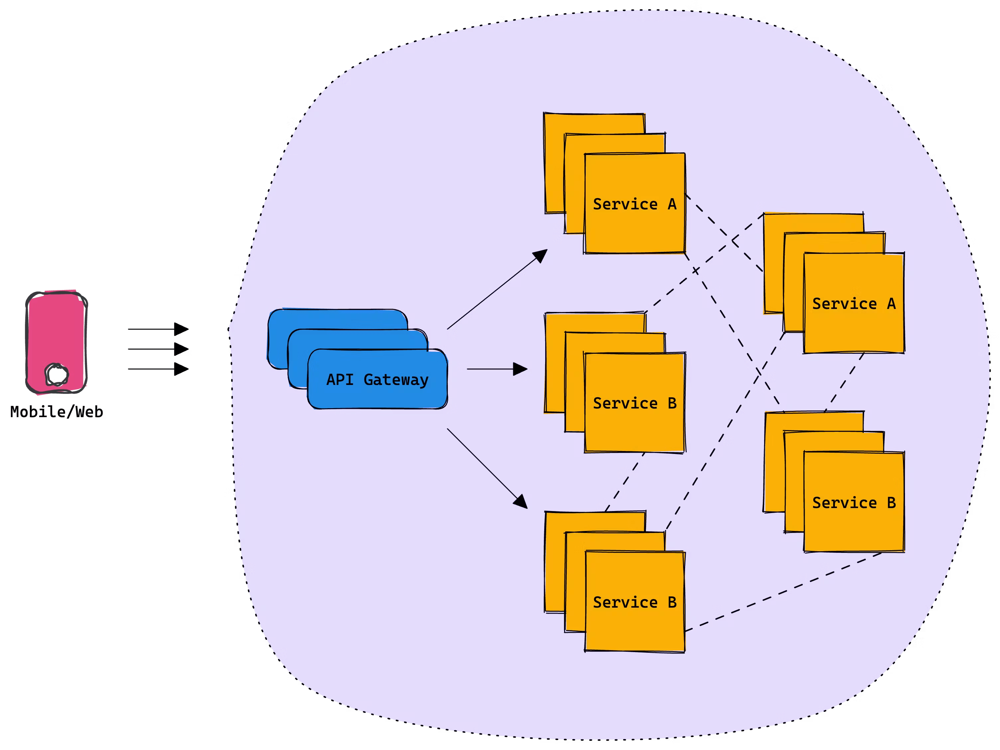

<!-- truncate -->

<head>
<link rel="canonical" href="https://tailcall.hashnode.dev/no-one-talks-about-api-orchestration"/>
<title>No one talks about API Orchestration</title>
</head>

Being in the industry for many years, building and consuming microservices, I have realized that there is one problem that no one really talks about when it comes to microservices ie. API Orchestration. As engineers, we love our microservices, small independent components that are responsible for doing just one thing. The promise that was sold when I was a kid was you can build these small independent services and compose them together to build an app, very fast and reliably. It took me years to realize that the necessary tooling for "composing" just doesn't exist! There are tools for distributed tracing, observability, caching, discovery, etc. But to compose services to build a product is completely offloaded to front-end engineers! There were two things that were happening in the tech ecosystem:

1. **Rich User Interfaces:** Responsive websites that worked on desktop and mobile are dead. To build a successful B2C business, you need to build for all three platforms viz. Android, iOS, and Web (Desktop/PWA). The applications need to look slick, rich in information, and have snappy response times. Development on multiple platforms requires a nuanced understanding of the stack and a lot of duplication of code.

2. **Microservice Proliferation:** Companies these days bootstrap themselves on microservices instead of monoliths. This is because the tooling to build microservices has gotten a lot better, and reusable components are available either in open-source or as a SAAS solution. This allows developers to focus on their core business logic and move fast.

## Microservice

Microservices architecture is a design pattern in which a large application is built as a suite of modular services, each of which runs its process and communicates with other services through well-defined interfaces, typically using a lightweight messaging protocol. This approach has several benefits over a monolithic architecture, including improved scalability, resilience, and maintainability. In a microservices architecture, each service has a specific role and is independently deployable, so developers can work on different services in parallel and deploy them independently of each other. This can make the development process more agile and allow for faster deployment of new features.

An API gateway is a server that acts as a single point of entry for certain types of requests. It can receive requests from the client, route them to the appropriate backend service, and then return the response from the backend service to the client. An API gateway can also perform tasks such as authentication, rate limiting, and caching. This makes it a useful component in a microservices architecture, where each service has its API and the API gateway acts as the "front door" for clients to access the services.

## API Composition

API composition refers to the process of combining multiple APIs to create a new API or a new functionality. This can be done by sending requests to multiple APIs and combining the results, or by creating a new API that acts as a façade for the underlying APIs.

> 💡 API Composition is also known as API Orchestration. This is however vastly different from Microservice Orchestration.

For example, consider a scenario where a client application wants to display a user's profile information and recent posts on a social media platform. In this case, the client can send two separate requests to two different APIs: one to retrieve the user's profile information, and another to retrieve their recent posts. The client can then combine the results from these two APIs to create a single response that contains all the required information. This new response can be considered as the output of the composed API.

To build a rich user interface, API composition is necessary on the client side. One of the main challenges with API composition on the client side is that it can lead to increased complexity in the client application. This is because the client needs to handle the process of sending requests to multiple APIs and combining the results, which can add to the overall size and complexity of the client code.

Another challenge with API composition on the client side is that it can result in reduced performance and increased latency. This is because the client needs to make multiple separate requests to different APIs, which can take more time and result in a slower response from the composed API.

In addition, API composition on the client side can also lead to increased security risks. This is because the client needs to handle sensitive information, such as API keys and authentication credentials, which can be vulnerable to attacks if not properly secured. The client doesn't have access to powerful CPUs or a reliable network either. This makes the composition problem even more challenging to implement and manage. It is therefore often more efficient and effective to perform API composition on the server side instead.

## Backend For Frontend

A BFF layer can help to solve the challenges of API composition by providing a separate backend service that is optimized for each specific frontend client. This can enable the BFF to perform API composition on behalf of the client, which can help to improve the performance and reliability of the composed API. The BFF layer typically sits as a separate component in the overall architecture, between the frontend client and the microservices. It can communicate with both the frontend client and the microservices using well-defined interfaces and protocols, such as REST or gRPC.

The BFF can take advantage of a powerful CPU and access to a fast network to improve the performance and reliability of the composed API. It can also provide added flexibility and control over the composition process. This can make it a useful tool for developers who want to create new APIs by combining the functionality of multiple underlying APIs.

BFFs truly solve the problems mentioned above to a great extent, however they introduce new set of challenges viz.

### Highly Specialized

One of the challenges with using a BFF layer is that it is a highly specialized solution that requires a significant amount of hand-written code. Unlike an API gateway, there is no standard BFF solution that can be deployed out-of-the-box, and each BFF implementation must be custom-tailored to the specific requirements of the frontend client. This lack of standardization and reusability can make the BFF solution more complex and difficult to maintain.

### Fragile

Another challenge with using a BFF layer is that it can be fragile and susceptible to failure. The BFF solution is dependent on the developers to follow best practices and handle all error scenarios, and if these steps are not taken, the solution can be prone to bugs and performance issues. Additionally, the BFF solution must be thoroughly tested, including performance testing, unit testing, and integration testing, to ensure that it is reliable and performs well in production. This can require significant effort and expertise, and if these steps are not properly followed, the BFF solution can be fragile and prone to failure. Also, it's worth mentioning that a BFF layer is an entry point to all your backend, it going down basically means nothing is accessible for the user so this layer needs to be robust and resilient to exceptions.

### Performance

Because BFF layers are typically custom-written for each use case, it can be difficult to predict the performance impact of a small code change. Issues such as unoptimized algorithms, inefficient caching, and unnecessary downstream requests can go unnoticed and only be discovered very late in the development cycle. Typically companies perform thorough benchmarking and load testing before anything goes live. This results in a very high time to market even for minor changes.

### Monolith

Eventually, this layer turns out to be a big monolith touching every service in your backend. The layer contains a lot of handwritten spaghetti code that's hard to maintain. Onboarding new engineers also becomes harder and upgrading libraries or architecture gets costlier. Any tiny change requires a full-fledged deployment on your infrastructure.

### Canary Support (or lack thereof)

Every change that happens in the backend requires the deployment of the BFF layer. In fact, any feature that is built on the client also requires changes on the BFF layer. Such frequent changes can not be exposed to 100% of users because the reliability and performance of this system are unknown. A common way to solve this problem is to use [blue-green](https://www.redhat.com/en/topics/devops/what-is-blue-green-deployment) deployments. This requires additional infrastructure and complex routing mechanisms. First-class support to do canary releases is very important and should be part of a modern BFF layer, however, most companies rely on DevOps for its support.

### Coupled Release

BFF layers can't be deployed independently since they act as a bridge between the clients and the services. Generally, the services need to go live first, and they need to make sure that the change is compatible with the current version of the BFF layer running in production. The interesting problem is in case there is a bug in the microservice and it needs to be reverted, even the BFF layer needs to be reverted. This kind of coupling makes it operationally very expensive to manage.

### Organizational Friction

The Backends for Frontends (BFF) pattern is designed to create a tailor-made backend service for each user interface (e.g., desktop, mobile, etc.), with the aim of simplifying the client-side and improving the user experience.

However, in practice, this architecture sometimes creates friction within the organization, particularly when BFFs are developed and maintained by the backend team. Here are a few reasons why:

1. **Communication and Responsiveness:** As the backend team is typically in charge of the BFF, front-end teams often have to wait for them to make necessary changes. This slows down the development process, especially when backlogs are high or priorities differ.

2. **Different Skillsets:** Backend and frontend developers often specialize in different programming languages and paradigms. If the backend team is in charge of the BFF, they might not be as comfortable or efficient at dealing with issues that are more closely related to the frontend.

3. **Lack of Ownership:** Frontend teams often feel that they lack ownership and control over the part of the system that directly impacts their work. This leads to decreased motivation and productivity.

One potential solution to these issues is to shift the ownership of the BFFs to the front-end teams. Since these teams are the primary consumers of the BFFs, they could be better placed to design, implement, and maintain them. This would not only empower the front-end teams but also free up backend teams to focus on their core responsibilities.

However, this solution is not without its own challenges. For one, front-end teams would need to upskill to handle their new responsibilities. Also, the organization would need to ensure that there are clear lines of communication between the front-end and backend teams, so that any changes to shared resources can be coordinated effectively.

### Legacy Gateway

BFF layers often end up implementing some of the cross-cutting concerns of an API gateway such as rate limiting, authentication, throttling, etc. This makes its purpose quite confusing in the sense that do we need an API gateway if we are using a BFF layer. Moreover, it's not very clear if we use an API gateway with a BFF layer, where should we place it? Should we place it between the clients and the BFF layer or the BFF layer and the service mesh? These are subjective decisions that each company ends up making as there is no standard way of doing this. However, it's worth mentioning that legacy gateways do introduce a gap that's being attempted to be filled by a BFF layer.

> BFF, Presentation Layer, Facade, Middleware, UI Layer, Orchestration Layer, API Adapter — Are all different nomenclatures used for the same thing.

To summarize, BFFs do indeed address the issues of API orchestration to a significant extent; however, they also present a new set of challenges for organizations to tackle. Clearly, there is more to the story. In our [next blog post](https://blog.tailcall.run/unraveling-the-challenges-of-bff-federation), we will discuss some of the solutions that large organizations with unlimited budgets have implemented to overcome this problem. So, please subscribe if you haven't already.
