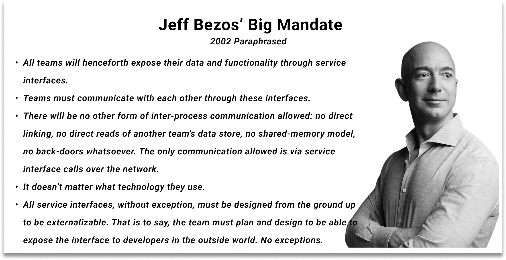

import CallToAction from '../src/components/blog/call-to-action.tsx';

As I reflect on the evolution of APIs, I am reminded of **Jeff Bezos' famous 2002 mandate** to his IT organization at Amazon.

The CEO's directive to expose data and functionality through service interfaces, and to design these interfaces to be externalizable, was a game-changer.

<!-- truncate -->

Fast-forward to today, and APIs have become the backbone of modern business, with even the smallest companies having hundreds of APIs.

However, the landscape has shifted dramatically. Having good APIs is no longer enough; we need a strategy for APIs.
Having good APIs is indeed a crucial starting point, but it's only the beginning. A well-designed API can provide a solid foundation for your business, but without a comprehensive strategy, you risk missing out on opportunities for growth, innovation, and efficiency.

A strategy for APIs involves considering the entire API lifecycle, from design and development to deployment, management, and maintenance. It requires a deep understanding of your business goals, target audience, and the role APIs play in achieving those goals.

In 2024, API strategy needs to be defined at the sub-API level, not just at the company level. This is where the rubber meets the road, and businesses must adapt to stay ahead of the curve.

## What is an API Strategy?

An API strategy is an outline of the steps needed to design, develop, and manage APIs effectively. It's no longer just about having good APIs; it's about ensuring they are secure, scalable, and reliable. It's about making sure developers are more productive and machine utilization is more efficient. In essence, API strategy is about abstracting cross-cutting concerns from business logic.
Abstracting cross-cutting concerns from business logic is a critical aspect of API strategy. Cross-cutting concerns refer to functionalities that are essential to the operation of your API but are not directly related to the business logic. Examples of cross-cutting concerns include:

- **Security**: authentication, authorization, and encryption
- **Monitoring**: logging, analytics, and error tracking
- **Scalability**: rate limiting, caching, and load balancing

By abstracting these concerns from business logic, you can decouple them from the core functionality of your API, making it easier to maintain, update, and scale your API without affecting the underlying business logic.

For instance, if you're building an e-commerce API, you might abstract security concerns by implementing OAuth 2.0 authentication and authorization. This would allow you to focus on the business logic of processing orders, managing inventory, and handling payments, while ensuring that security is handled separately.

## Why Do You Need an API Strategy?

The importance of an API strategy cannot be overstated. Without one, you risk exposing your business to security vulnerabilities, scalability issues, and reliability problems. A well-defined API strategy helps you address critical concerns such as:

- Cross-functional collaboration
- Rate limiting
- Circuit breaking
- Caching
- Routing
- Composition
- Access control
- Authentication
- Versioning
- Logging
- Monitoring
- Documentation

Having a strategy in place ensures that you're not just documenting your APIs, but also managing them effectively, securing them, scaling them, monitoring them, and making sure they're reliable.

## The Role of Tools in API Strategy

There are many tools available in the market to help with API strategy, such as API gateways and Swagger. An API gateway can help with rate limiting, caching, routing, access control, authentication, authorization, logging, and monitoring. Swagger can assist with documentation. However, are these tools enough? Are they capable of addressing all the challenges that come with API strategy? Let's discuss.

### API Composition: A Critical Aspect of API Strategy

API composition is a critical aspect of API strategy. How do you compose your APIs? Do you use an API gateway or a different tool? How do you prevent the [N+1 problem](/docs/graphql-n-plus-one-problem-solved-tailcall/#what-is-the-n1-problem) when composing APIs using an API gateway? How do you handle the failure of one of the APIs in the composition? How do you handle caching in the composition? These are just a few of the questions that need to be addressed in your API strategy.

### Access Control: A Key Consideration

Access control is another key consideration in API strategy. Can you create an API and use it as both a public API and an admin API, restricting access to fields based on user role? The answer is no, not without a well-defined API strategy.

## A Solution to API Strategy Challenges

For having a well-defined API strategy, you need a set of tools that can help you with the above points. Such a solution should have first-class support for:

- **API Composition:** Easily compose APIs to create complex workflows and integrations.
- **Access Control:** Implement fine-grained access control to restrict access to APIs and resources based on user roles and permissions.
- **Rate Limiting:** Enforce rate limits to prevent abuse and ensure fair usage of your APIs.
- **Circuit Breaking:** Detect and prevent cascading failures in your API ecosystem.
- **Caching:** Improve performance and reduce latency with intelligent caching mechanisms.
- **Routing:** Route API requests efficiently and securely to the right backend services.
- **Authentication and Authorization:** Implement robust authentication and authorization mechanisms to ensure secure access to your APIs.
- **Versioning:** Manage multiple versions of your APIs and ensure backward compatibility.
- **Logging and Monitoring:** Gain visibility into API performance and behavior with real-time logging and monitoring.
- **Documentation:** Generate accurate and up-to-date documentation for your APIs.

A good solution should also:

- **Introspect and detect problems:** Analyze your configurations to identify potential issues and provide recommendations for improvement.
- **Transfer type safety:** Ensure that your API configurations are type-safe and consistent with your code.
- **Provide access control to the sub-API level:** Restrict access to specific fields in the APIs based on user roles and permissions.

By using such a solution, you can overcome the challenges of API strategy and create a robust, scalable, and secure API ecosystem that drives innovation and growth in your business.

## Conclusion

In conclusion, API strategy is no longer a nice-to-have; it's a must-have for businesses that want to stay ahead of the curve. By defining a clear API strategy, businesses can drive innovation, improve efficiency, and create new opportunities for growth. At Tailcall, we're committed to helping businesses achieve their API goals with our GraphQL solution.

**Take the First Step Towards a Well-Defined API Strategy**

If you're struggling to define your API strategy, take the first step today. Assess your current API landscape, identify areas for improvement, and start building a strategy that works for your business. Remember, A well-defined API strategy is essential for driving innovation and growth in modern business because it enables companies to:

- **Unlock New Revenue Streams**: By providing APIs that offer value to external developers, businesses can create new revenue streams through API-based partnerships and monetization models.
- **Enhance Customer Experience**: APIs can provide real-time data and services that enhance customer experience, leading to increased loyalty and retention.
- **Foster Innovation**: APIs can enable innovation by providing access to new data, services, and capabilities, allowing businesses to create new products and services that drive growth.
- **Improve Operational Efficiency**: A well-defined API strategy can help businesses streamline their operations, reduce costs, and improve efficiency, freeing up resources to focus on innovation and growth.

By having a well-defined API strategy, businesses can create a solid foundation for innovation and growth, enabling them to stay ahead of the competition and achieve their goals.

**Ready to Take Your API Strategy to the Next Level?**

Contact us today to learn more about how Tailcall can help you overcome API strategy challenges and drive innovation and growth in your business.

<CallToAction
title="Discover future of GraphQL"
subtitle= "Try Tailcall today"
buttonText="Get Started"
backgroundImageSrc="/icons/basic/bg-tailcall.svg"
/>
