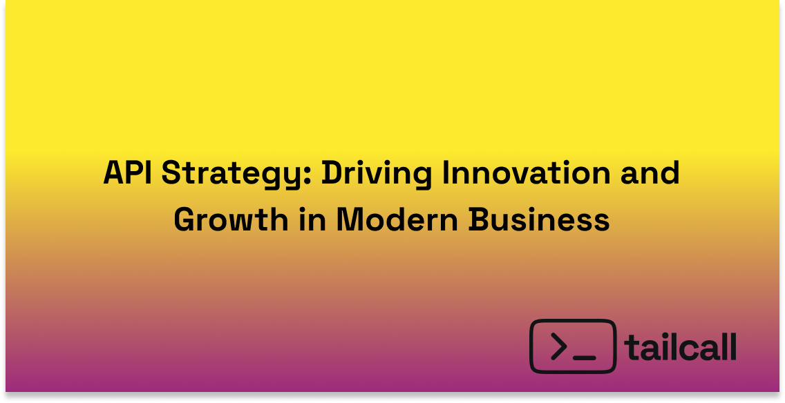

import APIStrategyQuiz from '../src/components/blog/api-strategy.tsx';
import CallToAction from '../src/components/blog/call-to-action.tsx';

Buckle up, folks! We're diving into the exciting world of APIs - the unsung heroes powering our digital universe. If you're not on the API bandwagon yet, you're missing out on the rocket fuel that's propelling businesses into the stratosphere. Let's explore why a killer API strategy isn't just nice to have - it's your ticket to innovation, efficiency, and explosive growth.

<!-- truncate -->

## I. The API Revolution: It's Here, and It's Huge!

APIs aren't just trending - they're taking over:

- API investments have skyrocketed by 150% in just three years. That's not just growth; that's a boom!
- 90% of developers use APIs in their work, highlighting their ubiquity in software development.
- Giants like Salesforce, Twilio, and Stripe? They're raking in over half their revenue through APIs. Talk about a cash cow!

Take Amazon, for instance. They've morphed from an online bookstore into a tech behemoth, all thanks to their API-first mindset. AWS, anyone?

## II. The API Obstacle Course: Challenges Ahead

Now, don't get me wrong - APIs aren't all rainbows and unicorns. There are some gnarly challenges to tackle:

1. **Complexity**: Juggling multiple APIs? It's like herding cats across different platforms.
2. **Security**: APIs are juicy targets for cyber baddies. Lock 'em down tight!
3. **Scalability**: When your API usage explodes (and trust me, it will), can you keep up?
4. **Integration**: Mixing APIs with legacy systems? That's a recipe for headaches.

Ignore these, and you're looking at a world of hurt - inflated costs, security nightmares, and users running for the hills.

## III. API Strategy: Your Secret Weapon for Business Domination

A rock-solid API strategy isn't just nice to have - it's your blueprint for conquering the digital realm:

1. **Improved Innovation and Competitiveness**: APIs are your fast track to prototyping and launching game-changing products.
2. **Increased Revenue and Growth**: APIs can open floodgates to business models you haven't even dreamed of yet.
3. **Enhanced Customer Experience**: Seamless integration = happy users. It's that simple.
4. **Improved Operational Efficiency**: Automate the boring stuff and watch productivity soar.

Just look at Uber. Their API strategy lets them play nice with everything from Google Maps to Spotify, creating an experience that's more than just a ride - it's a journey.

## IV. Key Components of a Successful API Strategy

A successful API strategy comprises several key components:

1. **API Governance**: Establish policies and standards for API development and usage.
2. **API Composition and Orchestration**: Create APIs that aggregate and orchestrate data from multiple sources.
3. **API Design and Development**: Create consistent, user-friendly APIs that align with business goals.
4. **API Security and Access Control**: Implement robust security measures to protect data and systems.
5. **API Analytics and Monitoring**: Track API performance and usage to inform decision-making.
6. **API Documentation and Support**: Provide comprehensive documentation and support for API users.

These components work together to ensure that APIs are developed, deployed, and managed in a way that maximizes their value to the organization.

## V. The Challenge of API Sprawl

As organizations rapidly adopt APIs, they often face a new challenge: API sprawl. This refers to the uncontrolled proliferation of APIs across an organization, leading to several issues:

1. **Increased Complexity**: Managing a large number of APIs across different teams and environments becomes increasingly difficult.
2. **Reduced Visibility**: It becomes challenging to maintain a clear overview of all APIs, their purposes, and their interdependencies.
3. **Security Risks**: With more APIs, the attack surface for potential security breaches expands.
4. **Inconsistent Governance**: Different teams may develop APIs with inconsistent standards and practices.
5. **Inefficiency**: Developers may create redundant APIs or struggle to find existing ones, leading to wasted resources.

Addressing API sprawl is crucial for maintaining an effective API strategy. It requires a combination of good governance, centralized API management, and tools for discovery and monitoring.

## VI. Best Practices for Implementing an API Strategy

To successfully implement an API strategy, organizations should:

1. **Define Clear Goals and Objectives**: Align API strategy with overall business objectives.
2. **Establish a Cross-Functional API Team**: Involve stakeholders from different departments.
3. **Develop a Comprehensive API Roadmap**: Plan for short-term and long-term API development.
4. **Implement a Robust API Governance Model**: Ensure consistency and quality across all APIs.
5. **Monitor and Analyze API Performance**: Continuously improve based on usage data and feedback.

Example: Netflix's API strategy involves a dedicated API team, clear governance policies, and continuous monitoring, allowing them to manage over 1000 APIs that power their streaming service across various devices and platforms.

## VII. Assessing Your API Strategy

<APIStrategyQuiz />

## VIII. How GraphQL Enhances Your API Strategy

As organizations strive to build robust and scalable API strategies, GraphQL has emerged as a compelling alternative to traditional REST APIs. By addressing several key challenges, GraphQL can play a pivotal role in refining your API approach and driving better outcomes.

1. **Simplifying API Complexity**:

   - Traditional REST APIs often lead to an explosion of endpoints, each tailored for specific data needs. This can result in complex maintenance and increased development overhead. GraphQL simplifies this by providing a single, unified endpoint through which clients can request precisely the data they need. This granularity reduces the burden of managing multiple endpoints and minimizes the likelihood of over-fetching or under-fetching data, leading to more efficient and streamlined operations.

2. **Strengthening Security Posture**:

   - Security remains a paramount concern in API strategy, particularly as APIs expose critical business functionalities to external entities. With GraphQL, you can implement fine-grained access controls directly within the schema, allowing you to define permissions at the field level. This approach ensures that only authorized users can access sensitive data, thus reducing the potential attack surface and enhancing the overall security of your API ecosystem.

3. **Boosting Scalability and Performance**:

   - As API usage scales, ensuring consistent performance becomes increasingly challenging. GraphQL addresses this by enabling clients to request only the data they need in a single query, which can reduce the amount of data transferred over the network. This selective querying not only optimizes bandwidth usage but also lightens server processing loads, contributing to better performance and scalability as your API adoption grows.

4. **Facilitating Legacy System Integration**:

   - Integrating modern APIs with legacy systems is often a complex and resource-intensive process. GraphQL eases this challenge by acting as an abstraction layer that can sit on top of existing REST APIs, databases, and other services. This allows organizations to modernize their API strategy incrementally, without the need for a complete overhaul of legacy systems. GraphQL’s ability to aggregate data from multiple sources into a single query response streamlines integration efforts and accelerates time-to-market for new initiatives.

5. **Mitigating API Sprawl**:
   - As organizations expand their API offerings, they frequently encounter the problem of API sprawl—an uncontrolled proliferation of APIs across various teams and departments. GraphQL provides a centralized schema that serves as a single source of truth for API interactions. This centralization not only helps in maintaining better visibility and governance but also reduces redundancy by allowing teams to reuse existing GraphQL types and queries, thereby mitigating the risks associated with API sprawl.

By incorporating GraphQL into your API strategy, you can overcome these challenges, achieving a more cohesive, efficient, and secure API environment. Whether you are dealing with the complexities of API management, ensuring data security, or integrating with legacy systems, GraphQL offers a flexible and powerful solution that can drive innovation and growth in your organization.

<CallToAction
title="Discover future of GraphQL"
subtitle= "Try Tailcall today"
buttonText="Get Started"
backgroundImageSrc="/icons/basic/bg-tailcall.svg"
/>

## IX. Conclusion

A well-defined API strategy, coupled with effective management of API sprawl, is crucial for organizations aiming to thrive in the digital age. By regularly assessing your API strategy using tools like the questionnaire provided, you can ensure that your organization continues to leverage APIs effectively for innovation, growth, and competitive advantage.

We encourage all organizations to not only develop and implement a robust API strategy but also to regularly evaluate and refine it. In doing so, you'll be better equipped to navigate the challenges of modern business, including API sprawl, while harnessing the full potential of your digital ecosystem.
