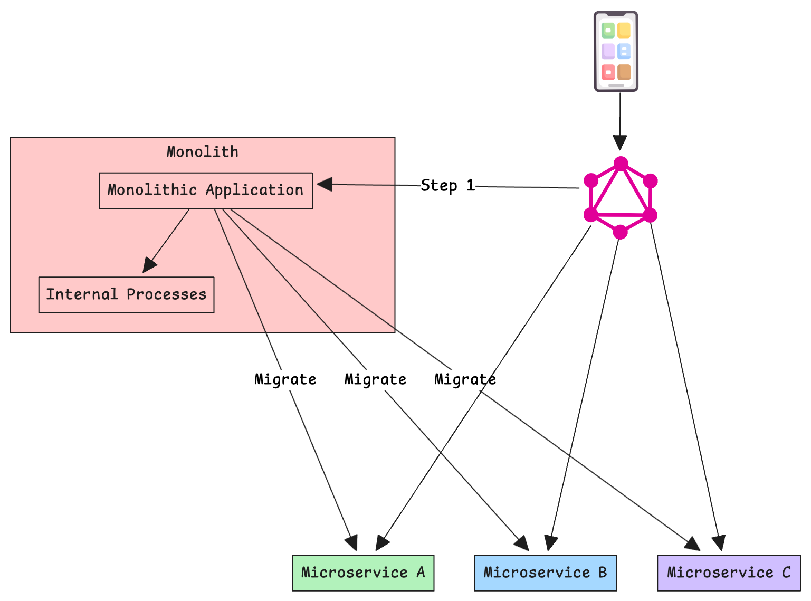
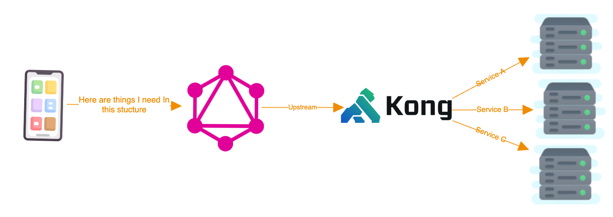

**Picture this:**

200 million users, countless fantasy teams, and a platform that needs to keep up with the lightning-fast pace of live sports. That was the exciting challenge we faced at [Dream11, India's largest fantasy sports platform](https://www.dream11.com/).

As a former employees, We're thrilled to share how we harnessed the power of GraphQL to create a platform that's not just scalable and performant, but also a joy for both users and developers to interact with.

<!-- truncate -->

## Case Study: Dream11's GraphQL Journey

Before we dive into the details of our GraphQL journey, check out this video for a high-level overview of how we tackled the challenges and transformed our backend architecture:

  <iframe
    src="https://www.youtube.com/embed/Esb7oQ0PuXw"
    frameBorder="0"
    title="Lessons for Scaling GraphQL"
    style={{ position: 'absolute', top: 0, left: 0, width: '100%', height: '100%', border: 0 }}
    allow="accelerometer; autoplay; clipboard-write; encrypted-media; gyroscope; picture-in-picture"
    allowFullScreen
    loading="lazy"
  ></iframe>

### The Challenge: Taming the Monolith

During our time at Dream11, we embarked on several major re-architecture projects to supercharge our systems' performance and scalability. But perhaps the most exhilarating (and occasionally hair-raising) journey was our transition from a monolithic architecture to microservices.

Now, let us tell you, this wasn't a walk in the park. We faced hurdles at every turn. But we had one golden rule that guided us through the chaos: "The frontend should never be shackled by the backend's structure." This mantra led us to an exciting solution: using GraphQL as a backend-for-frontend (BFF).

## The Magic of Backend-for-Frontends (BFFs)

Think of BFFs as the ultimate middlemen, sitting between our microservices and frontend applications. They're not just passing messages; they're tailoring responses and error handling for each client application. It's like having a personal assistant for each of your frontend apps! By implementing BFFs, we unlocked a treasure trove of advantages:

- **No more data bloat:** Say goodbye to under-fetching and over-fetching. Our BFFs serve each client exactly what they need, nothing more, nothing less.
- **Divide and conquer:** With BFFs handling the heavy lifting of data formatting, our frontend developers could focus on crafting amazing user experiences.
- **Network efficiency:** Imagine making one call instead of ten. That's the power of BFFs – they fetch data from multiple sources in one go, keeping our network traffic lean and mean.

## Dream11's Microservices Odyssey

Now, we could have gone for the "big bang" approach, but where's the fun (or safety) in that? Instead, we opted for a more measured journey:

1. First, we moved all our monolith APIs to a GraphQL-based BFF.
2. We then directed all frontend applications to this new BFF, even adding a lint check to catch any sneaky direct API calls to the monolith.
3. Once we were confident in our new setup, we began the exciting process of moving APIs to microservices, one by one.

Sure, it was a longer path, but it was smoother sailing. We minimized risks, kept our testing manageable, and, most importantly, kept our sanity intact!

## Unveiling Dream11's BFF Architecture

Let me pull back the curtain on our BFF architecture at Dream11. It was a symphony of components working in perfect harmony:

- **Frontend Applications:** The face of our platform, built in React. They took the data from our GraphQL server and transformed it into the engaging user interfaces our players loved.
- **GraphQL Server:** The maestro of our operation, built with Apollo Server. It orchestrated data fetching from microservices and delivered it beautifully to our frontend applications.
- **API Gateway:** The bouncer of our architecture, powered by Kong. It managed the flow of requests from the GraphQL server to our microservices.
- **Microservices:** Our data virtuosos, crafted with Node.js and Express. They fetched data from databases and passed it to the GraphQL server.

Now, you might be scratching your head, wondering, "Why put an API Gateway after the GraphQL server?" Great question! It all comes down to resilience. We needed fine-grained control over rate limiting and circuit breaking for each microservice. GraphQL's single endpoint made this tricky, so we added this extra layer to keep our systems robust and responsive.

This architecture was our trusted companion for years, scaling effortlessly to serve tens of millions of users. But as with any great journey, we eventually hit a new challenge: the performance of our GraphQL server started to feel the strain of our massive success.

## The GraphQL Advantage: Dream11's Secret Weapon

Implementing GraphQL for our BFF layer wasn't just a technical decision – it was a game-changer. Here's why we fell in love with GraphQL:

- **Network efficiency on steroids:** We slashed unnecessary network calls, making our app lightning-fast.
- **Bug squashing made easy:** Type-safe queries generated at compile time meant fewer surprises in production.
- **Performance boost:** We fetched only the data we needed, nothing more, nothing less. Also reduced multiple round trips to the server.
- **Flexibility unleashed:** We could structure our data exactly how we wanted, adapting to new requirements with ease.
- **Cross-platform harmony:** Consistency across all platforms became a breeze.
- **Developer joy:** Our frontend team couldn't stop raving about how easy it was to work with.
- **Time is money:** Reduced development time meant we could innovate faster.
- **Happy developers, happy life:** The improved developer experience led to more creative solutions and happier teams.

## The Next Chapter: From Challenges to Solutions

The journey we embarked on at Dream11 wasn't just about solving immediate problems – it was about reimagining how we approach backend architecture for massive-scale applications. The challenges we faced, the solutions we crafted, and the lessons we learned have directly shaped the development of Tailcall.

Tailcall emerged from the crucible of these experiences, designed to make the implementation of GraphQL and similar migration journeys significantly easier for other companies. Here's how Tailcall is addressing the pain points we encountered:

1. **Simplified Migration:** Tailcall provides tools to streamline the transition from monolithic architectures to microservices, making the journey we undertook at Dream11 more accessible and less risky for other organizations.

2. **Performance at Scale:** Drawing from our experiences with GraphQL performance challenges, Tailcall incorporates optimizations that allow GraphQL servers to handle massive loads more efficiently.

3. **Automated BFF Generation:** Recognizing the power of the BFF pattern, Tailcall offers features to automatically generate and manage Backend-for-Frontend layers, reducing development time and potential errors.

4. **Enhanced Resilience:** Our struggles with rate limiting and circuit breaking at the GraphQL layer have informed Tailcall's design, incorporating these features more seamlessly into the GraphQL ecosystem.

5. **Developer Experience:** The joys and pains of our development team at Dream11 have directly influenced Tailcall's focus on developer experience, making it easier for teams to work with GraphQL and microservices architectures.

6. **Flexible Scaling:** Tailcall embodies the lessons learned from scaling Dream11 to millions of users, offering flexible scaling options that grow with your application.

The challenges we faced at Dream11 weren't unique – they're common hurdles for any company dealing with rapid growth and complex data needs. Tailcall is our answer to these industry-wide challenges, encapsulating years of hard-won wisdom into a tool that makes these architectural transitions smoother, faster, and more reliable.

As we continue to evolve Tailcall, we're excited to see how it will empower other companies to undertake their own transformative journeys, armed with the insights and tools born from our experiences. The future of backend architecture is bright, and we're thrilled to be part of shaping it.

Stay tuned, fellow tech enthusiasts. With Tailcall, we're not just solving yesterday's problems – we're building tomorrow's solutions.
