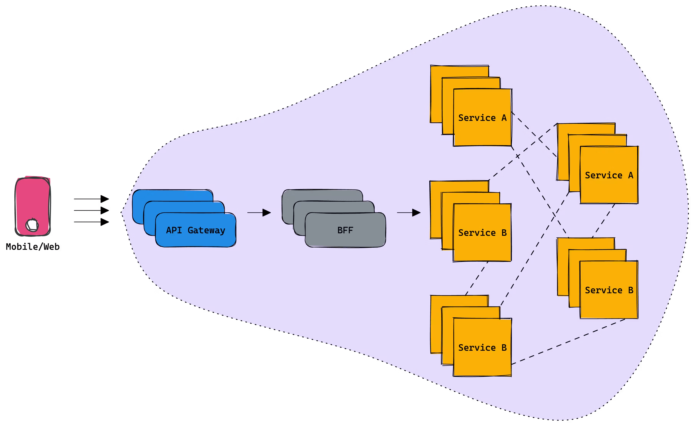
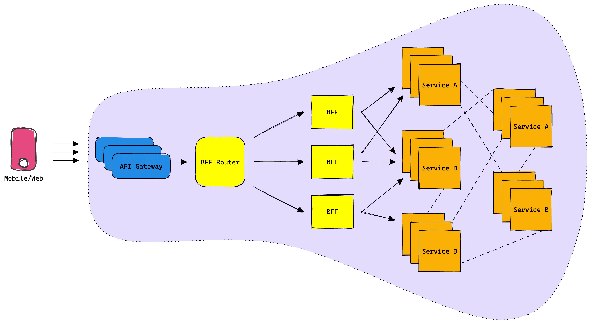

In our [previous](https://blog.tailcall.run/no-one-talks-about-api-orchestration) blog post, we discussed the challenges of API Orchestration and its often overlooked role in a microservices architecture. We explored how, while it serves as an abstraction for frontend apps and websites, this abstraction's performance is very sensitive to network latency and device performance thus directly impacting end-user experience. One proposed solution was to create a Backend for Frontend (BFF) layer, essentially moving the frontend abstraction to powerful servers within your VPC. Although this approach effectively addresses the user experience problem and simplifies the work of front-end engineers, it introduces a new set of challenges for the backend, leading to difficulties in scaling the monolithic solution. Here's what the BFF architecture looked like:

<!-- truncate -->

<head>
<link rel="canonical" href="https://tailcall.hashnode.dev/unraveling-the-challenges-of-bff-federation"/>
<title>Unraveling the Challenges of BFF Federation</title>
</head>

## Using a BFF Federation

Federation, as a concept, is not exclusive to GraphQL. In essence, it's about abstracting multiple data sources or services into a unified, single API interface that can be consumed by clients. This approach is not unique to any particular technology or framework and can be implemented with various tools and languages.

However, GraphQL has played a significant role in popularizing the concept of federation. With its strong typing, introspective capabilities, and its natural fit for defining schemas across distributed services, it has provided an elegant solution to the challenge of federating APIs.

While this blog discusses federation in the context of GraphQL, it's essential to understand that the core principles and challenges of the federation can be applied beyond GraphQL. Remember, the implementation of federation is not about a specific technology, but about the architectural approach to create a unified interface from multiple data sources.

With this in mind, let's delve into the pros and cons of the federation, using GraphQL as our main context for the discussion. As you'll see, the benefits and pitfalls of federation are relevant, whether you're using GraphQL or not.

Federation is a concept that originates from the philosophy of microservices. This approach promotes the partitioning of large monolithic systems into smaller, more manageable components. In a federated architecture, instead of having a monolithic Backend-for-Frontend (BFF) handling all requests, you have multiple smaller BFFs that handle different aspects of the request.

Imagine a client makes a request to your system. This request still goes through an API gateway, which serves as the entry point to your system. However, instead of hitting a monolithic BFF, it now meets a BFF Router, specifically designed to understand and route requests to the appropriate BFFs.

The Router is smart. It understands the client's request and can break it down into smaller parts. It then delegates these smaller tasks to the appropriate services, each responsible for a specific aspect of the request. These services work in parallel, handling their part of the request, which often involves calling downstream microservices and orchestrating their responses.

Once the BFFs have finished their tasks, they send their responses back to the Router. The Router, in turn, takes these individual responses, combines them into a single response that fulfils the original request, and sends it back to the client.

This system, where individual services handle specific parts of a request in a coordinated manner, is often referred to as a Federation. The term "Apollo Federation" or "Super Graph" is commonly used to describe this setup when it's implemented with Apollo, a popular GraphQL implementation, but the concept is not limited to any specific technology or tool.

## Federation Benefits

Many large organizations using GraphQL in production have transitioned to this architecture to accommodate their scaling needs. The primary selling points of this architecture are:

1. **Enhanced Team Ownership**: GraphQL Federation fosters a sense of ownership among teams by allowing each team to own and maintain its GraphQL service. With Federation, teams can operate independently, focusing on their specific domain without worrying about the overall schema. This separation of concerns leads to more maintainable code, faster development cycles, and increased productivity. It empowers teams to work in parallel, each owning a piece of the larger schema while ensuring that the entire system operates as a cohesive whole. This significantly enhances team efficiency and collaboration, particularly in larger organizations with multiple teams working on different services. This alone is by far the most significant aspect of using GraphQL Federation.

2. **Incremental Adoption**: A major advantage of GraphQL Federation is its ability to support incremental adoption. This means teams can gradually wrap their domain-specific microservices with a GraphQL layer, one at a time, and integrate it into the federated schema without disrupting the entire system. This flexible approach minimizes the impact on existing workflows and reduces the risks associated with large-scale changes.  
   From the frontend perspective, GraphQL Federation offers a unified interface for querying the data. This simplifies the frontend code and enables the development of rich, interactive UIs with less effort. As soon as the first services are federated, frontend developers can begin transitioning their queries to the federated schema, reducing disruption and allowing for a smoother adoption process.  
   This incremental approach also allows teams to evaluate and demonstrate the value of federation at each step, building confidence and promoting buy-in across the organization. It ensures teams are not overwhelmed by the complexity of new technology or architecture and can adjust their practices as they learn.

## Federation vs BFF

It's not hard to see that GraphQL Federation carries some serious muscle over its monolithic adversary, the BFF. But before we declare a champion, let's take a few rounds to scrutinize the [limitations](https://blog.tailcall.run/no-one-talks-about-api-orchestration#heading-highly-specialized) we've come across in our BFF solution, and see how the GraphQL Federation stands up under pressure. It's time for a head-to-head comparison!

1. **Specialization**: Both BFF and GraphQL Federation require a certain amount of manual intervention. In the BFF approach, the entire layer is custom-built, meaning there's no ready-to-use solution, which necessitates significant manual management. On the other hand, GraphQL Federation provides an open-source, ready-to-use Apollo Router. However, it's not an all-inclusive solution, as the individual GraphQL services still need to be manually maintained and written by hand for specific use cases. While it's still a tough fight, the federation manages to land a jab here and gets a few extra points in this round.

2. **Fragility**: Federation offers an enhanced strategy. In a federated architecture, when a GraphQL service malfunction, only its segment of the graph becomes inaccessible to the user. This results in a more resilient system, less prone to total failure, demonstrating the ability to continue the fight even after taking a hit. In this round, Federation steps up and delivers a solid punch.

3. **Performance**: When it comes to Performance, the Federation architecture introduces an extra journey for each packet. The request has to travel through the router, then to the individual GraphQL services, before finally reaching the domain service. This journey can add a few milliseconds of latency, a difference that may not be perceptible to the end user. However, this seemingly small delay has a broader impact on the performance of the entire architecture. The addition of the router introduces a requirement for more infrastructure and increases the frequency of data serialization and deserialization. This increased complexity affects both the system's throughput and infrastructure costs. In this round, the Federation architecture might not be the clear knockout winner we were hoping for.

4. **Monolith Tendency**: It's a clear knockout in this round for the Federation! It elegantly sidesteps the monolith tendency, keeping the architecture agile and modular. BFF, in contrast, takes a heavy fall with its tendency to become a monolithic layer over time.

5. **Canary Release:** Federation, unlike BFF, reveals graph dependencies and compatibility issues at runtime, not compile time. This amps up the need for first-class canary releases. However, when it comes to canary support, it's a draw. Both fighters are still in the ring, each showing resilience in their own way. No knockout here, folks!

6. **Coupled Release**: In the Federation architecture, each GraphQL service operates independently, significantly reducing the coupling between services and the router. This independence allows each team to manage its own release cycles, putting an end to the wide-scale halts that were commonplace with the BFF layer. However, it's important to note that each GraphQL service still maintains a tight connection with its corresponding downstream domain service. While this is a form of coupling, it's considerably less invasive than the BFF approach, where the entire layer was intertwined. Despite this necessary connection to the domain services, the Federation architecture proves to be more agile. In this round, GraphQL Federation edges out the BFF approach.

7. **Organizational Friction:** With Federation, the responsibility for managing the architecture often falls squarely on the shoulders of backend engineers. The reason is simple: the complexity of the architecture and its intimate ties with downstream domain services necessitate a deep level of technical understanding. This is a departure from the BFF paradigm, where frontend teams could claim ownership of this part of the infrastructure. The intricate nature of the Federation, however, makes this almost untenable. When put head-to-head with BFFs, the Federation seems to take a step back in this regard. The power to control abstraction slips away from the consumer. In this round, BFFs manage to hold their ground.

8. **Legacy Gateway:** Just as in the BFF model, the API gateway maintains its place in the Federation architecture, and rightfully so. However, we find ourselves reestablishing a substantial amount of resiliency and caching logic within these new layers, duplicating efforts previously expended on a traditional gateway. This redundancy marks a lack of efficiency in the Federation approach, signaling a tie in this round.

Overall, this round favors GraphQL Federation. It proves to be a significantly more robust architecture when evaluated based on the aforementioned criteria. Let's explore further and assess how it performs in isolation and as the company expands.

## Pitfalls of GraphQL Federation

While GraphQL Federation has numerous benefits, it is not without its downsides. Here are some points of caution that should be considered when deciding to use this architecture:

1. **Cost and Complexity:** GraphQL Federation introduces significant complexity into the architecture. Setting up, maintaining, and testing a federated graph can be a challenge as it requires a deep understanding of both GraphQL and distributed systems. Additionally, this architecture demands more infrastructure and a larger team for maintenance. As such, the adoption and migration process can be complex and costly. Typically, only large organizations with platform teams, robust budgets, and a governing body to maintain the schema's sanctity and system reliability, tend to consider adopting this approach. The inherent complexity and cost implications make the Federation a less likely choice for small to medium-sized organizations.

2. **Ownership Challenges:** It is often argued that domain service owners maintain their individual GraphQL layers. However, this doesn't always reflect the reality. Services can frequently be divided or merged, leading to uncertainty about how to modify the GraphQL layer. This results in a complex web of requests from GraphQL services to domain services outside the team's control.

3. **Infrastructure Scaling:** Each subgraph in a federated architecture operates on a separate piece of infrastructure, scaling independently. This brings its own set of challenges. For instance, when a subgraph is divided or merged, computing and scaling requirements need to be re-evaluated. Moreover, a deployment in another subgraph can trigger a substantial increase in load from the router on your subgraph, potentially causing unexpected stress on your infrastructure. This underscores the need for robust scaling and load-balancing strategies within a federated architecture.

While GraphQL Federation has the potential to solve some issues of traditional BFF architecture, it brings in its own set of challenges. Therefore, it's important to evaluate these considerations based on the specific requirements and constraints of your project before deciding to implement this architecture.

## We are onto something

When examining the underlying issue, the debate essentially revolves around microservices and monoliths. Undoubtedly, the federated solution offers better scalability compared to a monolithic architecture; however, it also introduces a myriad of distinct challenges related to maintenance and costs that warrant careful consideration. This is not the end of the discussion, as client requests pass through CDNs and the Gateway before reaching the router, and we have yet to explore those components of the infrastructure. In the following sections, we will delve into these components and further investigate how they interact, as well as delve deeper into GraphQL.
