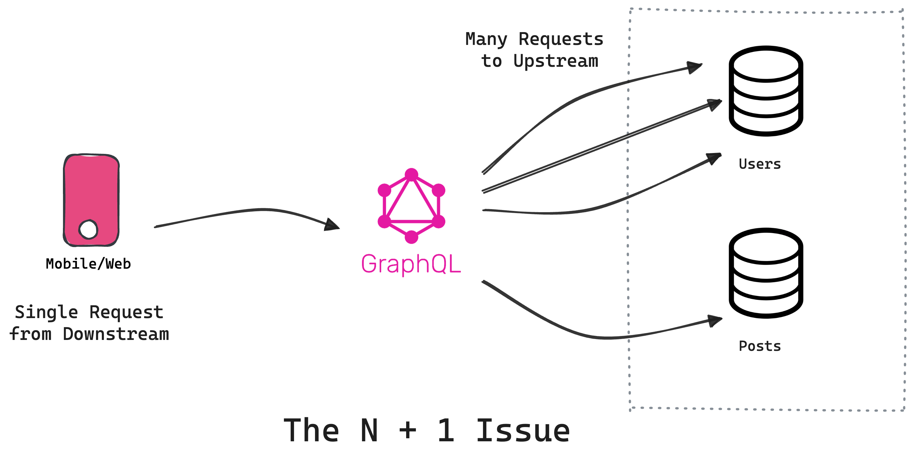

Is it really worth combining GraphQL with microservices or is it just a new shiny object with all the hype?

import CallToAction from '../src/components/blog/call-to-action.tsx';

<!-- truncate -->

## Introduction

In the fast-changing land of software development, two concepts have been gathering momentum: **GraphQL** and **microservices**. While the latter helps businesses decompose their applications into small independent services, the former makes it possible for the clients of these services to request only data of interest. Each of these technologies address specific challenges inherent in building modern applications, and when combined, they offer a powerful toolkit for developers aiming to create efficient and robust APIs.

But is it really worth combining the two or is it just a new shiny object with all the hype? Is it really cost-efficient and time-saving or just an expensive thing for tech majors? Read on as I explore the challenges, features and considerations of using GraphQL with microservices. 🚀

## What Are Microservices?


Compared to traditional monolithic architecture, in which all the constituents of an application are usually closely integrated and interwoven, **microservices** present a very compelling option. Microservices really orient the technique of decomposition and isolation. Development, scaling, and deployment for every service can be independent. It provides high flexibility and a better developer experience.

The three key characteristics of microservices are **scalability**, **flexibility**, and **maintainability**. The components of the system can be scaled as needed, and in terms of priority. Different languages and technologies can also be used to realize each service according to use cases appropriate for individual use, which can be developed and maintained independently by different teams. Cleanup will not only be in the debugging phase; it will also accelerate the development cycle, from which you can easily adapt and evolve your application over time.


### Example: Spotify

**Spotify** is a prime example of [successful microservice adoption](https://medium.com/codebase/microservices-architecture-at-spotify-beac905e9622). To efficiently support millions of monthly users, Spotify restructured its application into microservices, resulting in impressive performance and scalability. These microservices likely handle various specialized tasks, such as:

- Recommending tracks based on a user’s listening history.
- Identifying the genre and theme of each track.
- Personalizing playlists for users by combining insights from the recommendation and genre microservices.
- Delivering lyrics for tracks.

[Read: Migrating To Microservices](https://tailcall.run/blog/graphql-microservices-migration/).

## What is GraphQL?

**[GraphQL](https://tailcall.run/graphql/)** was designed based on the concept of _returning precisely what is asked for; no more, no less_. Open-sourced by Facebook in 2015, it fixes ancient issues of over-fetching and under-fetching that plagued REST APIs right from their very invention.

It empowers the client with **flexibility** regarding which particular fields to request in any use case. This is possible due to the **strongly typed schema** that clearly defines the data structure of the API and specifies what it returns. Plus, subscriptions allow GraphQL to return **real-time data**, meeting demands of modern applications.

### Example: GitHub

**GitHub** is one of the [prominent adopters of GraphQL](https://docs.github.com/en/graphql/overview/about-the-graphql-api). By implementing GraphQL, GitHub provides its users with a more flexible and efficient way to interact with its API. Developers can query for specific data, such as repositories, issues, and commits, all within a single request, enhancing the efficiency of their applications.

## Combining GraphQL and Microservices

The true magic happens when **GraphQL** and **microservices** are combined. This pairing allows developers to harness the power of microservices while mitigating some of the complexities associated with them.

### Benefits of Combining GraphQL and Microservices

By design, GraphQL has made optimization of **data retrieval** and parallel resolutions intrinsic to the system. **Error management** is also much smoother because of the automatic process of partial resolutions and formation of response as a whole. Further, due to **flexibility** and clear ownership, GraphQL makes it possible for clients to fetch data from different microservices. This grants extra control to the clients while communicating with microservices.

_fetching data from multiple microservices using Tailcall:_

```graphql
type Query {
  tracks: TrackData!
    @grpc(method: "tracks.trackService.listTracks")
}

type Track {
  id: ID!
  title: String!
  audioUrl: String!
  reactions: [Reaction]
    @http(path: "/tracks/{{.value.id}}/reactions")
  lyrics: [Lyric]
    @grpc(
      body: "{{.value.id}}"
      method: "tracks.trackService.getLyrics"
    )
}

type TrackData {
  track: [Track]!
}

type Reaction {
  emoji: String!
  count: Int!
}

type Lyric {
  text: String!
  timestampSecond: Int!
}
```

### Challenges of Combining GraphQL and Microservices

Sometimes, it's a pathway to **overengineering** for an application. You could end up writing long, sprawling schemas and queries for things you could have implemented in a few lines of code in REST. It can bring in unnecessary **complexity** and make it harder for another developer to implement something else in the app.



Another well-known challenge is the **N+1 problem**: this happens when a GraphQL query requesting nested data provokes plural sequential calls to a microservice, often due to a poorly designed schema. Fortunately, Tailcall has a solution to this problem built into the box, thus making your development easier and more efficient. [Read How](https://tailcall.run/docs/graphql-n-plus-one-problem-solved-tailcall/#n1-in-graphql-using-tailcall).

### Example: Netflix

**Netflix** is a prime example of a company that [successfully implemented microservices](https://netflixtechblog.com/rebuilding-netflix-video-processing-pipeline-with-microservices-4e5e6310e359), transforming its monolithic application into a more scalable, fault-tolerant, and efficient system. By adopting this architecture, Netflix enables each service, such as user profiles, content delivery, and recommendations, to operate independently while seamlessly integrating to provide a cohesive user experience. This approach allows Netflix to scale services based on demand, with resource-intensive microservices like content recommendations being scaled more aggressively than less demanding ones, such as age-group rating calculations.

## Designing Scalable APIs with GraphQL and Microservices

Designing scalable APIs that leverage both **GraphQL** and **microservices** requires careful planning and adherence to certain principles.

1. **Schema Design:** Begin with a robust, well-defined schema that accurately represents your data and services. A modular schema is crucial, as it allows your application to grow and evolve without causing disruptions. Ensure that the schema is flexible enough to accommodate new features and changes as your application scales.
2. **Service Orchestration:** To manage the complexity of multiple microservices, implement a service orchestration layer that coordinates communication between the GraphQL server and underlying services. This layer should handle essential tasks such as load balancing, caching, and fallback mechanisms to ensure seamless interactions and maintain API performance under varying loads.
3. **Caching:** Utilize effective caching strategies at both the GraphQL and microservice levels to enhance performance. Caching reduces the need for repeated data retrieval, lowering latency and improving the user experience. Consider using in-memory caches for frequently accessed data and implement cache invalidation strategies to ensure data consistency.
4. **Monitoring and Logging:** Comprehensive monitoring and logging are vital for tracking API performance, identifying potential bottlenecks, and quickly resolving issues. Implementing detailed logging with tools like OpenTelemetry provides valuable insights into the behavior of your API, helping you maintain high availability and optimize performance over time.

5. **Security:** With **Tailcall's** [built-in auth](https://tailcall.run/docs/field-level-access-control-graphql-authentication/) and [@protected](https://tailcall.run/docs/tailcall-dsl-graphql-custom-directives/#protected-directive) directive, you can add auth functionality and make fields protected with just a few lines of code - which is intelligent enough to protect any query that indirectly resolves to that field:

```graphql
type Reaction @protected {
  emoji: String!
  count: Int!
}
```

6. **Strong Typing:** Nothing can be more painful than having to work with a poorly-typed GraphQL schema where you had `email` and `url` as `string`, but with handmade validation code. These omissions are a big mistake which could usher in potential errors and inconsistencies in handling your data. Instead, make full use of GraphQL's in-built scalars and custom types. It leverages these built-in scalars to ensure that fields are valid according to the expected data types, reducing the need for error-prone manual validation:

```graphql
type Query {
  findMyAccount(phone: PhoneNumber!): Account!
    @http(path: "/accounts?phone={{.args.phone}}")
}
type Account {
  id: ID!
  name: String!
  email: String!
}
```

[Read: Designing The Perfect GraphQL Schema](https://tailcall.run/blog/graphql-schema/)

### Example: Airbnb

Airbnb successfully implemented scalable APIs [by combining GraphQL and microservices](https://www.infoq.com/news/2019/12/airbnb-graphql-migration/). Airbnb’s GraphQL layer acts as an abstraction over numerous microservices, allowing clients to retrieve data efficiently and consistently. By following the principles of schema design, service orchestration, and caching, Airbnb has built a robust platform that can scale with demand.

### Where Tailcall Comes In

When implementing a combination of GraphQL and microservices, the integration process can become complex, particularly when dealing with schema management, service orchestration, and security concerns. [Tools like Tailcall](https://tailcall.run/graphql/) can significantly simplify this process by providing a seamless integration layer that handles the intricacies of connecting GraphQL with various microservices. Tailcall enables developers to focus on building business logic rather than managing the underlying infrastructure, accelerating development and reducing potential errors.

<CallToAction
title="Ready to build your next app with GraphQL?"
subtitle= "Don’t get left behind - Try Tailcall today"
buttonText="Get Started"
backgroundImageSrc="/icons/basic/bg-tailcall.svg"
/>

## Security and Authentication with GraphQL and Microservices

Security is a major concern when integrating **GraphQL** with **microservices**. Without proper safeguards, the powerful flexibility of GraphQL can lead to significant risks.

### Major Concerns about Security:

1. **Query Complexity**: The superpower of GraphQL is letting clients create incredibly intricate and deeply nested queries. Sometimes, however, this becomes a nemesis. Imagine this: a bad user sending a query that is as deep as a rabbit hole, asking for endless amounts of data and gasping your server's breath. To keep things at hand and prevent your server from melting down, some ground rules should be created. Design query complexity analysis and set **depth limits** to make sure that queries are of manageable size; otherwise, they can overload your server. Have A Look:

```graphql
query {
  songs {
    # Fetch all songs
    author {
      # For each song, fetch the author's details
      songs {
        # For each author, fetch their songs
        author {
          # For each song by the author, fetch the author's details again
          comments # Retrieve the comments for each author
        } # and this can go forever - until your server overloads
      }
    }
  }
}
```

2. **Authentication and Authorization**: If you need to protect your microservices, some strong security configuration is requisite. Every microservice should be armed with a guard at the level of authentication and authorization. But don't stop here. Scale up these security measures to the GraphQL layer. Next, it will help you set up solid authentication strategies and fine-grained access controls right in your GraphQL schema. Think of this as having a bouncer at your door to make sure only the proper users get access to the proper data.

3. **Exposure of Data**: GraphQL's introspection and flexible queries can sometimes be a two-edged sword. Unless properly controlled, sensitive information may slip out and unintentionally be exposed. Implement strict field-level access control that guides how data can be queried and by whom to keep your data safe and sound. [Read: How is Introspection a Hidden Treasure for Attackers](https://tailcall.run/blog/graphql-introspection-security/#the-security-implications-of-introspection)

### Example: Facebook

**Facebook**, the creator of GraphQL, [has implemented robust security measures to protect its API](https://engineering.fb.com/2020/05/08/web/facebook-redesign/). Query complexity analysis, rate limiting, and other strict authentication protocols are all part of Facebook's efforts to secure the platform. Read: Securing your GraphQL API

## Final Thoughts

In conclusion, while exploring these technologies can be exciting and straightforward for some, it can also lead to significant challenges or even career setbacks if approached without proper preparation. Always conduct thorough research and planning before diving into GraphQL. To make the process easier and more secure, consider [using tools like Tailcall](https://tailcall.run/docs/) to streamline integration and fully unlock your API's potential. See you next time! 😄
