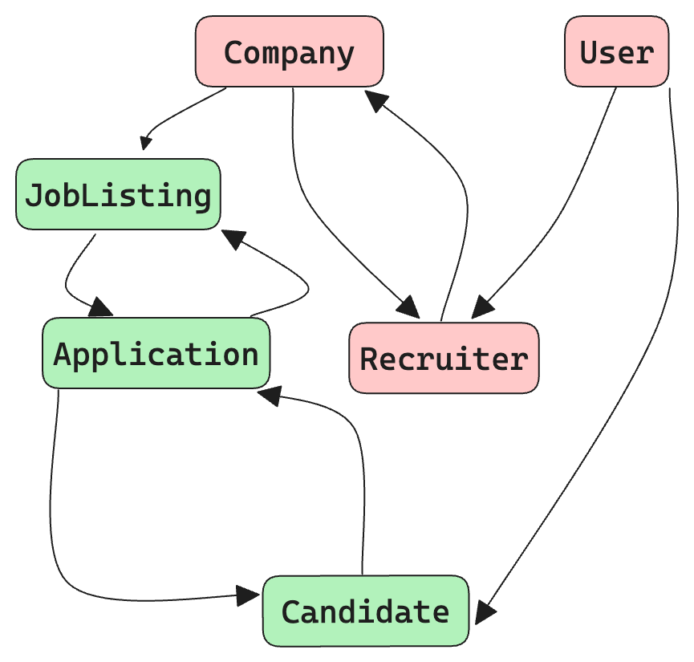

Designing a robust, scalable GraphQL schema is critical for building production-ready APIs that can evolve with your application's needs. In this comprehensive guide, we'll walk through the process of crafting a GraphQL schema for a real-world application, highlighting best practices and considerations along the way.

If you are thinking how we could possibly cover all of the lovely intricacies associated with this topic in one go, you are right, we can't and so we are not! We have created an amazing series to take you through the nuances of working with GraphQL schemas.

Let's break our job into puzzle pieces. Let's start by simply creating designing a brand new schema!

<!-- truncate -->

<div style={{textAlign: 'center', margin:'16px'}}>


</div>

If you're new to GraphQL Schema, check out our [GraphQL Schema Tutorial](https://tailcall.run/graphql/schemas-and-types/) to get up to speed with the basics.

## The Power of GraphQL Schemas

A well-designed GraphQL schema serves as the blueprint for your entire API. It defines:

- The types of data available
- The relationships between those types
- The operations clients can perform (queries, mutations, subscriptions)
- The structure of requests and responses

Your schema acts as a contract between your backend and frontend teams. Once published, clients can rely on its structure, enabling them to build UIs with confidence. A thoughtful schema design upfront can save significant refactoring down the road.

## Our Example Application: TechTalent

To illustrate schema design principles, let's imagine we're building TechTalent - a platform connecting tech companies with job seekers. Our application will allow:

- Companies to post job listings
- Candidates to create profiles and apply to jobs
- Recruiters to search candidates and manage applications

We'll design our schema step-by-step to support these core features.

## Step 1: Identify Core Types

The first step is to identify the main entities in our domain. For TechTalent, our core types might include:

- Company
- JobListing
- Candidate
- Application
- Recruiter

Let's start by defining these as object types in our schema:

```graphql
type Company {
  id: ID!
  name: String!
  description: String
  # More fields to come
}

type JobListing {
  id: ID!
  title: String!
  description: String!
  # More fields to come
}

type Candidate {
  id: ID!
  name: String!
  email: String!
  # More fields to come
}

type Application {
  id: ID!
  # More fields to come
}

type Recruiter {
  id: ID!
  name: String!
  email: String!
  # More fields to come
}
```

Notice we've only included a few basic fields at this stage. We'll flesh these out as we progress.

## Step 2: Model Relationships

Next, we need to consider how these types relate to each other. In GraphQL, we model relationships by adding fields that reference other types. Let's update our types:

```graphql
type Company {
  id: ID!
  name: String!
  description: String
  jobListings: [JobListing!]!
  recruiters: [Recruiter!]!
}

type JobListing {
  id: ID!
  title: String!
  description: String!
  company: Company!
  applications: [Application!]!
}

type Candidate {
  id: ID!
  name: String!
  email: String!
  applications: [Application!]!
}

type Application {
  id: ID!
  jobListing: JobListing!
  candidate: Candidate!
  status: ApplicationStatus!
}

type Recruiter {
  id: ID!
  name: String!
  email: String!
  company: Company!
}

enum ApplicationStatus {
  PENDING
  REVIEWED
  REJECTED
  ACCEPTED
}
```

We've now established the core relationships:

- Companies have job listings and recruiters
- Job listings belong to a company and have applications
- Candidates have applications
- Applications link a candidate to a job listing
- Recruiters belong to a company

Note the use of the `ApplicationStatus` enum to represent the fixed set of possible statuses.

## Step 3: Plan Query Operations

With our core types defined, let's consider what query operations our clients will need. We'll start with some basic CRUD (Create, Read, Update, Delete) operations:

```graphql
type Query {
  company(id: ID!): Company
  jobListing(id: ID!): JobListing
  candidate(id: ID!): Candidate

  # List operations
  companies: [Company!]!
  jobListings(filters: JobListingFilters): [JobListing!]!
  candidates(filters: CandidateFilters): [Candidate!]!
}

input JobListingFilters {
  companyId: ID
  title: String
  # Add more filter options
}

input CandidateFilters {
  skills: [String!]
  experienceYears: Int
  # Add more filter options
}
```

We've added basic queries to fetch individual entities by ID, as well as list queries for our main types. Notice the use of `input` types for filters - this allows for more flexible and extensible querying.

## Step 4: Plan Mutation Operations

Next, let's define some mutation operations to allow clients to modify data:

```graphql
type Mutation {
  # Company mutations
  createCompany(
    input: CreateCompanyInput!
  ): CreateCompanyPayload!
  updateCompany(
    id: ID!
    input: UpdateCompanyInput!
  ): UpdateCompanyPayload!

  # Job Listing mutations
  createJobListing(
    input: CreateJobListingInput!
  ): CreateJobListingPayload!
  updateJobListing(
    id: ID!
    input: UpdateJobListingInput!
  ): UpdateJobListingPayload!

  # Candidate mutations
  createCandidate(
    input: CreateCandidateInput!
  ): CreateCandidatePayload!
  updateCandidate(
    id: ID!
    input: UpdateCandidateInput!
  ): UpdateCandidatePayload!

  # Application mutations
  submitApplication(
    input: SubmitApplicationInput!
  ): SubmitApplicationPayload!
  updateApplicationStatus(
    id: ID!
    status: ApplicationStatus!
  ): UpdateApplicationStatusPayload!
}

# Input and Payload types for each mutation...
```

Notice the pattern we're using for mutations:

1. Each mutation has a corresponding input type
2. Each mutation returns a payload type

This structure offers several benefits:

- Input types allow for easy addition of new fields in the future
- Payload types can include both the modified entity and any errors or metadata
- It provides a consistent structure across all mutations

Let's look at an example input and payload type:

```graphql
input CreateJobListingInput {
  companyId: ID!
  title: String!
  description: String!
  requirements: [String!]!
  salary: SalaryInput
}

input SalaryInput {
  min: Int!
  max: Int!
  currency: String!
}

type CreateJobListingPayload {
  jobListing: JobListing
  errors: [Error!]
}

type Error {
  message: String!
  path: [String!]
}
```

This structure allows for detailed error reporting and future extensibility.

## Step 5: Consider Authentication and Authorization

In a production application, we need to consider authentication and authorization. Let's add some operations for user management:

```graphql
type Mutation {
  # ... previous mutations

  signup(input: SignupInput!): AuthPayload!
  login(input: LoginInput!): AuthPayload!
  logout: Boolean!
}

input SignupInput {
  email: String!
  password: String!
  name: String!
  role: UserRole!
}

input LoginInput {
  email: String!
  password: String!
}

type AuthPayload {
  token: String!
  user: User!
}

type User {
  id: ID!
  email: String!
  name: String!
  role: UserRole!
}

enum UserRole {
  CANDIDATE
  RECRUITER
  ADMIN
}
```

We've added basic authentication operations and a `User` type to represent authenticated users. In a real-world scenario, you'd likely want to implement more robust authentication and authorization mechanisms.

## Step 6: Implement Pagination

As our application grows, we'll need to implement pagination for our list queries. Let's update our `jobListings` query to use cursor-based pagination:

```graphql
type Query {
  # ... other queries

  jobListings(
    first: Int
    after: String
    filters: JobListingFilters
  ): JobListingConnection!
}

type JobListingConnection {
  edges: [JobListingEdge!]!
  pageInfo: PageInfo!
}

type JobListingEdge {
  node: JobListing!
  cursor: String!
}

type PageInfo {
  hasNextPage: Boolean!
  endCursor: String
}
```

This implementation follows the Relay connection specification, which provides a standardized way to handle pagination in GraphQL.

## Step 7: Plan for Real-time Updates

For certain features, we might want to provide real-time updates. Let's add a subscription to notify when new job listings are posted:

```graphql
type Subscription {
  newJobListing: JobListing!
}
```

Clients can subscribe to this operation to receive updates whenever a new job listing is created.

## Step 8: Implement Custom Scalars

Our schema might benefit from some custom scalar types for specific data formats. For example, let's add a `DateTime` scalar:

```graphql
scalar DateTime

type JobListing {
  # ... other fields
  postedAt: DateTime!
  applicationDeadline: DateTime
}
```

We'll need to implement the serialization/deserialization logic for this scalar in our resolvers.

## Step 9: Use Interfaces for Shared Fields

As our schema grows, we might notice some types sharing common fields. We can use interfaces to model this shared structure:

```graphql
interface Node {
  id: ID!
}

interface Timestamped {
  createdAt: DateTime!
  updatedAt: DateTime!
}

type Company implements Node & Timestamped {
  id: ID!
  createdAt: DateTime!
  updatedAt: DateTime!
  # ... other fields
}

type JobListing implements Node & Timestamped {
  id: ID!
  createdAt: DateTime!
  updatedAt: DateTime!
  # ... other fields
}
```

This approach promotes consistency and can make it easier to implement features that work across multiple types.

## Step 10: Document Your Schema

Finally, it's crucial to document your schema thoroughly. GraphQL allows for built-in documentation:

```graphql
"""
Represents a company on the TechTalent platform.
"""
type Company implements Node & Timestamped {
  """
  Unique identifier for the company.
  """
  id: ID!

  """
  The name of the company.
  """
  name: String!

  # ... other fields
}
```

Good documentation helps both your team and API consumers understand the purpose and usage of each type and field.

## Visualizing the Schema

To better understand the relationships in our schema, let's visualize the core types:



This diagram illustrates the key relationships between our main entities, helping us ensure our schema accurately represents our domain.

To visualize your schema, you can use tools like [GraphQL Voyager](https://graphql-kit.com/graphql-voyager/).

## Best Practices and Considerations

As we've designed our schema, we've touched on several best practices. Let's recap some key points and add a few more considerations:

1. **Start with the UI in mind**: Design your schema based on how the data will be used in your UI, not just how it's stored in your database.

2. **Use clear, consistent naming**: Adopt a naming convention (e.g., PascalCase for types, camelCase for fields) and stick to it.

3. **Leverage GraphQL features**: Make use of enums, interfaces, and unions to create a rich, expressive schema.

4. **Plan for change**: Use input types for mutations and consider versioning strategies for evolving your schema over time.

5. **Optimize for performance**: Be mindful of N+1 query problems and consider implementing DataLoader or similar batching mechanisms.

6. **Secure your schema**: Implement proper authentication and authorization. Consider using directives for field-level permissions.

7. **Validate input**: Use non-nullable fields and custom scalars to enforce data integrity at the schema level.

8. **Provide meaningful errors**: Return detailed error information in your mutation payloads to help clients handle failures gracefully.

9. **Monitor and analyze**: Implement logging and monitoring to understand how your schema is being used and where optimizations can be made.

10. **Keep it DRY**: Use interfaces and abstract types to reduce duplication in your schema.

## Conclusion

Designing a production-grade GraphQL schema is an iterative process that requires careful thought and planning. By starting with core types and relationships, then gradually adding queries, mutations, and advanced features, we can build a schema that's both powerful and maintainable.

Remember, your schema is a living document. As your application evolves, so too will your schema. By following these principles and best practices, you'll be well-equipped to design and maintain a GraphQL schema that can grow with your needs.

The TechTalent example we've explored here demonstrates many real-world considerations, but every application will have its unique requirements. Always design with your specific use cases in mind, and don't be afraid to iterate as you learn more about how your API is used in practice.

By investing time in thoughtful schema design upfront, you'll create a solid foundation for your GraphQL API, enabling efficient development and a great experience for your API consumers.

Alright greatttt! You have successfully completed the first part of a very intricate series!! Pat yourslef and maybe high five your cat! Here are the links to the next blogs in the series that have already been published.


- [Next Part](/blog/graphql-schema-part-2-1)
