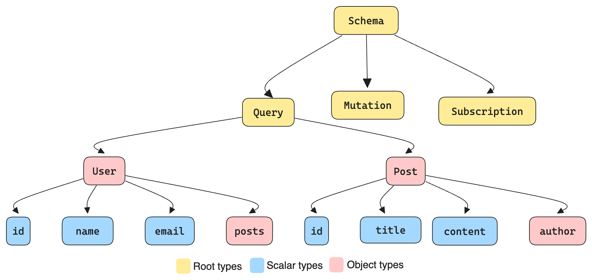

import Quiz from "../src/components/quiz/schema-quiz.tsx"



In our [previous post](https://tailcall.run/blog/graphql-schema/), we learnt scalable GraphQL schema is critical for building production-ready APIs that can evolve with your application's needs.

In this post, we will dive deeper on how to **continuously** evolve your schema to meet your application's changing requirements without Hard coded versioning.

<!-- truncate -->

You know that feeling when you're working on a project, and suddenly you realize your schema needs to change? Maybe you need to add a new field, modify an existing one, or even remove something entirely. It's enough to make any developer break out in a cold sweat, right?

But fear not! I'm here to show you **how to evolve your schema like a pro**, keeping your API fresh and exciting without causing your clients to tear their hair out.

## The Good, The Bad, and The Ugly of Schema Changes

Not all changes are created equal. In this section, we’ll analyze a few different types of changes and what makes them safe or unsafe.
First things first, let's break down the types of changes we might make to our schema:

1. **Safe Changes:** These are the golden children of schema evolution. You can make these changes anytime, and your clients won't even bat an eyelash.

2. **Dangerous Changes:** These are the sneaky ones. They might not break anything outright, but they can cause subtle issues that'll have your clients scratching their heads. We'll need to proceed carefully here.

3. **Breaking Changes:** The name says it all. These changes will send your clients' applications crashing down faster than you can say "**GraphQL**". We want to avoid these like the plague, but sometimes they're necessary. Don't worry, I'll show you how to handle them like a pro.


## Adding Without Breaking: The Art of Additive Changes

Let's start with the good stuff: **Additive changes**.

Most of the time, these are safe as houses.

For example, adding fields & adding types is unlikely to cause issues for clients. But, there are a few tricky scenarios to watch out for.

### The Optional Argument Conundrum

Adding optional arguments is generally safe - it's like offering your clients a shiny new toy without forcing them to play with it.

However, there's a catch. Check this out:

```diff
  type Query {
-   products(category: String): [Product!]!
+   products(category: String, inStock: Boolean): [Product!]!
  }
```

See what we did there? We added an optional `inStock` argument. Seems harmless, right?

Let's dive deeper into why changing the behavior of a resolver when an optional argument isn't provided can be problematic:

```graphql
type Query {
  products(category: String, inStock: Boolean): [Product!]!
}
```

Imagine you have clients that have been using this query:

```graphql
query {
  products(category: "Electronics") {
    name
    price
  }
}
```

If your resolver suddenly starts filtering out out-of-stock products when `inStock` isn't provided, these clients will unexpectedly receive fewer results. This could break their UI or data processing logic.

To avoid this issue, you can implement a strategy to handle the absence of the `inStock` argument gracefully in your resolver, so that the behavior remains consistent for clients.


### The Required Argument Trap

Now, this is where things get spicy 🌶️.

Adding a required argument is almost always a **breaking change**.

But, fear not! There's a way out:

```diff
  type Query {
-   products(category: String): [Product!]!
+   products(category: String, sortBy: SortOption!): [Product!]!
  }
```

This change is **breaking**, but it doesn't have to be.

You can provide a **default value** for the new argument to keep your existing clients happy.

```diff
type Query {
-    products(category: String): [Product!]!
+    products(category: String, sortBy: SortOption! = POPULARITY): [Product!]!
}
```

See that `= POPULARITY`? That's your get-out-of-jail-free card. By providing a default value, you've made this addition safe.

Existing clients will use the default, and new clients can take advantage of the sorting option.

Let's expand on why providing a default value for new required arguments is so crucial:

```graphql
type Query {
  products(category: String, sortBy: SortOption! = POPULARITY): [Product!]!
}
```

This approach offers several benefits:

1. **Backward Compatibility**: Existing clients that don't include the sortBy argument will continue to work without modification.

2. **Gradual Adoption**: New clients can start using the sorting feature immediately, while old clients can be updated at their own pace.

3. **Clear Intent**: The default value communicates the expected behavior to API consumers.

4. **Flexibility**: You can change the default sorting in the future without breaking existing queries.


:::tip
Always provide a **default value** for new required arguments to avoid breaking changes.
:::

## The Interface and Union Twist

Now, let's talk about some trickier additive changes that can catch you off guard if you're not careful.

### Adding New Interface Implementations

Adding a new type that implements an existing interface might seem harmless, but it can cause some unexpected behavior. Check this out:

```graphql
interface Node {
  id: ID!
}

type User implements Node {
  id: ID!
  name: String!
}

type Team implements Node {
  id: ID!
  name: String!
}

# New type
type Organization implements Node {
  id: ID!
  name: String!
  employees: [User!]!
}
```

By adding the `Organization` type, we've expanded what could be returned by queries selecting for `Node`. This could break clients that aren't prepared to handle new types. Always encourage clients to use proper type checking.

```graphql
query {
  node(id: "1") {
    ... on User {
      name
    }
    ... on Team {
      name
    }
    ... on Organization {
      name
      employees {
        name
      }
    }
  }
}
```

Without proper type checking, clients might encounter these issues:

1. **Runtime Errors:** If a client assumes all Node types have only a name field, they might try to access `employees` on a `User` or `Team`, causing errors.

2. **Missing Data:** Clients might not display Organization-specific data if they're not prepared to handle it.

3. **Incorrect Data Processing:** Business logic that assumes only `User` and `Team` types exist might produce incorrect results.

To mitigate these issues:

1. Use TypeScript or Flow on the client-side to catch type errors at compile-time.

2. Implement exhaustive type checking in your client code:

```typescript
function handleNode(node: Node) {
  switch (node.__typename) {
    case "User":
      return handleUser(node)
    case "Team":
      return handleTeam(node)
    case "Organization":
      return handleOrganization(node)
    default:
      const _exhaustiveCheck: never = node
      throw new Error(`Unhandled node type: ${(_exhaustiveCheck as any).__typename}`)
  }
}
```

This approach ensures that if a new type is added in the future, TypeScript will raise a compile-time error, prompting developers to update their code.

### The Union Expansion Conundrum

Similar to interfaces, adding new members to a union can cause runtime surprises. Consider this:

```diff
-  union SearchResult = User | Post
+  union SearchResult = User | Post | Comment
```

Surprise! Your clients might suddenly receive a type they weren't expecting. It's like opening a box of chocolates and finding a pickle - not necessarily bad, but definitely unexpected. Make sure to document how clients should handle these surprise types.

Let's delve into why union expansions can be tricky and how to handle them gracefully:

When you add Comment to the SearchResult union, existing clients might break in subtle ways:

1. **Incomplete UI:** If the client only has UI components for User and Post, Comment results won't be displayed.
3. **Runtime Errors:** Code that assumes only User and Post types exist might throw errors when encountering a Comment.

To handle this gracefully:

1. Implement a fallback UI component for unknown types:

   ```tsx
   function SearchResultItem({result}) {
     switch (result.__typename) {
       case "User":
         return <UserResult user={result} />
       case "Post":
         return <PostResult post={result} />
       case "Comment":
         return <CommentResult comment={result} />
       default:
         return <UnknownResultType type={result.__typename} />
     }
   }
   ```


2. Encourage clients to use introspection queries to stay updated on schema changes:

    ```graphql
        query {
          __type(name: "SearchResult") {
            kinds
            possibleTypes {
              name
            }
          }
        }
    ```

By implementing these strategies, clients can gracefully handle new union members without breaking existing functionality.

### The Enum Evolution

Adding new enum values seems innocent enough, but it can impact client-side logic. Let's look at an example:

```diff
  enum OrderStatus {
   PENDING
   COMPLETED
+  CANCELED
+  REFUNDED
}
```

Clients that were using exhaustive switches might now have incomplete logic. Encourage clients to use default cases to handle new enum values.

```typescript
switch (order.status) {
  case "PENDING":
    return "Order is pending"
  case "COMPLETED":
    return "Order is completed"
  default:
    return "Order status unknown"
}
```

## The Modification Minefield

Now, let's talk about modifying existing parts of your schema. This is where things can get really hairy. For example, changing a field’s type or changing the name of a type is a big breaking change.

### The Default Value Dilemma

Changing default values might seem innocent, but it can cause some serious headaches. Consider this:

```diff
type Query {
-  products(category: String, showOutOfStock: Boolean = False): [Product!]!
+  products(category: String, showOutOfStock: Boolean = True): [Product!]!
}
```

Changing the default value of an argument or input field is unlikely to be a breaking change in terms of the schema itself, but is very likely to cause issues at runtime if the default value affects the runtime behavior of the field.

Avoid this change in general, but it may be possible to achieve if the behavior of the field does not change.

### Changing Description or Deprecation

Changing the description of fields, types and any member is unlikely to cause any
harm to clients. Clients should not depend on schema descriptions for runtime logic!

## The Subtraction Subterfuge

Removing things from your schema is almost always a breaking change. If you remove a field, type, or argument, clients that depend on it will break. You can't just take things away without consequences.

:::important
All subtractive changes to a schema are **breaking changes**.
:::

But sometimes, it's necessary. Here's how to do it without causing a riot.

### The Field Farewell

Let's say we want to remove a field because it's causing performance issues. Here's the smart way to do it:

1. Introduce a replacement
1. Deprecate the old field
1. Wait (patiently!)
1. Remove when usage has died down

```diff
type Query {
-  products(first: Int!): [Product!]!
+  products(first: Int!): [Product!]! @deprecated(reason: “products is deprecated and
is getting replaced by the field `topProducts`.”)
+  topProducts(first: Int!): [Product!]!
}
```

By introducing `topProducts` and deprecating `products`, we give our clients time to adapt. And hey, we've even improved our API in the process!

The old field may be removed after a certain period and if the usage for it has gone down. Keep in mind you don’t necessarily have to make the change unless absolutely needed. Additive changes and deprecations are sometimes enough to keep evolving the API.

### The Argument Abandonment

Removing an argument is similar to removing a field. You can deprecate it and introduce a new field with the desired behavior. Clients will have time to migrate to the new field before the old one is removed.

```diff
type Query {
-  products(first: Int!, featured: Boolean): String!
+  products(first: Int!, featured: Boolean): String! @deprecated(reason: “products
is deprecated, use `allProducts` for products and `featuredProducts` to get products that are featured”
+  allProducts(first: Int!): String!
+  featuredProducts(first: Int!): String!
}
```

If you need to make a change to an existing field, because arguments can’t be depre- cated just yet, you should indicate that the argument is deprecated through its description.

```diff
type Query {
- products(first: Int!, featured: Boolean): String!
+  products(first: Int!,
+  # DEPRECATED: This argument will be removed. Use query `featuredProducts`.
+  featured: Boolean
+   ): String!
}
```

### The Non-Null to Null Transformation

This is one of the trickiest changes to make. You thought making a field non-null was a good idea, but now you need to change it back. Here's how to handle it:

For scalar fields, you might be able to save your users from errors by returning the empty value instead of null.

For object types, sometimes it’s possible to use a “Empty Object” when the result is null.

This approach can help prevent null pointer exceptions on the client side.

### The Type Deletion Dilemma

Sometimes, you need to remove an entire type from your schema. This is a major operation and requires careful planning.

1. First, deprecate all fields that return this type:

   ```graphql
   type Query {
     oldUser(id: ID!): OldUser @deprecated(reason: "Use `user` query with new User type instead")
     user(id: ID!): User
   }
   ```

2. If the type is part of a union or implements an interface, you'll need to be extra cautious. These can't be easily deprecated, so clear communication is key.
3. Finally, after a long deprecation period and when usage has dropped to zero, you can remove the type entirely.

Note that you might want to deprecate using that type within your codebase to avoid developers to use that User type for new fields.
Removing a type is even trickier when it’s part of union types or implements interfaces. Once again, union members and interface implementations cannot be marked as deprecated. This means that fields like node may stop working correctly if the type you’re removing was reachable through that field.

Your best bet in these cases are to either keep this type as part of unions and through interfaces or to communicate that change very carefully through descriptions and out of band communication like documentation and emails.

### Changing a Field Type

Changing a field’s type is not a change we can make easily. Once again, approaching the change in an additive is often your best bet.

```diff
type User {
  bestFriend: String! @deprecated(reason: “Use `bestFriendObject` instead.”)
+ bestFriendObject: User!
}
```

As you might have noticed, the downside of additive changes is that often the best names are already taken. If wanted, you may remove the original field and reintroduce it under the new object at that point.

```diff
type User {
- bestFriend: String! @deprecated(reason: “Use `bestFriendObject` instead.”)
  bestFriendObject: User!
+ bestFriend: User!
}
```

## Conclusion

Evolving a GraphQL schema is a delicate balance between innovation and stability. By following the principles and strategies outlined in this article, you can confidently evolve your schema while minimizing disruption to your clients.

Remember these key takeaways:

1. **Favor Additive Changes**: Whenever possible, add new fields, types, or arguments instead of modifying existing ones. This approach maintains backward compatibility while allowing your schema to grow.

2. **Communicate Clearly**: Use deprecation notices, schema descriptions, and out-of-band communication to keep your clients informed about upcoming changes.

3. **Provide Transition Paths**: When breaking changes are necessary, offer clear migration paths. This might involve introducing new fields alongside deprecated ones or providing new query structures that achieve the same results.

4. **Leverage Schema Design Tools**: Use schema comparison tools, custom deprecation systems, and usage tracking to make informed decisions about schema evolution.

5. **Think Long-term**: Consider the future implications of your schema design choices. A well-designed schema should be flexible enough to accommodate new features without frequent breaking changes.

6. **Empower Your Clients**: Provide guidelines and best practices for consuming your API. This includes proper type checking, handling of unknown types, and staying updated with schema changes.

By treating your GraphQL schema as a product with its own lifecycle and evolution strategy, you can build APIs that are both powerful and adaptable. This approach allows you to innovate rapidly while providing a stable and reliable service to your clients.

Remember, a great GraphQL schema is never truly finished – it's a living, breathing entity that grows and evolves with your application's needs. Embrace this continuous evolution, and you'll create APIs that stand the test of time.

## Quiz Time! 🎉

Now that we've explored the intricacies of evolving GraphQL schemas, let's put your knowledge to the test! Can you correctly identify which changes are safe, dangerous, or breaking? Take the quiz below to find out!

<Quiz
  questions={[
    {
      id: 1,
      text: "Adding a new field to a GraphQL schema is a:",
      options: ["Safe change", "Dangerous change", "Breaking change"],
      correctAnswer: 0,
    },
    {
      id: 2,
      text: "Removing a field from a GraphQL schema is a:",
      options: ["Safe change", "Dangerous change", "Breaking change"],
      correctAnswer: 2,
    },
    {
      id: 3,
      text: "Adding a new required argument to an existing field without a default value is a:",
      options: ["Safe change", "Dangerous change", "Breaking change"],
      correctAnswer: 2,
    },
    {
      id: 4,
      text: "Changing a field's return type from a specific type to a more general type (e.g., String to ID) is a:",
      options: ["Safe change", "Dangerous change", "Breaking change"],
      correctAnswer: 1,
    },
    {
      id: 5,
      text: "Adding a new type that implements an existing interface is a:",
      options: ["Safe change", "Dangerous change", "Breaking change"],
      correctAnswer: 1,
    },
  ]}
/>

Remember, understanding the impact of schema changes is crucial for maintaining a robust and client-friendly GraphQL API. Keep practicing and always consider the potential consequences of your schema modifications!
