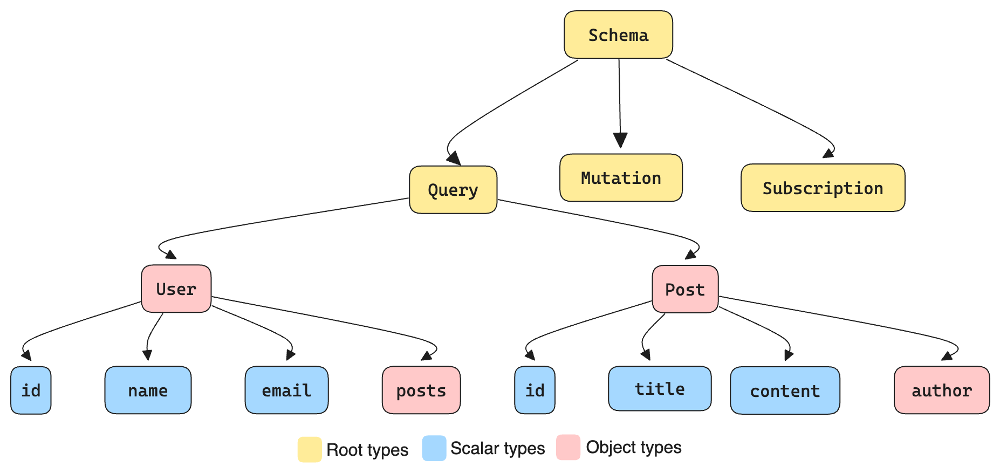

import Quiz from "../src/components/quiz/quiz.tsx"



## Removing Without Breaking: The Subtraction Subterfuge

In our [previous post](https://tailcall.run/blog/graphql-schema-part-2-2), we explored how to modify existing schema elements without causing disruptions. Now, we'll tackle the most challenging part: removing schema elements and handling breaking changes.

<!-- truncate -->

## The Subtraction Subterfuge

Removing things from your schema is almost always a breaking change. If you remove a field, type, or argument, clients that depend on it will break. You can't just take things away without consequences.

But sometimes, it's necessary. Here's how to do it without causing a riot.

### The Field Farewell

Let's say we want to remove a field because it's causing performance issues. Here's the smart way to do it:

1. Introduce a replacement
2. Deprecate the old field
3. Wait (patiently!)
4. Remove when usage has died down

```diff
type Query {
-  products(first: Int!): [Product!]!
+  products(first: Int!): [Product!]! @deprecated(reason: “products is deprecated and is getting replaced by the field `topProducts`.”)
+  topProducts(first: Int!): [Product!]!
}
```

By introducing `topProducts` and deprecating `products`, we give our clients time to adapt. And hey, we've even improved our API in the process!

The old field may be removed after a certain period and if the usage for it has gone down. Keep in mind you don’t necessarily have to make the change unless absolutely needed. Additive changes and deprecations are sometimes enough to keep evolving the API.

### The Argument Abandonment

Removing an argument is similar to removing a field. You can deprecate it and

introduce a new field with the desired behavior. Clients will have time to migrate to the new field before the old one is removed.

```diff
type Query {
-  products(first: Int!, featured: Boolean): String!
+  products(first: Int!, featured: Boolean): String! @deprecated(reason: “products is deprecated, use `allProducts` for products and `featuredProducts` to get products that are featured”)
+  allProducts(first: Int!): String!
+  featuredProducts(first: Int!): String!
}
```

If you need to make a change to an existing field, because arguments can’t be deprecated just yet, you should indicate that the argument is deprecated through its description.

```diff
type Query {
- products(first: Int!, featured: Boolean): String!
+  products(first: Int!,
+  # DEPRECATED: This argument will be removed. Use query `featuredProducts`.
+  featured: Boolean
+   ): String!
}
```

### The Type Deletion Dilemma

Sometimes, you need to remove an entire type from your schema. This is a major operation and requires careful planning.

1. First, deprecate all fields that return this type:

```graphql
type Query {
  oldUser(id: ID!): OldUser @deprecated(reason: "Use `user` query with new User type instead")
  user(id: ID!): User
}
```

2. If the type is part of a union or implements an interface, you'll need to be extra cautious. These can't be easily deprecated, so clear communication is key.
3. Finally, after a long deprecation period and when usage has dropped to zero, you can remove the type entirely.

Note that you might want to deprecate using that type within your codebase to avoid developers to use that User type for new fields. Removing a type is even trickier when it’s part of union types or implements interfaces. Once again, union members and interface implementations cannot be marked as deprecated. This means that fields like node may stop working correctly if the type you’re removing was reachable through that field.

Your best bet in these cases are to either keep this type as part of unions and through interfaces or to communicate that change very carefully through descriptions and out of band communication like documentation and emails.

## Quiz Time! 🎉

<Quiz
  questions={[
    {
      id: 1,
      text: "What is a critical consideration before removing a field from a GraphQL schema?",
      options: [
        "Ensuring the field is no longer in use by any clients",
        "Providing a detailed explanation in the schema documentation",
        "Immediately notifying all clients via email",
        "Replacing the field with a temporary placeholder",
      ],
      correctAnswer: 0,
    },
    {
      id: 2,
      text: "Why is it recommended to deprecate a field before removing it?",
      options: [
        "To avoid immediate schema validation errors",
        "To provide clients with time to migrate to the new schema",
        "To enhance schema performance temporarily",
        "To test the removal process in a staging environment",
      ],
      correctAnswer: 1,
    },
    {
      id: 3,
      text: "What is the best practice for handling arguments that cannot be deprecated directly in GraphQL?",
      options: [
        "Removing the argument immediately and updating the resolver",
        "Indicating the deprecation through the argument's description",
        "Notifying clients to ignore the argument",
        "Using schema validation to enforce the change",
      ],
      correctAnswer: 1,
    },
    {
      id: 4,
      text: "What is a key risk when removing a type that is part of a union or implements an interface?",
      options: [
        "It will cause performance degradation",
        "It cannot be documented properly",
        "It may break queries that rely on the type",
        "It requires changing the schema version",
      ],
      correctAnswer: 2,
    },
    {
      id: 5,
      text: "Before removing an entire type from the schema, which step is essential?",
      options: [
        "Changing the type to a deprecated placeholder",
        "Deprecating all fields that return this type",
        "Ensuring no clients are using the type",
        "Updating the resolver logic to handle the removal",
      ],
      correctAnswer: 1,
    },
    {
      id: 6,
      text: "When removing a type that is widely used, what is a crucial communication strategy?",
      options: [
        "Update the schema silently and track client errors",
        "Send detailed migration guides and update documentation",
        "Force clients to adapt immediately by pushing changes",
        "Use a different API version to manage the change",
      ],
      correctAnswer: 1,
    },
    {
      id: 7,
      text: "How can you minimize disruption when removing an argument from a GraphQL query?",
      options: [
        "Immediately notify all clients",
        "Provide a new query or field that does not use the argument",
        "Deprecate the entire query",
        "Change the schema version",
      ],
      correctAnswer: 1,
    },
    {
      id: 8,
      text: "What is the primary goal of providing a deprecation period before removing a schema element?",
      options: [
        "To test the impact of the removal on server performance",
        "To allow clients sufficient time to adjust their queries",
        "To prepare the documentation for the change",
        "To gradually phase out old schema versions",
      ],
      correctAnswer: 1,
    },
  ]}
/>

## Conclusion

Removing schema elements is a delicate process that requires strategic planning and clear communication to avoid breaking changes. By following the principles and strategies outlined in this article, you can confidently remove fields, arguments, and types while minimizing disruption to your clients.

Remember these key takeaways:

1. **Communicate Clearly**: Use deprecation notices, schema descriptions, and out-of-band communication to keep your clients informed about upcoming changes.
2. **Provide Transition Paths**: When breaking changes are necessary, offer clear migration paths. This might involve introducing new fields alongside deprecated ones or providing new query structures that achieve the same results.
3. **Monitor Usage**: Keep an eye on usage metrics to determine when it's safe to remove deprecated elements. Don't rush the process – give your clients time to adapt.

By treating your GraphQL schema as a product with its own lifecycle and evolution strategy, you can build APIs that are both powerful and adaptable. This approach allows you to innovate rapidly while providing a stable and reliable service to your clients.

Remember, a great GraphQL schema is never truly finished – it's a living, breathing entity that grows and evolves with your application's needs. Embrace this continuous evolution, and you'll create APIs that stand the test of time.
