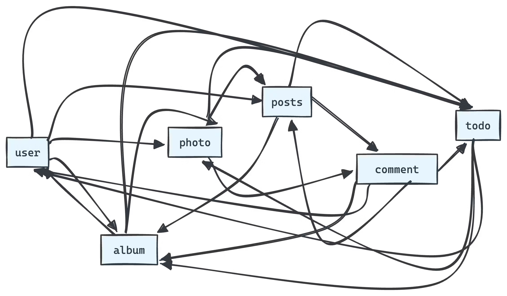
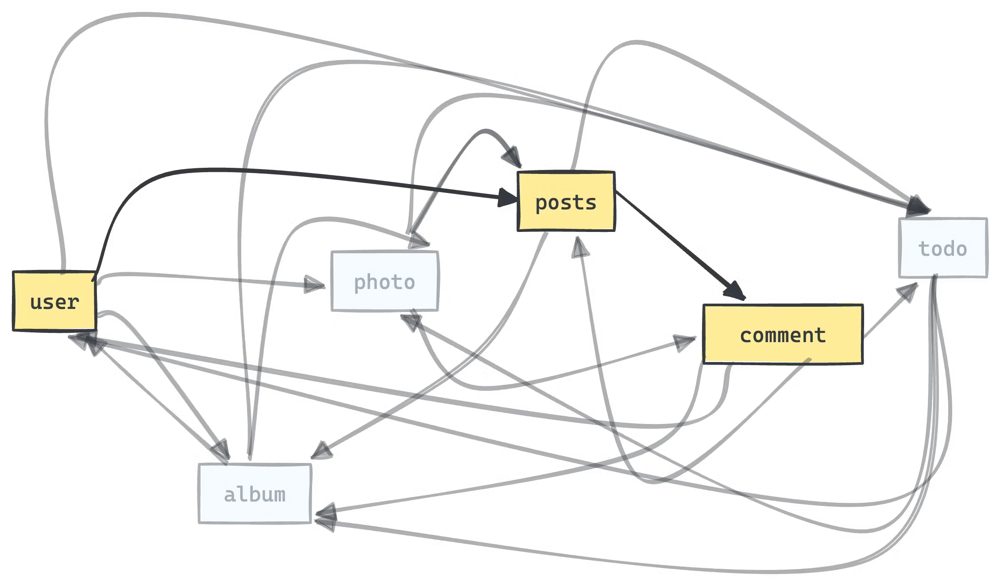

<head>
<link rel="canonical" href="https://tailcall.hashnode.dev/graphql-vs-rest-vs-grpc"/>
<title>GraphQL vs REST vs gRPC - an unfair comparison</title>
</head>

Since its inception, GraphQL has steadily gained popularity, often finding itself at the center of comparisons with other data query and manipulation languages such as REST and gRPC. The internet is replete with articles debating the merits and demerits of each, with some even questioning the viability of GraphQL. However, this discourse misses a crucial point: the unique strengths of GraphQL. This article aims to illuminate the distinct advantages GraphQL offers, particularly in addressing a common but complex challenge known as impedance mismatch.

<!-- truncate -->

Impedance mismatch refers to the discordance between the capabilities of an existing API and the ideal features required for a specific use case. From the perspective of a platform engineer, the goal is to develop APIs that cater to a broad range of needs. Yet, crafting a unique API for every conceivable requirement is neither practical nor efficient. Consequently, engineers often end up creating generalized APIs. However, as a consumer, you might find these APIs lacking in some respects while being superfluous in others. Furthermore, as your needs evolve, so does your notion of the ideal API, exacerbating this mismatch. Herein lies the brilliance of GraphQL: it offers a framework for structuring data exposure and queries that significantly mitigates this issue.

The GraphQL specification introduces the concept of viewing data as a graph composed of nodes, which represent domain entities for a business, interconnected by relationships that define their interactions. For instance, in the development of a social network, a user entity might have the ability to create a post, which in turn could receive comments, illustrating the interconnected nature of data entities.

With the data conceptualized as a graph, GraphQL advocates for a method of querying that allows for precise data retrieval. This selective querying capability enables developers to request exactly the data they need, distinguishing GraphQL from REST and gRPC which aren't truly a "queryable". The precision of GraphQL extends to the granularity of specifying individual fields within entities, facilitating extremely efficient and targeted queries.

Notably, the GraphQL specification does not prescribe any specific data storage methodologies but focuses on the manner in which data is queried, hence the designation "Graph Query Language." This approach allows for queries tailored to specific requirements, such as obtaining posts by the current user along with comments on those posts. By enabling precise data queries, GraphQL helps in avoiding the inefficiencies associated with over-fetching or under-fetching data, thereby enhancing overall system performance.

The impedance mismatch is not solely a technical issue pertaining to the differences in API schemas. It extends into the realm of development processes as well. GraphQL significantly ameliorates this aspect by allowing the consumers of an API to begin their work even before the actual API is fully implemented. This is made possible through the agreement on a schema upfront. By decoupling the dependency between the consumer and the provider of the API, GraphQL facilitates a more efficient and flexible development process.

Comparing GraphQL with REST or gRPC on this front might not do justice to their distinct objectives. REST and gRPC are primarily designed as lightweight RPC protocols, not specifically to address impedance mismatch for which a full fledged query language is more suitable. A more apt comparison would be with OpenAPI, which also allows for API composition. However, OpenAPI's capabilities in fine-tuning what an API delivers are somewhat [constrained](https://swagger.io/specification/#composition-and-inheritance-polymorphism) compared to GraphQL's flexible querying capabilities.

Beyond the technical resolution of impedance mismatch, GraphQL addresses a critical business problem: the inefficiency in software development that arises from this gap between actual and ideal APIs. This inefficiency leads to developers spending excessive time on API orchestration—time that could be better spent on core application development. They find themselves constantly writing, revising, and optimizing APIs and their orchestration, as well as managing the fallout from breaking changes. By leveraging GraphQL, developers can significantly reduce these frictions, streamlining the development process and enhancing productivity. In essence, GraphQL not only solves a technical problem but also delivers substantial business value by enabling more efficient and flexible software development practices.

GraphQL offers an excellent developer experience for API consumption with its intuitive query language that allows for retrieving deeply nested data independently of the upstream source. However, it does have some limitations. At [Tailcall](https://tailcall.run), we are dedicated to making GraphQL more accessible and easier to work with.

If you like what you just read, please do subscribe and share on twitter and linkedin 🙏
