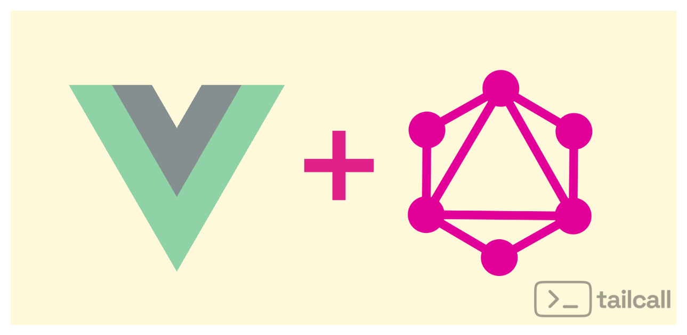

---
authors:
  - name: David Onyedikachi
    title: NodeJs-Golang Backend Developer, with experience in Python, Rust, and Solidity
    url: https://github.com/onyedikachi-david
    image_url: https://avatars.githubusercontent.com/u/51977119?v=4
tags: [GraphQL, Vue, Apollo client]
hide_table_of_contents: true
title: "GraphQL in Vue: 5 Best Approaches for Data Fetching"
description: "Explore Apollo Vue, Villus, and other methods for efficient GraphQL integration in Vue applications, with detailed comparisons and error handling strategies."
sidebar_label: "GraphQL in Vue"
slug: graphql-vue-client
image: /image/blog/vue-with-graphql.png
---



## Introduction

### GraphQL in Vue: 5 Best Approaches for Data Fetching

Hey there, Vue enthusiasts! 👋 Are you ready to supercharge your data fetching game? Buckle up, because we're about to embark on an exhilarating journey through the world of GraphQL in Vue!

You know that feeling when you're trying to fetch data for your Vue app, and it feels like you're wrestling with an octopus? 🐙 Well, fear not! GraphQL is here to turn that octopus into a well-behaved pet that fetches exactly what you need, when you need it.

In this guide, we'll explore five fantastic approaches to integrating GraphQL with Vue. It's like we're about to open a treasure chest of data fetching goodies, and trust me, you'll want to get your hands on these gems! 💎

So, whether you're a GraphQL newbie or a seasoned pro, there's something here for everyone. We'll dive deep into each method, compare them side by side, and even tackle the thorny issue of error handling. By the end of this article, you'll be slinging GraphQL queries like a data-fetching superhero! 🦸‍♀️

Ready to level up your Vue app? Let's dive in!

### 🛠️ Project Setup

Let's start by setting up our Vue project with Vite, which provides a faster and leaner development experience:

```bash
npm create vite@latest vue-graphql-tailcall-showcase -- --template vue-ts
cd vue-graphql-tailcall-showcase
npm install
```

This creates a new Vue 3 project with TypeScript support. Now, let's install the necessary dependencies for our GraphQL experiments:

```bash
npm install @apollo/client @vue/apollo-composable graphql
npm install @urql/vue
npm install axios
npm install villus
```

These installations will allow us to explore different GraphQL client options in our Vue application.

### 🔧 Tailcall Backend Configuration

Now, let's set up our Tailcall backend that will wrap the JSONPlaceholder API, providing a GraphQL interface to RESTful data.

First, create a `tailcall` directory in the project root:

```bash
mkdir tailcall
```

Then, create a `jsonplaceholder.graphql` file in this directory:

```graphql
# File: tailcall/jsonplaceholder.graphql

schema
  @server(port: 8000, hostname: "0.0.0.0")
  @upstream(
    baseURL: "http://jsonplaceholder.typicode.com"
    httpCache: 42
  ) {
  query: Query
}

type Query {
  posts: [Post] @http(path: "/posts")
  user(id: Int!): User @http(path: "/users/{{.args.id}}")
}

type User {
  id: Int!
  name: String!
  username: String!
  email: String!
  phone: String
  website: String
}

type Post {
  id: Int!
  userId: Int!
  title: String!
  body: String!
  user: User @http(path: "/users/{{.value.userId}}")
}
```

This GraphQL schema defines our API structure, mapping RESTful endpoints to GraphQL types and queries.

To start the Tailcall server, you'll need to have Tailcall installed. If you haven't installed it yet, follow the installation instructions from the Tailcall documentation. Once installed, you can start the server with:

```sh
tailcall start ./tailcall/jsonplaceholder.graphql
```

This command starts a GraphQL server on `http://localhost:8000`, which will act as a bridge between our Vue application and the JSONPlaceholder API.

With this setup, we're ready to dive into the exciting world of GraphQL in Vue! 🚀 Our Tailcall backend provides a perfect playground for exploring different GraphQL client approaches, allowing us to fetch posts and user data with the flexibility and power of GraphQL queries. In the following sections, we'll explore how to leverage this backend with various GraphQL clients in our Vue application. Get ready for some data-fetching magic! ✨

Alright, let's dive into our first approach: Apollo Client! 🚀

## Approach 1: Apollo Client - The Swiss Army Knife of GraphQL

Picture this: You're a data-fetching chef, and Apollo Client is your top-of-the-line kitchen knife set. It's sharp, versatile, and makes slicing through complex queries feel like cutting through butter. Let's see how we can whip up a delicious Vue dish with Apollo Client!

### 1. Installation and Integration Steps

First things first, let's get our ingredients ready. You'll need to install the following packages:

```bash
npm install @apollo/client @vue/apollo-composable graphql
```

Now, let's set the table. In your `main.js` file, you'll need to create an Apollo Client instance and provide it to your Vue app. It's like setting up your kitchen before you start cooking!

```javascript
import {createApp, provide, h} from "vue"
import {
  ApolloClient,
  InMemoryCache,
} from "@apollo/client/core"
import {DefaultApolloClient} from "@vue/apollo-composable"

const apolloClient = new ApolloClient({
  uri: "YOUR_GRAPHQL_ENDPOINT",
  cache: new InMemoryCache(),
})

const app = createApp({
  setup() {
    provide(DefaultApolloClient, apolloClient)
  },
  render: () => h(App),
})
```

### 2. Code Snippets

Now, let's get cooking! Here's how you can use Apollo Client in your Vue component:

```typescript
<script setup lang="ts">
import { useQuery } from '@vue/apollo-composable'
import gql from 'graphql-tag'
import { ref, watch } from 'vue'

interface Post {
  id: number
  title: string
  body: string
  user: {
    name: string
  }
}

const GET_POSTS_QUERY = gql`
  query GetPosts {
    posts(limit: 10) {
      id
      title
      body
      user {
        name
      }
    }
  }
`

const { result, loading, error, refetch } = useQuery<{ posts: Post[] }>(GET_POSTS_QUERY)

const fetchPosts = () => {
  refetch()
}

// Error handling logic...
</script>

<template>
  <div class="container">
    <h2>Apollo Client Example</h2>
    <button @click="fetchPosts">Fetch Posts</button>
    <!-- Display logic... -->
  </div>
</template>
```

Isn't that neat? 😎 With Apollo Client, fetching data is as easy as pie. The `useQuery` composable does all the heavy lifting for you, serving up your data on a silver platter.

### 3. Error Handling

But wait, what if something goes wrong in our kitchen? Don't worry, Apollo Client has got your back with some top-notch error handling:

```typescript
const networkError = (ref < string) | (null > null)
const graphqlError = (ref < string) | (null > null)
const unexpectedError = (ref < string) | (null > null)

watch(error, (newError) => {
  if (newError) {
    if (newError.networkError) {
      networkError.value =
        "Network error: " + newError.networkError.message
    } else if (
      newError.graphQLErrors &&
      newError.graphQLErrors.length > 0
    ) {
      graphqlError.value =
        "GraphQL error: " +
        newError.graphQLErrors
          .map((e) => e.message)
          .join(", ")
    } else {
      unexpectedError.value =
        "Unexpected error: " + newError.message
    }
  } else {
    networkError.value = null
    graphqlError.value = null
    unexpectedError.value = null
  }
})
```

This error handling is like having a sous chef who catches any mishaps before they ruin your dish. Network errors, GraphQL errors, or unexpected issues - all neatly categorized and ready to be displayed to the user.

### 4. Why Apollo Client Rocks

1. **Powerful Caching**: Apollo Client comes with a built-in caching system that's smarter than your average bear. It automatically caches your query results, making subsequent requests lightning fast.

2. **Real-time Updates**: With Apollo Client, your app can feel alive! It supports real-time updates out of the box, perfect for those dynamic, data-driven applications.

3. **Optimistic UI**: Want to make your UI feel snappy? Apollo Client's optimistic UI features let you update the UI before the server responds. It's like time travel for your data!

4. **Developer Tools**: The Apollo DevTools extension for Chrome is like having x-ray vision for your GraphQL queries. Debug, inspect cache, and watch your queries in real-time!

So there you have it, folks! Apollo Client - the superhero of GraphQL clients. It's powerful, flexible, and comes with more features than you can shake a stick at. But is it the perfect fit for every scenario? Stay tuned as we explore more approaches and find out!

Next up, we'll be looking at another contender in the GraphQL arena. Will it give Apollo a run for its money? Let's find out! 🏃‍♂️💨

## Approach 2: URQL - The Lightweight Contender

Ladies and gentlemen, put your hands together for URQL! 👏 If Apollo Client is the heavyweight champion of GraphQL clients, URQL is the nimble featherweight that packs a surprising punch. Let's dive into this lean, mean, data-fetching machine!

### 1. Installation and Integration Steps

First things first, let's get URQL into our Vue ring. It's as easy as:

```bash
npm install @urql/vue graphql
```

Now, let's set up our URQL client. It's like preparing a lightweight but powerful sports car for a race:

```javascript
import {createApp} from "vue"
import urql, {createClient} from "@urql/vue"

const client = createClient({
  url: "YOUR_GRAPHQL_ENDPOINT",
})

const app = createApp(App)
app.use(urql, client)
```

### 2. Code Snippets

Alright, let's see URQL in action! Here's how you can use it in your Vue component:

```typescript
<script setup lang="ts">
import { useQuery } from '@urql/vue'
import { ref, watch } from 'vue'

const { executeQuery, fetching, error, data } = useQuery({
  query: `
    query GetPosts {
      posts {
        id
        title
        body
        user {
          name
        }
      }
    }
  `,
  pause: true
})

const fetchPosts = () => {
  executeQuery()
}

// Error handling logic...
</script>

<template>
  <div class="container">
    <h2>URQL Example</h2>
    <button @click="fetchPosts">Fetch Posts</button>
    <!-- Display logic... -->
  </div>
</template>
```

Wow, look at that sleek code! 😍 URQL keeps things simple and straightforward. The `useQuery` composable gives you everything you need to fetch data and handle the query state.

### 3. Error Handling

But what if our lightweight contender stumbles? No worries, URQL's got some nifty error handling moves:

```typescript
const networkError = (ref < string) | (null > null)
const graphqlError = (ref < string) | (null > null)
const unexpectedError = (ref < string) | (null > null)

watch(error, (newError) => {
  if (newError) {
    if (newError.networkError) {
      networkError.value =
        "Network error: " + newError.networkError.message
    } else if (
      newError.graphQLErrors &&
      newError.graphQLErrors.length > 0
    ) {
      graphqlError.value =
        "GraphQL error: " +
        newError.graphQLErrors
          .map((e) => e.message)
          .join(", ")
    } else {
      unexpectedError.value =
        "Unexpected error: " + newError.message
    }
  } else {
    networkError.value = null
    graphqlError.value = null
    unexpectedError.value = null
  }
})
```

This error handling is like having a skilled cornerman in your boxing match. It catches and categorizes errors, ensuring you're never caught off guard.

### 4. Why URQL Rocks

1. **Lightweight Champion**: URQL is like the minimalist's dream GraphQL client. It's small, fast, and doesn't come with unnecessary baggage.

2. **Extensibility**: Don't let its size fool you! URQL is highly extensible. Need more features? Just add some exchanges (URQL's middleware system) and you're good to go!

3. **Easy to Understand**: URQL's simplicity makes it a breeze to learn and use. It's like the "easy to pick up, hard to master" of GraphQL clients.

4. **Built-in Cache**: While not as sophisticated as Apollo's, URQL comes with a built-in normalized cache that gets the job done for most use cases.

So, there you have it! URQL - the lightweight contender that proves sometimes less is more. It's perfect for those who want a no-frills, straightforward GraphQL experience.

But wait, we're not done yet! 🎭 We've seen the heavyweight and the lightweight, but what other flavors of GraphQL goodness await us? Stay tuned as we continue our journey through the GraphQL landscape in Vue!

Up next, we'll be exploring yet another approach. Will it be the Goldilocks of GraphQL clients - just right? Let's find out! 🕵️‍♀️

## Approach 3: Fetch API - The DIY Dynamo

Alright, Vue enthusiasts! 🛠️ It's time to roll up our sleeves and get our hands dirty with the Fetch API. If Apollo and URQL are like ordering a gourmet meal, using Fetch API is like cooking that meal yourself from scratch. It's time to channel your inner GraphQL chef!

### 1. Installation and Integration Steps

Here's the beauty of the Fetch API - it comes built-in with modern browsers! No need to install any extra packages. It's like finding out your kitchen already has all the tools you need. How's that for convenience?

### 2. Code Snippets

Let's dive into our DIY GraphQL solution:

```typescript
<template>
  <div class="fetch-example">
    <h2>Fetch API Example</h2>
    <button @click="fetchPosts" :disabled="loading">Fetch Posts</button>
    <!-- Display logic... -->
  </div>
</template>

<script setup lang="ts">
import { ref } from 'vue'

interface Post {
  id: number
  title: string
  body: string
  user: {
    name: string
  }
}

const posts = ref<Post[]>([])
const loading = ref(false)
const networkError = ref<string | null>(null)
const graphqlError = ref<string | null>(null)
const unexpectedError = ref<string | null>(null)

const fetchPosts = async () => {
  loading.value = true
  networkError.value = null
  graphqlError.value = null
  unexpectedError.value = null

  try {
    const response = await fetch('/graphql', {
      method: 'POST',
      headers: { 'Content-Type': 'application/json' },
      body: JSON.stringify({
        query: `
        query GetPosts {
          posts {
            id
            title
            body
            user {
              name
            }
          }
        }
      `
      })
    })
    if (!response.ok) {
      throw new Error(`HTTP error! status: ${response.status}`)
    }
    const result = await response.json()
    if (result.errors && result.errors.length > 0) {
      graphqlError.value = result.errors.map((e: any) => e.message).join(', ')
    } else {
      posts.value = result.data.posts.slice(0, 4)
    }
  } catch (err: any) {
    if (err.message.startsWith('HTTP error!')) {
      networkError.value = err.message
    } else {
      unexpectedError.value = err.message
    }
  } finally {
    loading.value = false
  }
}
</script>
```

Look at that! We're crafting our GraphQL requests by hand. It's like being a data-fetching artisan. 🎨

### 3. Error Handling

When you're cooking up your own GraphQL solution, you need to be prepared for things to get a little messy. But don't worry, we've got a robust error handling system:

```javascript
try {
  // ... fetch logic ...
} catch (err: any) {
  if (err.message.startsWith('HTTP error!')) {
    networkError.value = err.message
  } else {
    unexpectedError.value = err.message
  }
} finally {
  loading.value = false
}
```

This error handling is like having a fire extinguisher in your kitchen. It's there to catch and categorize any mishaps, ensuring your app doesn't go up in flames!

### 4. Why Fetch API Rocks

1. **Ultimate Control**: With Fetch API, you're the master of your own destiny. Want to customize how requests are sent? Go for it! The world is your oyster.

2. **No Extra Dependencies**: Fetch API comes built-in with modern browsers. It's like discovering you already have a fully stocked pantry!

3. **Learning Experience**: Using Fetch API gives you a deeper understanding of how GraphQL works under the hood. It's like learning to cook instead of just ordering takeout.

4. **Lightweight**: Since you're not adding any extra libraries, your bundle size stays lean and mean.

So there you have it, folks! The Fetch API approach - for when you want to roll up your sleeves and get intimate with your GraphQL requests. It's perfect for those who love control and aren't afraid of a little elbow grease.

But wait, is this the end of our GraphQL journey? Not by a long shot! 🚀 We've seen the heavyweight, the lightweight, and now the DIY approach. What other flavors of GraphQL goodness await us in the Vue universe?

Stay tuned as we continue our expedition through the land of data fetching. Up next, we'll be exploring yet another approach. Will it be the secret ingredient your Vue app has been missing? Let's find out! 🕵️‍♀️

## Approach 4: Axios - The Smooth Operator

Ladies and gentlemen, put your hands together for Axios! 🎭 If Fetch API is like cooking from scratch, Axios is like having a sous chef who takes care of all the little details. It's time to add some finesse to our GraphQL requests!

### 1. Installation and Integration Steps

First things first, let's invite Axios to our Vue party:

```bash
npm install axios
```

That's it! Axios is like that friend who's always ready to go - no complicated setup required.

### 2. Code Snippets

Now, let's see Axios strut its stuff:

```typescript
<script setup lang="ts">
import { ref } from 'vue'
import axios from 'axios'

interface Post {
  id: number
  title: string
  body: string
  user: {
    name: string
  }
}

const posts = ref<Post[]>([])
const loading = ref(false)
const networkError = ref<string | null>(null)
const graphqlError = ref<string | null>(null)
const unexpectedError = ref<string | null>(null)

const fetchPosts = async () => {
  loading.value = true
  networkError.value = null
  graphqlError.value = null
  unexpectedError.value = null

  try {
    const response = await axios.post('/graphql', {
      query: `
        query GetPosts {
          posts {
            id
            title
            body
            user {
              name
            }
          }
        }
      `
    })
    if (response.status !== 200) {
      throw new Error(`HTTP error! status: ${response.status}`)
    }
    const result = response.data
    if (result.errors && result.errors.length > 0) {
      graphqlError.value = result.errors.map((e: any) => e.message).join(', ')
    } else {
      posts.value = result.data.posts.slice(0, 4)
    }
  } catch (err: any) {
    if (err.response) {
      networkError.value = `HTTP error! status: ${err.response.status}`
    } else {
      unexpectedError.value = err.message
    }
  } finally {
    loading.value = false
  }
}
</script>

<template>
  <div class="axios-example">
    <h2>Axios API Example</h2>
    <button @click="fetchPosts" :disabled="loading">Fetch Posts</button>
    <!-- Display logic... -->
  </div>
</template>
```

Look at that smooth operator! 😎 Axios makes our GraphQL requests look effortless. It's like watching a professional chef at work - everything just flows.

### 3. Error Handling

Axios comes with some nifty error handling capabilities out of the box. It's like having a safety net for your data fetching acrobatics:

```typescript
try {
  // ... axios request ...
} catch (err: any) {
  if (err.response) {
    networkError.value = `HTTP error! status: ${err.response.status}`
  } else {
    unexpectedError.value = err.message
  }
} finally {
  loading.value = false
}
```

This error handling is like having a personal assistant who categorizes all your problems neatly. Network issues? Check. Unexpected errors? Double-check. Axios has got you covered!

### 4. Why Axios Rocks

1. **Automatic Transforms**: Axios automatically transforms your response data. It's like having a translator who speaks both JSON and JavaScript fluently!

2. **Request and Response Interceptors**: Need to add an auth token to every request? Or maybe log all responses? Axios interceptors have got your back. It's like having a bouncer who checks every guest at your data party.

3. **Browser and Node.js Support**: Whether you're in the browser or on a server, Axios works the same way. It's the chameleon of HTTP clients!

4. **Cancellation Support**: Changed your mind about that request? No problem! Axios lets you cancel requests on the fly. It's like having an "undo" button for your API calls.

So there you have it, folks! Axios - the smooth operator of the HTTP request world. It's perfect for those who want a balance between control and convenience, with a dash of extra features thrown in for good measure.

But hold onto your hats, because our GraphQL journey isn't over yet! 🎩 We've seen the heavyweight, the lightweight, the DIY approach, and now the smooth operator. What other GraphQL wonders await us in the Vue universe?

Stay tuned as we wrap up our expedition through the land of data fetching. We've got one more approach up our sleeve, and it might just be the cherry on top of your GraphQL sundae! Will it be the perfect finale to our data-fetching symphony? Let's find out! 🎵

## Approach 5: Villus - The Vue-Native Virtuoso

Ladies and gentlemen, for our grand finale, let me introduce you to Villus! 🎭 If our GraphQL journey was a concert, Villus would be the show-stopping final act. It's the Vue-native GraphQL client that's about to make your data fetching sing!

### 1. Installation and Integration Steps

Let's roll out the red carpet for Villus:

```bash
npm install villus graphql
```

Now, let's set the stage. In your `main.js` file:

```typescript
import {createApp} from "vue"
import {createClient as villusClient, fetch} from "villus"

const villus_client = villusClient({
  url: "/graphql",
  use: [fetch()],
})

const app = createApp(App)

app.use(villus_client)
```

### 2. Code Snippets

Now, let's watch Villus perform its magic:

```typescript
<script setup lang="ts">
import { useQuery } from 'villus'
import { ref } from 'vue'

interface Post {
  id: number
  title: string
  body: string
  user: {
    name: string
  }
}

interface QueryResult {
  posts: Post[]
}

const posts = ref<Post[]>([])
const loading = ref(false)
const networkError = ref<string | null>(null)
const graphqlError = ref<string | null>(null)
const unexpectedError = ref<string | null>(null)

const query = useQuery<QueryResult>({
  query: `
    query GetPosts {
      posts {
        id
        title
        body
        user {
          name
        }
      }
    }
  `,
  paused: true
})

const fetchPosts = async () => {
  loading.value = true
  networkError.value = null
  graphqlError.value = null
  unexpectedError.value = null
  try {
    const result = await query.execute()
    if (result.error) {
      throw result.error
    }
    if (result.data && result.data.posts) {
      posts.value = result.data.posts.slice(0, 4)
    } else {
      throw new Error('Posts not found in query result')
    }
  } catch (e: any) {
    if (e.message.startsWith('Network Error')) {
      networkError.value = e.message
    } else if (e.graphQLErrors) {
      graphqlError.value = e.graphQLErrors.map((err: any) => err.message).join(', ')
    } else {
      unexpectedError.value = e.message
    }
  } finally {
    loading.value = false
  }
}
</script>

<template>
  <div class="container">
    <h2>Villus Example</h2>
    <button @click="fetchPosts" :disabled="loading">Fetch Posts</button>
    <!-- Display logic... -->
  </div>
</template>
```

Look at that performance! 🎉 Villus brings together the best of both worlds - the simplicity of Vue with the power of GraphQL. It's like watching a virtuoso play their instrument.

### 3. Error Handling

Villus doesn't just perform, it gracefully handles mishaps too:

```typescript
try {
  const result = await query.execute()
  if (result.error) {
    throw result.error
  }
  // ... handle successful result ...
} catch (e: any) {
  if (e.message.startsWith("Network Error")) {
    networkError.value = e.message
  } else if (e.graphQLErrors) {
    graphqlError.value = e.graphQLErrors
      .map((err: any) => err.message)
      .join(", ")
  } else {
    unexpectedError.value = e.message
  }
}
```

This error handling is like having a stage manager who can handle any unexpected event. Network issues? GraphQL errors? Unexpected problems? Villus has got it all covered!

### 4. Why Villus Rocks

1. **Vue-Native**: Villus is built specifically for Vue. It's like having a custom-tailored suit for your Vue app - it just fits perfectly!

2. **Lightweight**: Villus keeps things lean and mean. It's the gymnast of GraphQL clients - flexible and lightweight.

3. **Composable**: With its composition API support, Villus plays beautifully with Vue 3. It's like adding a harmony to your Vue melody.

4. **Smart Defaults**: Villus comes with smart defaults that just work, but it's also highly customizable. It's like having an instrument that's ready to play out of the box, but can be tuned to your exact preferences.

And there you have it, folks! Villus - the Vue-native virtuoso that brings your GraphQL queries to life with style and grace.

## Comparison Table

| Feature                            | Apollo Client                                     | URQL                      | Fetch API          | Axios                                               | Villus                    |
| ---------------------------------- | ------------------------------------------------- | ------------------------- | ------------------ | --------------------------------------------------- | ------------------------- |
| Bundle Size (Minified + Gzipped)\* | 47.8 kB                                           | 10.2 kB                   | 2.8kB              | 13.2kB                                              | 4.6kB                     |
| Learning Curve                     | Steep                                             | Moderate                  | Low                | Low                                                 | Moderate                  |
| Caching Capabilities               | Advanced                                          | Good                      | Manual             | Manual                                              | Good                      |
| Community Support                  | Extensive                                         | Growing                   | Widespread         | Extensive                                           | Limited                   |
| Additional Features                | Rich ecosystem, dev tools, local state management | Lightweight, customizable | Native browser API | Request/response interceptors, automatic transforms | Vue-specific, lightweight |

\*Bundle sizes culled from bundlephobia.com

Here's a brief explanation of the ratings:

1. Learning Curve:

   - Apollo Client: Steep due to its extensive features and concepts.
   - URQL: Moderate as it's simpler than Apollo but still has GraphQL-specific concepts.
   - Fetch API: Low as it's a basic browser API.
   - Axios: Low as it's straightforward to use for HTTP requests.
   - Villus: Moderate as it's Vue-specific but simpler than Apollo.

2. Caching Capabilities:

   - Apollo Client: Advanced with sophisticated normalization and cache policies.
   - URQL: Good built-in caching with customizable options.
   - Fetch API: Manual caching required.
   - Axios: Manual caching required.
   - Villus: Good basic caching capabilities.

3. Community Support:

   - Apollo Client: Extensive due to its popularity in the GraphQL ecosystem.
   - URQL: Growing community, but not as large as Apollo's.
   - Fetch API: Widespread as it's a web standard.
   - Axios: Extensive due to its popularity for HTTP requests.
   - Villus: Limited as it's a newer and more niche library.

4. Additional Features:
   - Apollo Client: Rich ecosystem with developer tools and local state management.
   - URQL: Lightweight and highly customizable.
   - Fetch API: Native browser API, no extra features.
   - Axios: Request/response interceptors, automatic transforms for data.
   - Villus: Vue-specific integration, lightweight alternative to Apollo.

This table provides a high-level comparison of the different approaches for GraphQL data fetching in Vue. Each approach has its strengths and may be more suitable depending on the specific requirements of a project.

### Caching Capabilities

1. Apollo Client:

   - Offers a sophisticated normalized cache
   - Supports various cache policies (cache-first, network-only, etc.)
   - Allows for fine-grained cache updates and invalidation
   - Provides optimistic UI updates

2. URQL:

   - Implements a document cache by default
   - Supports customizable caching strategies
   - Offers a normalized cache through the Normalized Cache exchange
   - Provides easy cache updates and invalidation

3. Fetch API:

   - No built-in caching mechanism
   - Requires manual implementation of caching logic
   - Can leverage browser's HTTP cache or custom in-memory/storage solutions

4. Axios:

   - No built-in caching mechanism for GraphQL
   - Requires manual implementation of caching logic
   - Can be combined with external caching libraries

5. Villus:
   - Provides a simple document cache
   - Supports cache policies similar to Apollo (cache-first, network-only)
   - Offers manual cache manipulation methods
   - Lighter weight caching compared to Apollo

## Common Issues and Resolutions

1. Apollo Client:

   - Issue: Over-fetching data
     Resolution: Use fragments and optimized queries
   - Issue: Cache inconsistencies
     Resolution: Manually update cache or use refetchQueries
   - Issue: Performance with large datasets
     Resolution: Implement pagination or infinite scrolling

2. URQL:

   - Issue: Lack of advanced caching features out-of-the-box
     Resolution: Use additional exchanges like the Normalized Cache exchange
   - Issue: Limited dev tools compared to Apollo
     Resolution: Rely on browser network tab or implement custom logging
   - Issue: Learning curve for exchanges concept
     Resolution: Start with basic setup and gradually add exchanges as needed

3. Fetch API:

   - Issue: Verbose syntax for GraphQL requests
     Resolution: Create utility functions to simplify request creation
   - Issue: No built-in error handling for GraphQL errors
     Resolution: Implement custom error checking and handling logic
   - Issue: Manual caching and state management
     Resolution: Use state management libraries like Vuex or Pinia alongside Fetch

4. Axios:

   - Issue: Not GraphQL-specific, requiring more boilerplate
     Resolution: Create custom wrapper functions for GraphQL operations
   - Issue: Handling GraphQL errors separately from HTTP errors
     Resolution: Implement middleware to check for and handle GraphQL-specific errors
   - Issue: No built-in caching for GraphQL queries
     Resolution: Implement custom caching layer or use with a state management solution

5. Villus:
   - Issue: Limited ecosystem compared to Apollo
     Resolution: Combine with other Vue libraries for missing features
   - Issue: Less community resources and examples
     Resolution: Refer to official documentation and reach out to maintainers for support
   - Issue: Potential performance issues with larger applications
     Resolution: Consider using more robust solutions like Apollo for very complex apps

Each approach has its own set of challenges, but also offers unique advantages. The choice between them often depends on the specific requirements of your project, the complexity of your GraphQL operations, and your team's familiarity with the tools.

## The Grand Finale

We've journeyed through the land of GraphQL in Vue, exploring five fantastic approaches:

1. Apollo Client: The Swiss Army knife
2. URQL: The lightweight contender
3. Fetch API: The DIY dynamo
4. Axios: The smooth operator
5. Villus: The Vue-native virtuoso

Each approach has its own strengths, like instruments in an orchestra. The choice depends on your project's needs, your team's expertise, and the symphony you want to create.

Remember, in the world of web development, there's no one-size-fits-all solution. It's about finding the right tool for your unique masterpiece. So go forth, experiment, and may your Vue apps be forever data-rich and performant!

And with that, we bring down the curtain on our GraphQL in Vue extravaganza. But don't worry, the show never really ends in the ever-evolving world of web development. Keep learning, keep coding, and most importantly, keep having fun! 🎭🚀
