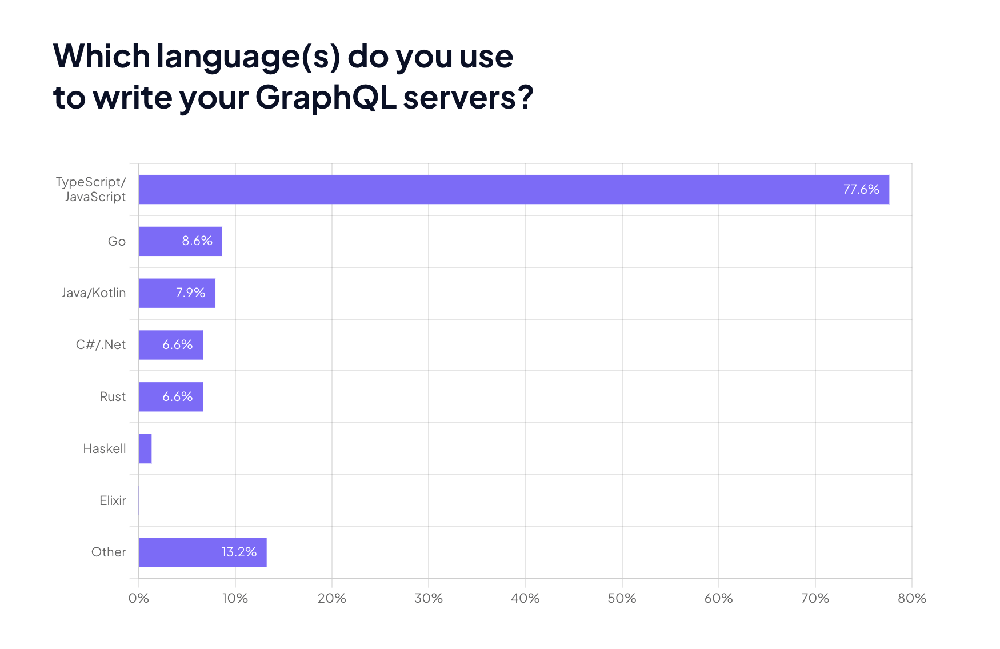

Building a GraphQL backend by hand might seem like a noble pursuit, but the landscape of API development is evolving rapidly, and so are the challenges that come with it. Today, the process is often fraught with complexity, performance bottlenecks, security vulnerabilities, and reliability issues. Yet again, we had a developer expressing [frustration](https://bessey.dev/blog/2024/05/24/why-im-over-graphql/) about the issues with GraphQL and the reasons for leaving our mighty ship. I wish to dive deeper into these challenges and explore why the future points towards automated, high-performance solutions.

<!-- truncate -->

<head>
<link rel="canonical" href="https://tailcall.hashnode.dev/writing-a-graphql-backend-by-hand-is-long-gone"/>
<title>Writing a GraphQL Backend by Hand is Long Gone</title>
</head>

## Complexity with GraphQL

If you see, most of the concerns with GraphQL are around building a robust GraphQL backend. It's rarely about consuming GraphQL, because if you look closely at the GraphQL spec, you will find that it's focused on how to elegantly consume data. As long as the output of your backend matches what's expected in the query, the specification doesn't care about how the backend is implemented.

Hence, the main complexity with GraphQL comes with how GraphQL is built. One of the major hurdles in hand-coding a GraphQL backend is managing performance. Issues like batching, incorrect usage of data loaders, caching, and the notorious N+1 problem can cripple your application.

Manually implementing batching mechanisms and data loaders can be incredibly tedious. While libraries like [DataLoader](https://github.com/graphql/dataloader) can assist, integrating them seamlessly into your system requires a deep understanding of both your data and the GraphQL query patterns. Overuse of data loaders is so common with most GraphQL implementations that ultimately it becomes the main culprit for high latency.

Secondly, traditional caching doesn't work with GraphQL, so you have to resort to all sorts of solutions, using persisted queries or some vendor-specific implementation of caching. Implementing effective caching strategies is essential for performance but it's tricky. Developers must decide what to cache, when to invalidate the cache, and how to manage cache consistency, which adds another layer of complexity.

The N+1 issue, boy, that's perhaps everyone's favorite issue with GraphQL. It arises when executing multiple upstream requests that could have been combined into one, leading to massive performance degradation. Detecting and solving this requires meticulous analysis of query patterns and database access, which requires developers to have the context of the whole query at once, generate a query plan, translate it to appropriate upstream calls, and then execute! That's a lot of complex engineering effort; building a general-purpose query engine is not for the faint-hearted, and in the midst of all this complex yet interesting work, I need to ship features!

> [Grafast](https://grafast.org/grafast) is an upcoming generalized query planner that could make query-planning in JS a bit more tamed.

GraphQL’s flexibility can be a double-edged sword when it comes to security, necessitating robust mechanisms for authentication and authorization. Like caching, traditional route-based API access doesn't work with GraphQL. Implementing these security layers correctly involves ensuring that only authenticated users can access the GraphQL entity and that they can only access data or fields that they are authorized to see. This requires fine-grained control and often custom logic and the invention of a new standard that works just for you.

Lastly, but most importantly, ensuring your GraphQL API is reliable means tackling error handling, propagation, and telemetry. Proper error handling in GraphQL is crucial for providing meaningful feedback to clients and maintaining the integrity of your application. The GraphQL team recently started working on a [standard](https://graphql-http.com/) for serving GraphQL over HTTP, which won't be easy to integrate if you already have a GraphQL API running in production. Moreover, integrating telemetry within a GraphQL backend isn't easy either; it is a very involved process to integrate spans to trace GraphQL resolvers. And, if you have written your GraphQL layer by hand in JavaScript, be ready for some [significant performance degradation](https://github.com/DataDog/dd-trace-js/issues/1095).

## GraphQL is more like SQL and less like REST

We talked about it in our [previous](graphql-vs-rest-vs-grpc-2024-03-30.md) blog why GraphQL isn't like REST or gRPC. I would argue that SQL is a closer elder sibling of GraphQL than REST or gRPC. Writing a GraphQL backend can be likened to building an SQL engine manually. Imagine if every time you wanted to interact with a database, you had to write the SQL engine from scratch. Every time you made a database change, you would need to rewrite your engine so that it can work with the new schema or indexes. It’s inefficient and impractical; no one does that. Fortunately, modern databases come with embedded, high-performance SQL engines such as [Apache Calcite](https://calcite.apache.org/) that adhere to the SQL specification but abstract away the complexities around building it. These databases allow developers to focus on writing queries and managing data without worrying about the underlying mechanics, thanks to their sophisticated query engines.

GraphQL, much like SQL, is a query language designed to allow clients to request exactly the data they need. Unlike REST, which relies on fixed endpoints, or gRPC, which focuses on remote procedure calls, GraphQL provides a flexible, hierarchical way to fetch and manipulate data, making it a closer analog to SQL in terms of expressiveness and precision. And I believe the future of GraphQL is going to be like the journey of this elder sibling.

## The future of GraphQL

The future of GraphQL development is moving towards generalized automated solutions built on modern, low-level system stacks like Rust and Zig, and moving away from the prevalent hand-written Node.js-based solutions of today.

- These engines will connect to data sources of any type and build a GraphQL endpoint on top of them. They will find connections between other data sources, sometimes completely automatically and sometimes using hints given by the developer, creating a unified GraphQL experience.

- Similar to SQL engines, which use JIT techniques to identify performance optimizations at runtime, GraphQL engines will become extremely smart about performance. My hope is that GraphQL will eventually move away from its dependency on the JSON protocol, into something more efficient such as protobuf.

- There is definitely going to be a lot of work put into the standardization of the loose ends. GraphQL engines will eventually converge on error handling and error propagation strategies. GraphQL on HTTP is the first step in that direction. Authentication and Authorization too will very quickly become standard features of GraphQL, so you won't need to worry about inventing a new way of authentication. This will all be packed into a GraphQL standard. This might be a stretch, but if the standards team gets together, I think even GraphQL caching will be consistent across all GraphQL engines, and you will be able to switch from one caching solution to another without locking into a vendor-specific implementation.

You might have already seen a wave of open-source solutions that build GraphQL on top of existing data sources. One such solution paving the way is [Tailcall](https://tailcall.run). Tailcall’s platform is designed to automate the creation, validation, and optimization of GraphQL backends. Sticking to standards and ensuring developers don't ever have to pay the heavy tax of using GraphQL that they do today, do check it out!

Lastly, if you are reading this today and thinking of writing a GraphQL server by hand, I urge you to reconsider and use something that does this for you. Before you know it, your handwritten solution will be deprecated in favor of something faster, easier, and more secure: an automatic GraphQL solution.
