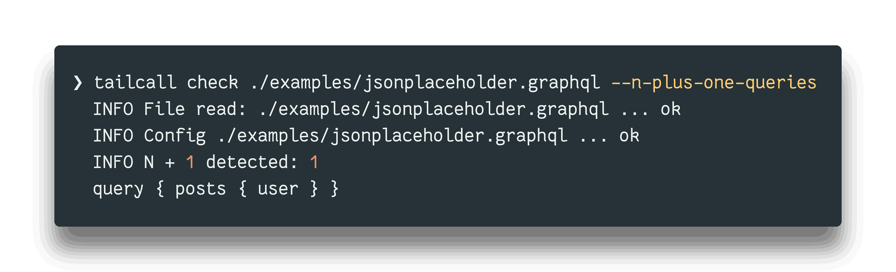
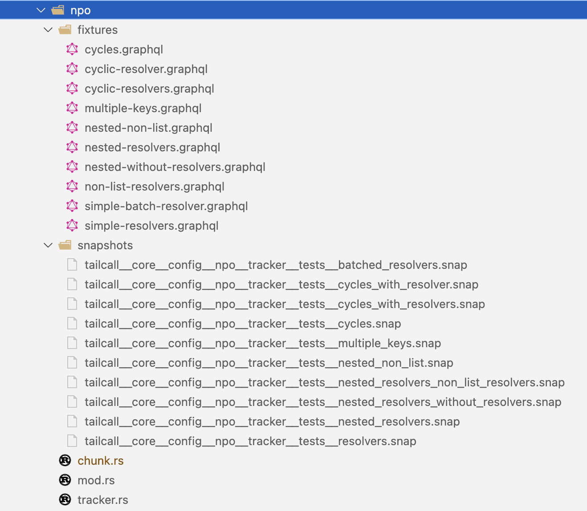

As a developer working with GraphQL, you're likely familiar with the concept of N+1 issues. If not, you're in for a treat - check out our [N+1 guide!](/docs/graphql-n-plus-one-problem-solved-tailcall)

<!-- truncate -->

To summarize, they occur when a GraphQL resolver is called multiple times for a single GraphQL request, leading to a large set of requests upstream and overall slower query execution. In this blog post, we'll dive into how Tailcall specifically identifies N+1 issues in GraphQL, and explore the algorithm and data structures used to detect these issues.

## High-Level Working

Unlike a traditional GraphQL implementation where the resolvers are written by hand, Tailcall encourages developers to take a configuration-driven approach. This has many benefits, and we have talked about them in our previous [blog](./no-code-graphql-2024-05-30.md).

One of the main advantages of not handwriting is the ability to introspect and optimize. Let's take an example of two functions written in Rust, though the problem is evident in all general purpose programming languages.

```rust
const BASE_URL: &str = "https://jsonplaceholder.typicode.com"

// Describes a typical Post returned from the /posts API
struct Post {
    id: i32,
    user_id: i32
    title: String,
    body: String,
    user: Option<User>
}

// Describes a typical User object from the /users API
struct User {
    id: i32
    name: String,
    email: String
}

// Asynchronously retrieves a `User` object by making a GET request using the given `user_id`.
async fn get_user(user_id: i32) -> User {
    let response = request(Method::GET, format!("{}/users/{}", BASE_URL, user_id)).await;

    // Decode the body as a User
    decode(response.body)
}

// Asynchronously fetches and updates posts with user details from the API.
async fn get_posts() -> Vec<Post> {
    let response = request(Method::GET, format!("{}/posts", BASE_URL)).await;


    // Decode the response into a Vec<Post>
    let mut posts = decode(response.body)


    // Set the actual user by making an HTTP call
    for post in posts {
        post.user = Some(get_user(post.user_id).await);
    }
    posts
}
```

You might have identified that there are few issues in the implementation above:

1. For each post item we end up making a call for the user independently, there is a clear N+1 issue here.
2. It's possible that two posts can be written by the same user, and yet we will end up making duplicate calls for the same user.
3. All calls to the `/users` API is being made in sequence, even though they can be paralyzed.
4. There are multiple points of failure which the above code doesn't handle.

Now, yes all of these issues can be solved by better coding practices, using a [Result](https://doc.rust-lang.org/std/result/) type and using a [DataLoader](https://github.com/graphql/dataloader) but that's besides the point. The point here is - Semantic analysis of any code is critical to building a robust systems and is only possible with some sort of human intervention typically in the form of code reviews or perhaps using some LLM if you are into that hype. What you can't do is - Write an algorithm to identify the N+1 issue in your GraphQL implementation that **100% accurate**.

With a configuration its a completely different story, take the below Tailcall configuration for example:

```graphql
schema
  @upstream(
    baseURL: "https://jsonplaceholder.typicode.com"
  ) {
  query: Query
}

type Query {
  posts: [Post] @http(path: "/posts")
}

type Post {
  id: ID!
  userId: ID!
  title: String!
  body: String!
  user: User @http(path: "/users{{.value.userId}}")
}

type User {
  id: ID
  name: String
  email: String
}
```

It's simple, expressive and doesn't expose the guts of how data will be queried, batched, deduped, parsed etc. Sure, configurations take away flexibility from writing anything but in return it liberates you from a ton of such nitty gritties of building a robust software system. The above configuration file can be parsed, validated and semantically analyzed accurately to identify issues such as N+1 very precisely using the [check](/docs/tailcall-graphql-cli/#check) command as follows:



## The Algorithm

Tailcall reads your [configuration](/docs/tailcall-graphql-configuration-format-conversion), parses it, and internally stores it in an efficient graph data-structure that resembles a `HashMap`. This allows `O(1)` access to a GraphQL type which represented as a node by its name. Once the graph data-structure is ready we make it go through a series of validators, one of them being the **N+1 tracker**.

Now, here's where it gets fascinating. We use a Depth-First Search (DFS) algorithm, starting at the root query and traversing all the connected nodes. Let me walk you through this cool process:

1. Initialize two variables to track the currently traversed `path` and `visited` fields so that we can avoid cycles.
2. Start at the root query and begin traversing the graph data structure.
3. For each field in the current node, check if it has a resolver and is not batched. We know if the node contains a resolver if that node has a [`@http`](/docs/tailcall-dsl-graphql-custom-directives#http-directive) or a [`@grpc`](/docs/tailcall-dsl-graphql-custom-directives#grpc-directive). Tailcall supports powerful batching primitives and if a field uses a Batch API, then that resolver is whitelisted and dropped from the list of potential N+1 candidates.
4. If the field has a resolver and is not batched, and the current path contains a list, then the current path is added to the result.
5. Otherwise, we recursively traverse the graph data structure, updating the current path and visited fields as necessary.
6. If a cycle is detected, return the cached result instead of re-traversing the path.
7. Once the traversal is complete, return the result, which represents the identified N+1 issues.

This algorithm allows Tailcall to efficiently identify potential N+1 issues across your entire GraphQL schema, even in complex, deeply nested structures.

:::tip
To see the actual implementation you can check out the [tracker.rs](https://github.com/tailcallhq/tailcall/blob/main/src/core/config/npo/tracker.rs) implementation.
:::

## Performance

While starting, Tailcall automatically performs these validations and one of our users complained that it would take around 5 minutes to start the server for their configuration which was around 10,000 lines. This caught our attention! The thing is, finding N+1 issues is a complex dynamic-programming problem. All this while our team has been focused on [benchmarking](https://github.com/tailcallhq/graphql-benchmarks) and optimizing the runtime performance of the server. This was the first time perhaps that we were surprised to see such a degradation in performance. We quickly realized that this is a dynamic programming problem and there are certain tricks to make such algorithms efficient. For us, it boiled down to two key optimizations:

### 1. Memoization

Our algorithm uses a cache to store the results of previous traversals. The cache is used to avoid re-traversing the same path multiple times. It's essentially memoization however is super critical if you have a huge configuration that you'd want to validate.

### 2. Chunk Data Structure

Let me introduce you to our secret weapon: a special yet simple data structure that we affectionately call "Chunk". It's a game-changer for storing and manipulating query paths. The chunk data structure is implemented as an enum with three variants:

```rust
enum Chunk<A> {
    Empty,
    Append(A, Rc<Chunk<A>>),
    Concat(Rc<Chunk<A>>, Rc<Chunk<A>>)
}

impl<A> Chunk<A> {
    pub fn new() -> Self {
        Self::Empty
    }

    pub fn is_null(&self) -> bool {
        matches!(self, Chunk::Empty)
    }

    pub fn append(self, a: A) -> Self {
        Chunk::Append(a, Rc::new(self))
    }

    pub fn concat(self, other: Chunk<A>) -> Self {
        if self.is_null() {
            return other;
        }
        if other.is_null() {
            return self;
        }
        Self::Concat(Rc::new(self), Rc::new(other))
    }

    pub fn as_vec(&self) -> Vec<&A> {
        // ... converts the chunk into a vec
    }
}
```

| **Variant** |                                                               |
| ----------- | ------------------------------------------------------------- |
| **Nil**     | Represents an empty chunk                                     |
| **Append**  | Represents an append operation performed on an existing chunk |
| **Concat**  | Represents the concatenation of two chunks                    |

The chunk data structure has the following properties:

- `O(1)` complexity for append and concat operations.
- Uses Reference Counting instead of Boxing to make cloning faster.
- Can be converted to a vector of references to the elements in the chunk.

You can clearly see that we don't actually perform an append or a concat operation instead we store a representation of that operation. This is a significant optimization because while performing the DFS, we create a lot of temporary query paths. However with the chunk data structure we don't need to allocate any additional memory on the heap or perform any form of wasted computation for paths that don't produce an N+1 query.

## Conclusion

Lastly to ensure that we are always correct and no N+1 issues go unidentified we perform tests with actual configurations.



Hopefully, this peek behind the curtain gives you some insight into how Tailcall identifies N+1 issues in your GraphQL configuration. Pretty cool, right?

- If you think we can make our N+1 detection faster or better in some other way, please help us improve by [contributing](https://github.com/tailcallhq/tailcall) 🙏
- If you find this interesting please spread the word 🙌
