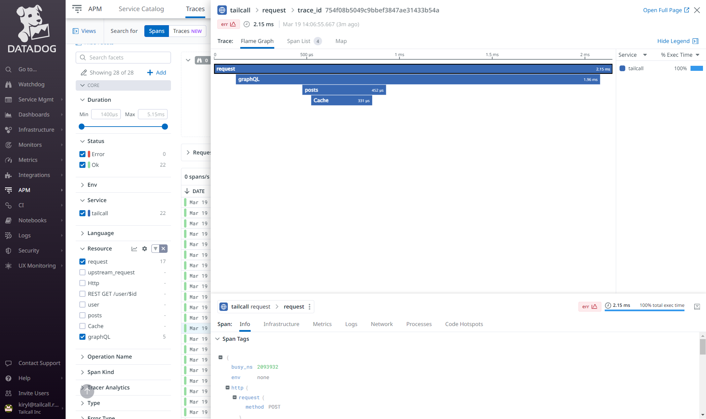
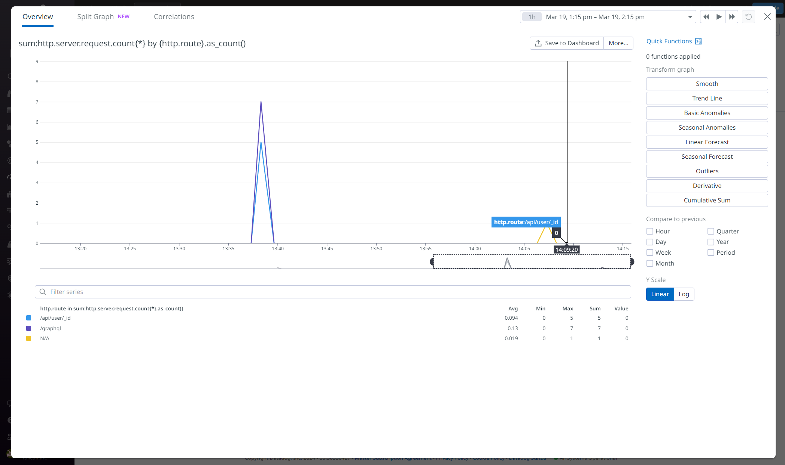

This guide is based on the [official doc](https://docs.datadoghq.com/getting_started/opentelemetry/?s=header#exploring-observability-data-in-datadog).

1. Go to [datadoghq.com](https://www.datadoghq.com)
2. Login to your account (make sure you choose right region for your account on login)
3. Go to `Organization Settings -> API Keys` and copy the value of existing key or create a new one
4. Integration with datadog requires [OpenTelemetry Collector](./telemetry.md#opentelemetry-collector) to be able to send data to. As an example we can use following config for the collector:
   ```yml
   receivers:
     otlp:
       protocols:
         grpc:
           endpoint: 0.0.0.0:4317
   exporters:
     logging:
       verbosity: detailed
     datadog:
       traces:
         span_name_as_resource_name: true
       hostname: "otelcol"
       api:
         key: ${DATADOG_API_KEY}
         # make sure to specify right datadog site based on
         # https://docs.datadoghq.com/getting_started/site/
         site: us5.datadoghq.com
   processors:
     batch:
     datadog/processor:
     probabilistic_sampler:
       sampling_percentage: 30
   service:
     pipelines:
       traces:
         receivers: [otlp]
         processors: [batch, datadog/processor]
         exporters: [datadog]
       metrics:
         receivers: [otlp]
         processors: [batch]
         exporters: [datadog]
       logs:
         receivers: [otlp]
         processors: [batch]
         exporters: [datadog]
   ```
5. Go to your tailcall config and update it to:
   ```graphql
   schema
     @telemetry(
       export: {otlp: {url: "http://localhost:4317"}}
     ) {
     query: Query
   }
   ```
6. 5. Set the api key you've copied before to the environment variable named `DATADOG_API_KEY` and start Otel collector and tailcall with updated config

Now make some requests to running service and wait a little bit until Datadog proceeds the data. After that you can go to `APM -> Traces`, locate the span with name `request` and click on it. You should see something like on screenshot below:



To see metrics now go to `Metrics -> Explorer` and search for metric you want to see. After updating the query you should see something like on example below:


