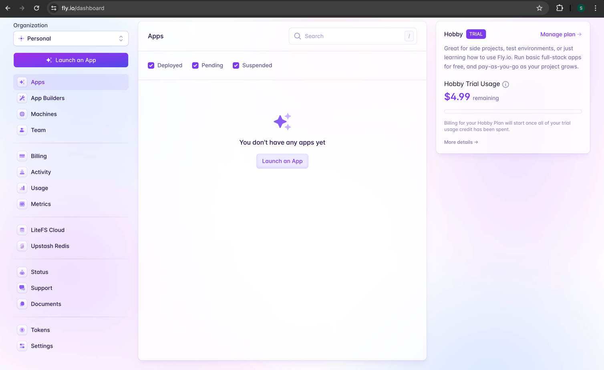
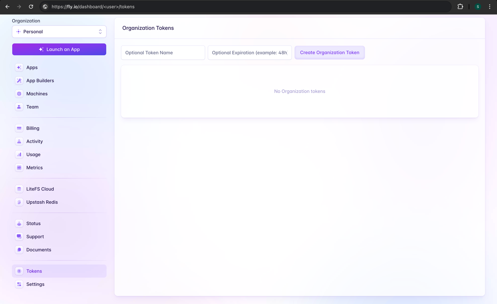
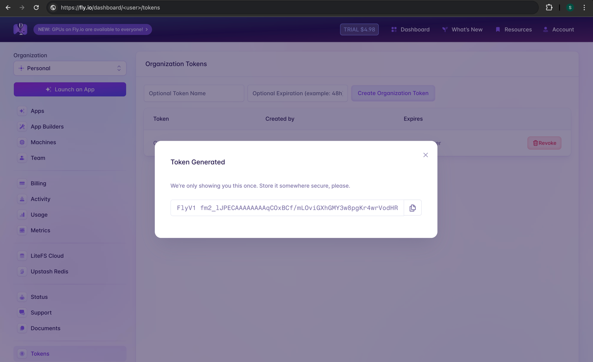
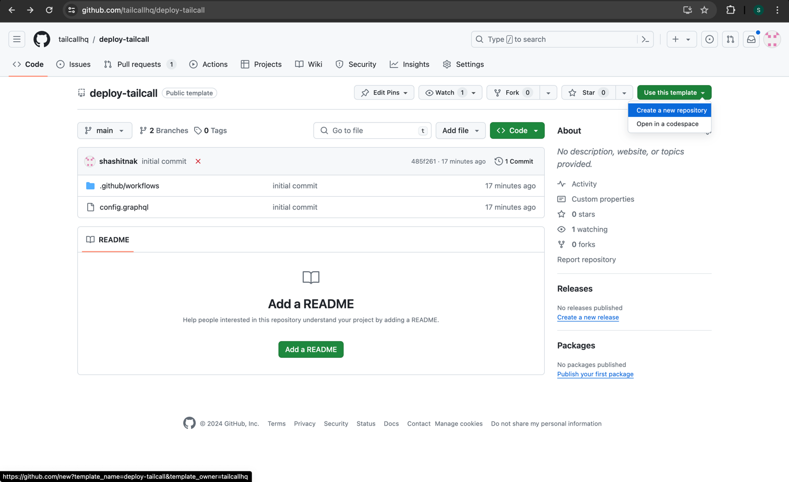
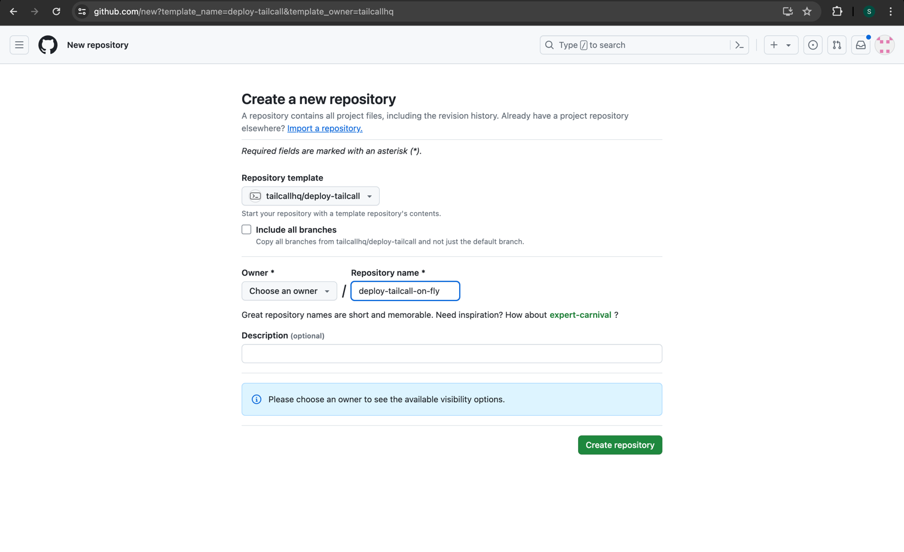
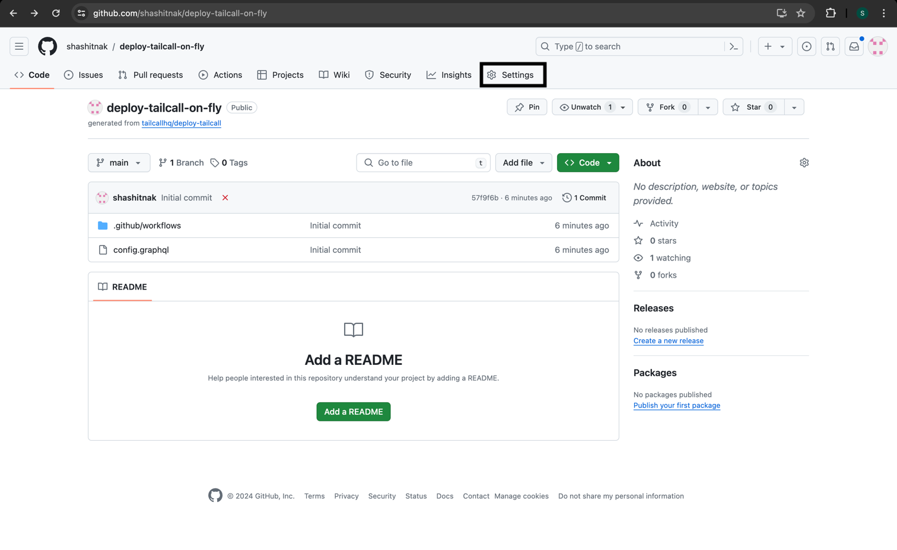
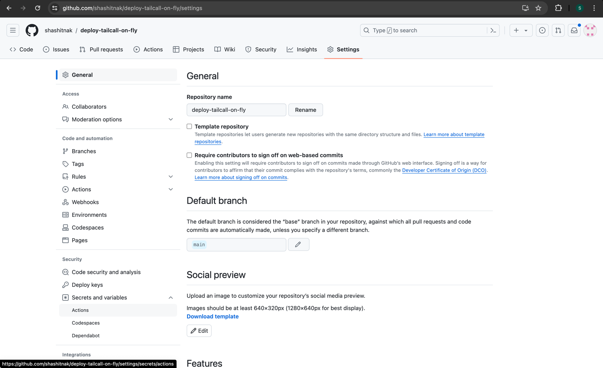
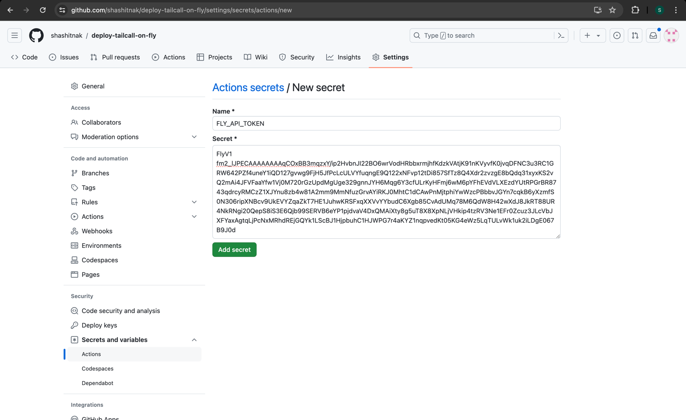

Before deploying `tailcall` on fly, you need to generate an API Key from Fly.io. If you don't have an account on Fly.io, you can create one [here](https://fly.io/app/sign-up).

### Generate API Key for Fly

Follow the steps below to generate an API Key:

1. Go to [Fly.io dashboard](https://fly.io/dashboard).



2. Click on `Tokens` in the left sidebar.



3. Here, you can optionally provide a name and the expiry for the token. Click on `Create Organization Token` to generate the token.



4. Copy the generated token and store it securely.

### Setting up the project repo

The easiest way to get started is to create a new repository using this template repo [https://github.com/tailcallhq/deploy-tailcall](https://github.com/tailcallhq/deploy-tailcall).

1. Go to the repo and click on `Use this template` and create a new repository.



2. Give your repository a name and click on `Create repository`.



3. Now that you have created a repository, you will need to add the Fly API token to the repository secrets. To do that, click on `Settings`.



4. Click on `Secrets and variables` in the left side bar to expand the section and click on `Actions`.



5. Click on `New repository secret` to add a new secret.


6. Add the secret name as `FLY_API_TOKEN` or any name you prefer and paste the Fly API token that you generated earlier in the value field. Click on `Add secret` to save the secret.



You are now ready to deploy your `tailcall` server on Fly.

### Deploy on Fly

In this example, we will deploy a simple `graphQL` server using `tailcall`, on Fly, which will convert the JSONPlaceholder REST API to a GraphQL API.

Below is the config present in the template repo, that will be used for this deployment. You can learn more about this [here](https://tailcall.run/docs/getting_started/configuration/).

```graphql
schema
  @server(hostname: "0.0.0.0", port: 8080)
  @upstream(
    baseURL: "http://jsonplaceholder.typicode.com"
  ) {
  query: Query
}

type Query {
  posts: [Post] @http(path: "/posts")
}

type User {
  id: Int!
  name: String!
  username: String!
  email: String!
  phone: String
  website: String
}

type Post {
  id: Int!
  userId: Int!
  title: String!
  body: String!
  user: User @http(path: "/users/{{.value.userId}}")
}
```

To deploy the server, just update the `provider` to `fly` in the `deploy-tailcall` job in the `.github/workflows/main.yml` file, similar to the example below.

```yaml
on: [push]

jobs:
  deploy_tailcall:
    runs-on: ubuntu-latest
    name: Deploy Tailcall
    steps:
      - name: Checkout repository
        uses: actions/checkout@v2
      - name: Deploy Tailcall
        id: deploy-tailcall
        uses: tailcallhq/gh-action@v0.2
        with:
          provider: "fly" # Specifies the cloud provider as 'fly'
          fly-api-token: ${{ secrets.FLY_API_TOKEN }}
          fly-app-name: "tailcall"
          fly-region: "lax"
          tailcall-config: "config.graphql"
```

After updating the `main.yml` file, commit the changes and push them to the repository. This will trigger the deployment of the `tailcall` server on Fly.
