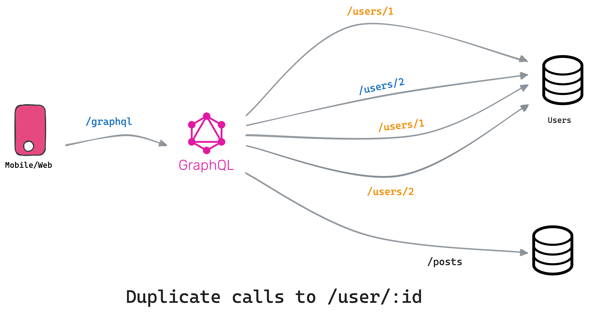
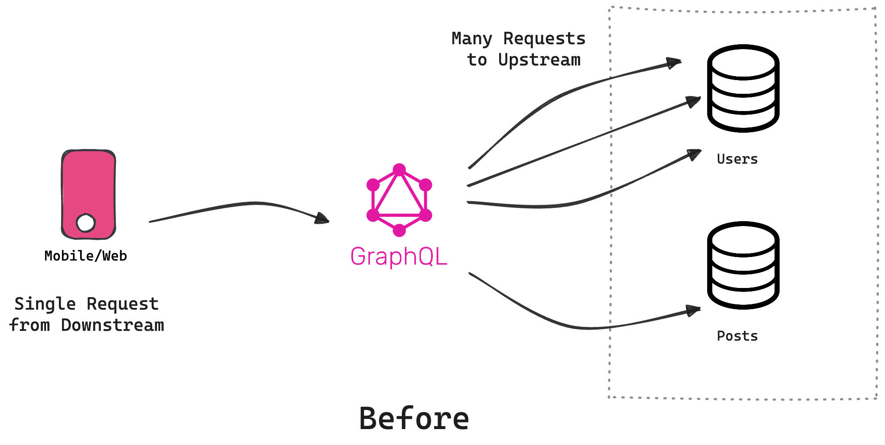

The **N+1 problem** significantly impacts systems performance by triggering numerous upstream requests in response to a single downstream request. However, with Tailcall's powerful introspection capabilities, you can identify all instances of N+1 issues even before you start your server! Amazing, right? but before we delve deeper into how Tailcall accomplishes this, let's understand the N+1 issue in detail.

## Example

Imagine we need to fetch data from the [jsonplaceholder.typicode.com](https://jsonplaceholder.typicode.com/), requiring both posts and their authors' details.

First, we request all posts:

```bash
❯ curl https://jsonplaceholder.typicode.com/posts
  [
    {
      "userId": 1,
      "id": 1,
      "title": "Creating Solutions for Challenges",
      "body": "We anticipate and understand challenges, creating solutions while considering exceptions and criticisms."
    },
    {
      "userId": 1,
      "id": 2,
      "title": "Understanding Identity",
      "body": "Life's essence, measured through time, presents pains and joys. We find solace in the mundane, seeking meaning beyond the visible."
    }
  ]
```

This command retrieves posts from the API, with each post containing a `userId` field indicating its author.

Next, we fetch details for each post's author, such as:

```bash
❯ curl https://jsonplaceholder.typicode.com/users/1
  {
    "id": 1,
    "name": "Leanne Graham",
    "username": "Bret",
    "email": "Sincere@april.biz",
    "address": {
      "street": "Kulas Light",
      "suite": "Apt. 556",
      "city": "Gwenborough",
      "zipcode": "92998-3874",
      "geo": {
        "lat": "-37.3159",
        "lng": "81.1496"
      }
    },
    "phone": "1-770-736-8031 x56442",
    "website": "hildegard.org",
    "company": {
      "name": "Romaguera-Crona",
      "catchPhrase": "Multi-layered client-server neural-net",
      "bs": "harness real-time e-markets"
    }
  }
```

For 100 posts, this results in 100 additional requests for author details, totaling 101 requests. This is the infamous _N + 1 problem_:

- 1 request for `/posts`
- 100 or `N` requests for `/users/:id` for each user

:::info
This issue can escalate in real-world scenarios, leading to straining resources, increasing server costs, slowing response times, and potentially causing server downtime even at a moderate scale.
:::

Hope this gives you a high-level overview of what the N + 1 problem is in the API context. It's a common problem not specific to just APIs or GraphQL, you will see this problem very commonly in database queries also. However addressing the N+1 problem during application design and development is crucial and we will see how this is tackled in Tailcall.

## N+1 in Tailcall

Before diving into solutions, let's observe the N+1 problem in the following Tailcall configuration:

:::tip
If you are new here you might want to checkout our [Getting Started](/docs/guides/getting_started.md) guide.
:::

```graphql
schema
  @upstream(
    baseURL: "http://jsonplaceholder.typicode.com"
  ) {
  query: Query
}

type Query {
  posts: [Post] @http(path: "/posts")
}

type Post {
  id: Int!
  userId: Int!
  title: String!
  body: String!
  user: User @http(path: "/users/{{.value.userId}}")
}

type User {
  id: Int!
  name: String!
  username: String!
  email: String!
}
```

This configuration sets up a GraphQL schema for a Tailcall server utilizing [jsonplaceholder.typicode.com](https://jsonplaceholder.typicode.com/) as its data source. It allows direct querying of posts and, for each post, retrieves the associated author information. Similar to our curl requests above, when we query for posts and their authors we end up issuing multiple user calls upstream:

Let's examine the CLI output for this configuration with Tailcall's `start` command:

```text {6-9}
❯ tailcall start ./examples/jsonplaceholder.graphql
  INFO File read: ./examples/jsonplaceholder.graphql ... ok
  INFO N + 1 detected: 1
  INFO 🚀 Tailcall launched at [0.0.0.0:8000] over HTTP/1.1
  INFO 🌍 Playground: https://tailcall.run/playground/?u=http://127.0.0.1:8000/graphql
  INFO GET http://jsonplaceholder.typicode.com/posts HTTP/1.1
  INFO GET http://jsonplaceholder.typicode.com/users/8 HTTP/1.1
  ...
  INFO GET http://jsonplaceholder.typicode.com/users/8 HTTP/1.1
  INFO GET http://jsonplaceholder.typicode.com/users/10 HTTP/1.1
```

Tailcall logs a sequence of requests made to fetch posts and then their individual authors, highlighting the N+1 problem in real-time. Since there are 100 posts, so 100 requests are made to fetch the authors.

## Deduplication

If you run the query, at first you will observe a lot of duplicate requests are being made for getting the same author details.



This happens because of the 100 posts, a lot them are authored by the same user and by default Tailcall will make a request for every user when requested. You can fix this by setting [dedupe](../directives/upstream.md#dedupe) to `true` in [upstream](../directives/upstream.md).

```graphql {4}
schema
  @upstream(
    baseURL: "http://jsonplaceholder.typicode.com"
    dedupe: true
  ) {
  query: Query
}

type Query {
  # ...
}

type Post {
  # ...
}

type User {
  # ...
}
```

When you enable `dedupe`, for each downstream request, Tailcall will automatically deduplicate all upstream requests and instead of making 100 it will only make 10 requests for unique users:

```text {6-16}
❯ tailcall start ./examples/jsonplaceholder.graphql
  INFO File read: ./examples/jsonplaceholder.graphql ... ok
  INFO N + 1 detected: 1
  INFO 🚀 Tailcall launched at [0.0.0.0:8000] over HTTP/1.1
  INFO 🌍 Playground: https://tailcall.run/playground/?u=http://127.0.0.1:8000/graphql
  INFO GET http://jsonplaceholder.typicode.com/posts HTTP/1.1
  INFO GET http://jsonplaceholder.typicode.com/users/1 HTTP/1.1
  INFO GET http://jsonplaceholder.typicode.com/users/2 HTTP/1.1
  INFO GET http://jsonplaceholder.typicode.com/users/3 HTTP/1.1
  INFO GET http://jsonplaceholder.typicode.com/users/4 HTTP/1.1
  INFO GET http://jsonplaceholder.typicode.com/users/5 HTTP/1.1
  INFO GET http://jsonplaceholder.typicode.com/users/6 HTTP/1.1
  INFO GET http://jsonplaceholder.typicode.com/users/7 HTTP/1.1
  INFO GET http://jsonplaceholder.typicode.com/users/8 HTTP/1.1
  INFO GET http://jsonplaceholder.typicode.com/users/9 HTTP/1.1
  INFO GET http://jsonplaceholder.typicode.com/users/10 HTTP/1.1
```

This is a massive 10x improvement over the previous implementation. However, it might not always be the case. For eg: If all the posts are created by different users you might still end up making 100 requests upstream.


:::tip
Dedupe has a slight performance overhead so if your use case doesn't have any N + 1 issues, it might be worth keeping this setting disabled.
:::

## N+1 Checks

Before we get into the actual solution, if you observe closely the above logs Tailcall identified that there was one N + 1 issue, even before the requests were made:

```text {3}
❯ tailcall start ./examples/jsonplaceholder.graphql
  INFO File read: ./examples/jsonplaceholder.graphql ... ok
  INFO N + 1 detected: 1
  INFO 🚀 Tailcall launched at [0.0.0.0:8000] over HTTP/1.1
  INFO 🌍 Playground: https://tailcall.run/playground/?u=http://127.0.0.1:8000/graphql
  INFO GET http://jsonplaceholder.typicode.com/posts HTTP/1.1
  INFO GET http://jsonplaceholder.typicode.com/users/8 HTTP/1.1
  ...
  INFO GET http://jsonplaceholder.typicode.com/users/10 HTTP/1.1
```

To get a deeper understanding of what this N + 1 issue is, we can use the [--n-plus-one-queries](../guides/cli.md#--n-plus-one-queries) parameter with the `check` command:

```text {4,5}
❯ tailcall check ./jsonplaceholder.graphql --n-plus-one-queries
  INFO File read: ./examples/jsonplaceholder.graphql ... ok
  INFO Config ./examples/jsonplaceholder.graphql ... ok
  INFO N + 1 detected: 1
  query { posts { user } }
```

Incredible, isn't it? Tailcall has discovered that querying for posts followed by their users would result in N + 1 upstream calls. This represents a significant productivity gain, as you can now identify all such N + 1 issues upfront without resorting to complex profiling, tracing, or other runtime techniques. The `check` command also identifies the minimal query that could lead to these N + 1 problems by performing semantic analysis of your configuration. With these powerful tools handy you can go about making extremely efficient GraphQL backends as we will see next:

## Batch APIs


An effective technique to mitigate the N+1 problem is deduplicating similar requests, significantly reducing the number of server calls. We achieved it previously using the [dedupe](../directives/upstream.md#dedupe) setting. With Tailcall we can go one step further by giving hints about "batch APIs".

**Batch APIs:** Are special APIs that allow us to query multiple things at once. In our case we can pass multiple user Ids as query params, to the `/users` API to resolve many users at once:

:::tip
Try to hit [/users?id=1&id=2](https://jsonplaceholder.typicode.com/users?id=1&id=2)
:::

TailCall provides the capability to leverage _Batch APIs_. To utilize this feature, edit the `@http` directive on `Post.user` field in your GraphQL schema as follows:

```graphql {9-10}
type Post {
  id: Int!
  userId: Int!
  title: String!
  body: String!
  user: User
    @http(
      path: "/users"
      query: [{key: "id", value: "{{.value.userId}}"}]
      batchKey: ["id"]
    )
}
```

The described changes introduce two significant tweaks to the `@http` directive:

1. **Addition of a query parameter:**

   ```graphql {6}
   type Post {
     # ...
     user: User
       @http(
         path: "/users"
         query: [{key: "id", value: "{{.value.userId}}"}]
         batchKey: ["id"]
       )
   }
   ```

   This configuration generates a URL with the `userId` from the `Post` in the query params. For a batch of users, the CLI compiles a single URL, such as `/users?id=1&id=2&id=3...id=10`, consolidating the 10 requests into one.

1. **Addition of a batchKey:**
   ```graphql {7}
   type Post {
     # ...
     user: User
       @http(
         path: "/users"
         query: [{key: "id", value: "{{.value.userId}}"}]
         batchKey: ["id"]
       )
   }
   ```
   This parameter instructs the system to use the user's `id`, in the `User` type, as the unique identifier. This helps in differentiating between users received from the batch API.

Let's see what the server logs when you now start Tailcall with the updated configuration:

```graphql {21-22}
schema
  @server(port: 8000)
  @upstream(
    baseURL: "http://jsonplaceholder.typicode.com"
  ) {
  query: Query
}

type Query {
  posts: [Post] @http(path: "/posts")
}

type Post {
  id: Int!
  userId: Int!
  title: String!
  body: String!
  user: User
    @http(
      path: "/users"
      query: [{key: "id", value: "{{.value.userId}}"}]
      batchKey: ["id"]
    )
}

type User {
  id: Int!
  name: String!
  username: String!
  email: String!
}
```

Let's start the server as usual and focus on the detected N + 1 issues:

```text {3,7}
❯ tailcall start ./examples/jsonplaceholder.graphql
  INFO File read: ./examples/jsonplaceholder.graphql ... ok
  INFO N + 1 detected: 0
  INFO 🚀 Tailcall launched at [0.0.0.0:8000] over HTTP/1.1
  INFO 🌍 Playground: https://tailcall.run/playground/?u=http://127.0.0.1:8000/graphql
  INFO GET http://jsonplaceholder.typicode.com/posts HTTP/1.1
  INFO GET http://jsonplaceholder.typicode.com/users?id=1&id=10&id=2&id=3&id=4&id=5&id=6&id=7&id=8&id=9 HTTP/1.1
```

As you can see there are ZERO N + 1 detected this time! It basically means that irrespective of how large the list of posts is there is a finite number of requests that will be issued in this case that's always going to be TWO. And this is how Tailcall users tackle the N + 1 problem in GraphQL.

## Conclusion

To summarize, we learnt that N + 1 is a general problem and not specific to GraphQL. It's a hard problem to identify, and developers often resort to runtime analysis to find such scenarios. N + 1 can really strain your infrastructure, leading to serious downtime in certain cases.



We also learnt that in Tailcall, the CLI can introspect your configuration and identify all the potential N + 1 issues upfront. Using `dedupe`, you can improve the N + 1 problem significantly, however, it's not a complete solution. To completely eliminate the N + 1 problem, you can configure Tailcall to leverage Batch APIs. Hopefully, this guide underscores the effectiveness of Tailcall in addressing the N + 1 problem.


