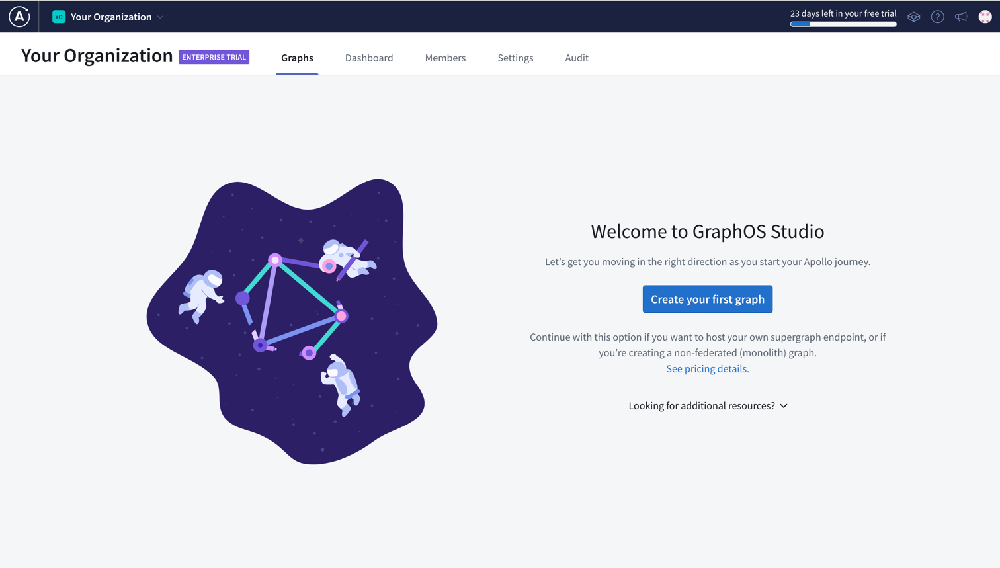
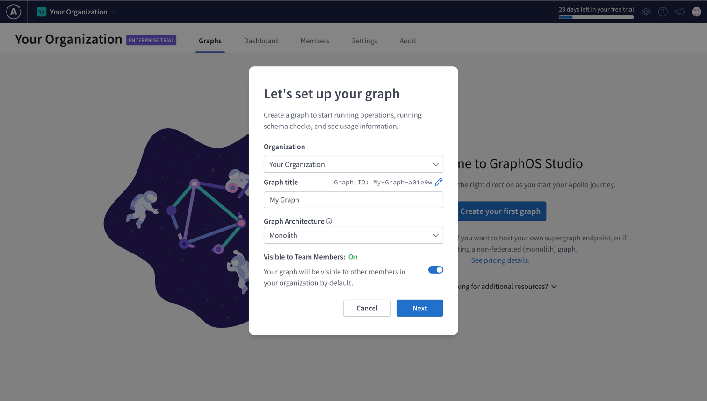
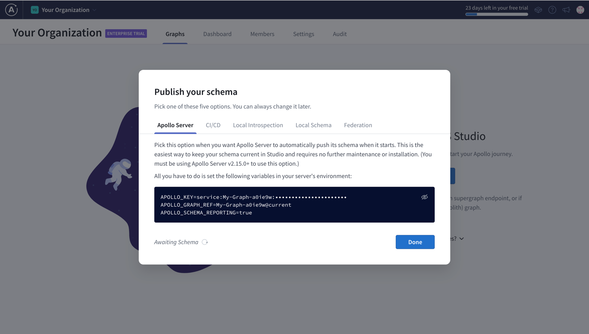
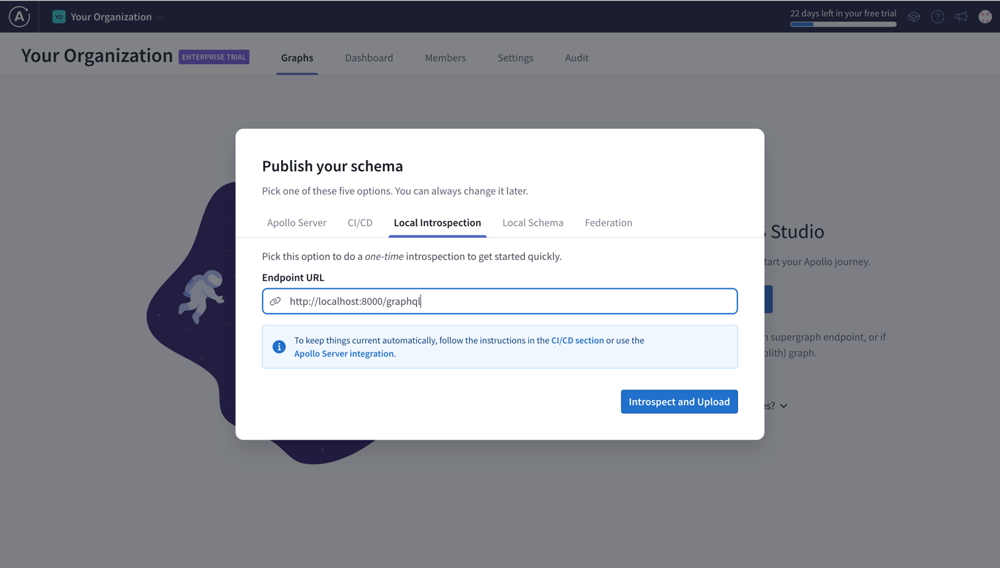
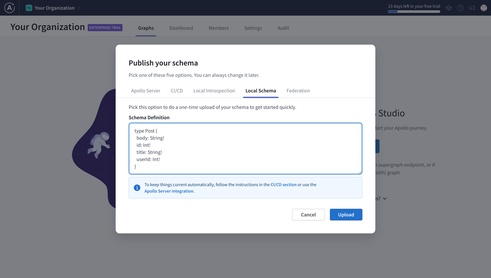
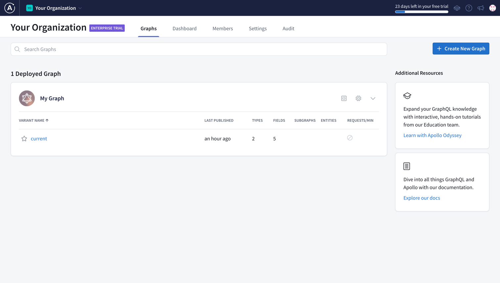
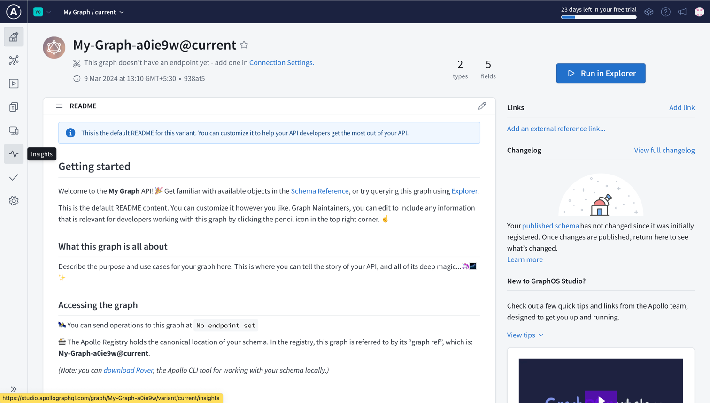
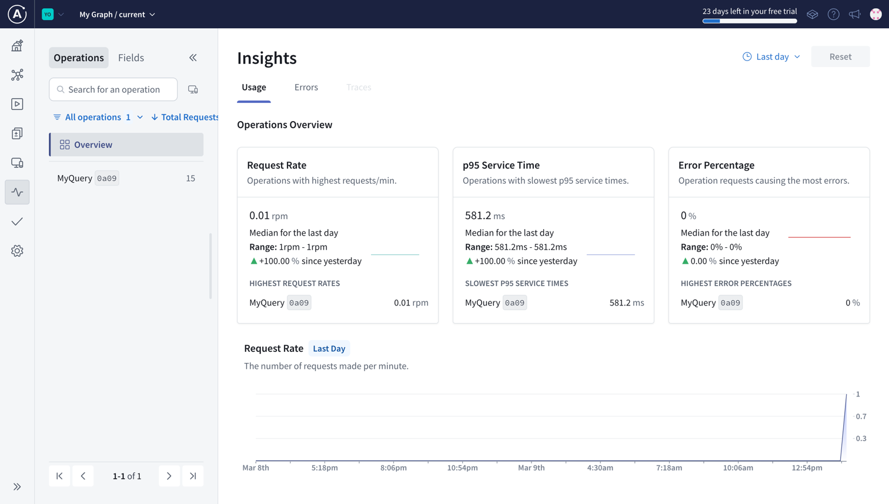
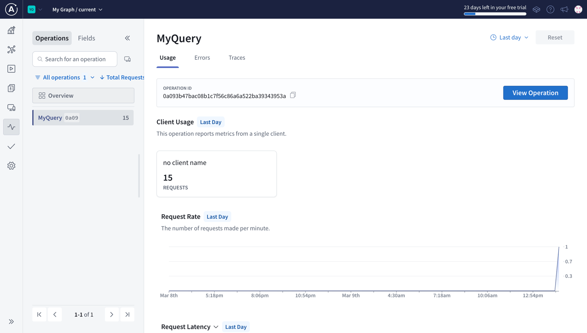

This guide illustrates how to configure `tailcall` to send usage metrics to [Apollo Studio](https://studio.apollographql.com).

## Creating a monolith graph

1. Before you configure `tailcall`, you will need to create a `Monolith` graph on Apollo Studio.

   

1. Go to your organization's home page and click on `Create your first graph`, if this is your first graph or `Create New Graph` if you have existing graphs.

   

1. Change the `Graph title`, `Graph ID` and other fields as desired and make sure to change `Graph Architecture` to Monolith, assuming `tailcall` is booted in monolith mode.
1. Once you are done, click on `Next`. You'll see the following screen.

   

1. Copy the fields `APOLLO_KEY` and `APOLLO_GRAPH_REF` as they are required by `tailcall` to be able to send the usage metrics.

1. Next we need to connect Apollo with our running instance of Tailcall. There are two ways to let Apollo know about your GraphQL schema:

   1. Navigate to `Local Introspection`. If you have a deployed instance of your GraphQL server you can put the URL pointing to that in `Endpoint URL` and click on `Introspect and Upload`. If not, start a local instance of `tailcall` and put the local url here, similar to how is shown in the image below. You can start a local instance of Tailcall by running `tailcall start` (click [here](./cli.md) to know more).

      

   1. Or, Navigate to `Local Schema` and insert your schema generated by `tailcall` and click `Upload`. You can get the schema by running `tailcall check` (click [here](./cli.md) to know more).

      

You have now created a Monolith graph in Apollo Studio. The next step is to configure `tailcall` to use the `APOLLO_API_KEY` and `APOLLO_GRAPH_REF`. Follow detailed instructions [here](../operators/telemetry.md).

## Checking the metrics in Apollo Studio

To see the metrics for you queries follow these instructions:

1. Start `tailcall` with the appropriate configuration for Apollo (click [here](./cli.md#start) to know more). Below is an example of what a config may look like:

   ```graphql
   schema
     @server(port: 8000, graphiql: true)
     @upstream(
       baseURL: "http://jsonplaceholder.typicode.com"
     )
     @telemetry(
       export: {
         apollo: {
           api_key: "<APOLLO_API_KEY from Apollo Website>"
           graph_ref: "<APOLLO_GRAPH_REF from Apollo Website>"
         }
       }
     ) {
     query: Query
   }

   type Query {
     posts: [Post] @http(path: "/posts")
   }

   type Post {
     id: Int!
     userId: Int!
     title: String!
     body: String!
   }
   ```

1. Visit `http://localhost:8000/graphql` and create a query with an appropriate name (below is an example query named `MyQuery`) and run it multiple times to send the metrics to Apollo Studio.

   :::tip
   Naming the query is not required to be able to send the metrics, but it helps to organize the metrics with appropriate names when viewed in Apollo Studio.
   :::

   ```graphql
   query MyQuery {
     posts {
       id
       title
     }
   }
   ```

1. To see the metrics click on the `VARIANT NAME` of your graph. In the example below, the variant name is `current`.

   

1. You will see the following page. From here click on insights icon as highlighted on the left side of the image.

   

1. You will now be able to see all the information related to your queries here

   

   

:::important
If you don't see the name of your query here, try running the query multiple times and waiting for some time. Since the metric isn't sent to Apollo Studio for each query, instead they are batched together and sent at once for efficiency reasons.
:::
