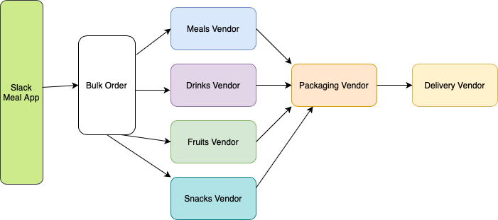

One of the ways developers can handle the dreaded [N+1 problem](https://tailcall.run/docs/guides/n+1/) is to use batching.

Batching when configured correctly, can significantly reduce strain on high-traffic backends. You only need to add a handful of operators to your GraphQL schema (i.e. custom directives) for Tailcall to do most of the heavy lifting for you[^1].

## Scenario

Catered lunches and healthy snacks are some of the free perks startups offer to office employees, but with the rise of remote work, many startups are leaving this tradition.

One way to keep the tradition going would be a universal meal delivery application in Slack, available as a `/ship-meal` command. Managers, anywhere in the world, could use the command to have lunch delivered to teammates, including those that work from home.

### Multiple Vendors



### Constraints

The nature of such a service could cause traffic spikes for every upstream vendor needed to fulfil each individual order, so some care has to be taken when designing the meal app's API.
For instance, if thousands of managers across the world use the command at the same time (just before lunch break) to place team orders, the sudden traffic spike will spread to upstream vendors, leading to delayed or failed orders.

_Batching_ is a one technique that can be used to avoid overwhelming upstream servers with too many simultaneous requests. Batching combines multiple operations in a bulk operation that is sent in a single request.

Tailcall supports batching via two [operators](https://tailcall.run/docs/operators/): `@upstream` and `@http`.
Before we go over this Tailcall feature, we'll briefly review the most common implementations of batching in REST APIs.

---

## Batching in REST APIs

### High Correspondence Between REST and CRUD

In backends that adhere to the REST architectural style, the HTTP methods `POST`, `GET`, `PUT`, and `DELETE` roughly correspond to _Create_, _Read_, _Update_, and _Delete_ operations respectively in the CRUD paradigm as can be seen in the table below.

| HTTP method | CRUD paradigm |
| ----------- | ------------- |
| `POST`      | _Create_      |
| `GET`       | _Read_        |
| `PUT`       | _Update_      |
| `DELETE`    | _Delete_      |

This one-to-one correspondence works because CRUD and REST often deal with a single entity or resource as the case may be.

```bash
  POST 	/v1/employees      (Create an employee entity)
   GET 	/v1/employees/:id  (Read an employee entity)
   PUT 	/v1/employees/:id  (Update an employee entity)
DELETE 	/v1/employees/:id  (Delete an employee entity)
   GET 	/v1/employees      (Read multiple employee entities)
```

### Low Correspondence Between Batching and CRUD

The one-to-one correspondence doesn't carry over when batching is added to a REST API because batching can either involve:

- performing the same operation on different entities of the same type (e.g. _Update_ the team's order so meals are shipped to employees with the following ids `1`, `4` & `7`) or;
- grouping together different operations in one request (e.g. _Create_ `Jain` as a new employee, _Update_ an employee's meal preferences and _Delete_ meals above a certain price from the menu).

### Real-world Examples of Batching

The table below condenses the most common URL styles used to implement batching in the real-world.

| Operation | HTTP method | URL style                     | Parameters       | Content type       | Example                                                                                          |
| --------- | ----------- | ----------------------------- | ---------------- | ------------------ | ------------------------------------------------------------------------------------------------ |
| _Read_    |             |                               |                  |                    |                                                                                                  |
|           | `GET`       | 1. `/users?id=1&id=4&id=7`    | URL query params | -                  | [github.com](https://github.com/search?q=user%3Adefunkt+user%3Aubuntu+user%3Amojombo&type=users) |
|           | `GET`       | 2. `/users/1,4,7`             | URL path params  | -                  | [ipstack.com](https://ipstack.com/documentation#bulk)                                            |
|           | `POST`      | 3. `/users/`                  | Request body     | `application/json` | [ipinfo.io](https://ipinfo.io/developers/advanced-usage#batching-requests)                       |
| _CRUD_    |             |                               |                  |                    |                                                                                                  |
|           | `POST`      | 4. `/users?batch`             | Request body     | `application/json` | [facebook.com](https://developers.facebook.com/docs/graph-api/batch-requests)                    |
|           | `POST`      | 5. `/batch/submitJob` (async) | Request body     | `application/json` | [arcgis.com](https://developers.arcgis.com/rest/services-reference/enterprise/batch-geocode.htm) |
|           | `POST`      | 6. `/batch/`                  | Request body     | `multipart/mixed`  | [google.com](https://cloud.google.com/storage/docs/batch)                                        |

### Batching: Sync or Async

REST APIs that support batching can either follow a synchronous or asynchronous style depending on the underlying operation.

The sync style is the most common and is often used for operations that are short-lived i.e. operations that can be completed quickly so that the server can return an immediate response (`200 OK`). In fact, out of the 6 different URL styles shown in the table above, only URL style #5 is asynchronous, the rest are synchronous.

The async style is used in situations where an operation can take a considerable amount of time to complete. The server will process the request asynchronously but will return an immediate response (`202 Accepted`)[^202-Accepted] instead of letting the client wait.

### Receiving an Async Response: Pull or Push

Within the async request style, there are two ways of retrieving a response from the server: pull or push.

In the pull model: the client periodically polls the server to check that the operation has completed successfully, or failed.

In the push model: when the operation is complete, the server pushes the results over an existing subscription with the client such as a web socket (for browser-based clients) or a web hook (for server-based clients).[^delivery]

### Open Data Protocol

URL style #6 in the table above, uses a `Content-type` of `multipart/mixed` which makes it the most flexible way of implementing batching in REST APIs. It allows clients to submit arbitrary operations (multiple _Create_, _Read_, _Update_, and _Delete_ operations, each with its own `Content-type`) in a single request, though most services enforce a limit[^batch-size-limit] in the range of 10-1000 called the batch size. The batch size is the number of sub-requests that can be included in a single request to an endpoint that supports batching.


---

## Batching in Tailcall

Tailcall supports batching `GET` requests in REST APIs that follow the design in URL style #1 in the table above. The batch size is configurable and can be set via `@upstream(... batch.maxSize)`.

Let's now return to our meal delivery app to illustrate how it works.

### Meal Prep and Delivery

Before meals are prepped, the meal delivery app will first check how many meals it will need to make for each company and the location of the employees where each meal will be delivered. Since employees may sometimes switch between working at the office, at a co-working space or from home, the app tries to estimate each employee's current location by geolocation of their IP address.

```graphql showLineNumbers
schema
  @server(port: 8000, graphiql: true)
  # highlight-start
  @upstream(baseURL: "https://geoip-batch.fly.dev", httpCache: true, batch: {delay: 1, maxSize: 100}) {
  # highlight-end
  query: Query
}

type Query {
  users: [User]! @http(path: "/users")
}

type User {
  id: Int!
  username: String!
  email: String!
  phone: String
  ip: String!
  # highlight-start
  country: Country! @http(path: "/batch", query: [{key: "query", value: "{{value.ip}}"}], groupBy: ["query"])
  # highlight-end
}

type Country {
  query: String
  country: String
  regionName: String
  city: String
  lat: Float
  lon: Float
}
```

A lot of geolocation services support batch requests to save on network round-trips. The sample `graphql` shows how to lookup the location of multiple employees using only one batch request.

The Tailcall [`@upstream`](https://tailcall.run/docs/operators/upstream/) operator exposes several properties that allows developers to control various aspects of the upstream server connection, including how requests are batched.

In our example above, I enabled HTTP caching by setting the [`httpCache`](https://tailcall.run/docs/operators/upstream/#httpcache) property to `true` since it defaults to `false`.

I also configured [`batch`](https://tailcall.run/docs/operators/upstream/#batch) object which controls batching. I set `delay: 1` indicating a delay of 1 millisecond between each batch request (to avoid getting throttled by the upstream server) and set `maxSize: 100` indicating the Tailcall can issue up to `100` sub-requests as part of a single batch request.


When you run the following GraphQL query:

```graphql
{
  users {
    id
    username
    email
    phone
    ip
    country {
      query
      country
      regionName
      city
      lat
      lon
    }
  }
}
```

It will produce the following output in Tailcall:

```bash
2024-01-22T13:57:33Z INFO  tailcall::cli::tc] N + 1: 0
[2024-01-22T13:57:33Z INFO  tailcall::http] 🚀 Tailcall launched at [127.0.0.1:8000] over HTTP/1.1
[2024-01-22T13:57:33Z INFO  tailcall::http] 🌍 Playground: http://127.0.0.1:8000
[2024-01-22T13:58:04Z INFO  tailcall::http::client] GET https://geoip-batch.fly.dev/users HTTP/1.1
[2024-01-22T13:58:05Z INFO  tailcall::http::client] GET https://geoip-batch.fly.dev/batch?query=100.159.51.104&query=103.72.86.183&query=116.92.198.102&query=117.29.86.254&query=137.235.164.173&query=141.14.53.176&query=163.245.232.27&query=174.238.43.126&query=197.37.13.163&query=205.226.160.3&query=25.207.107.146&query=29.82.54.30&query=43.20.78.113&query=48.30.193.203&query=49.201.206.36&query=51.102.180.216&query=53.240.20.181&query=59.43.194.22&query=71.57.235.192&query=73.15.179.178&query=74.80.53.208&query=75.75.234.243&query=78.170.185.120&query=78.43.74.226&query=82.170.69.15&query=87.213.156.73&query=90.202.216.39&query=91.200.56.127&query=93.246.47.59&query=97.11.116.84 HTTP/1.1
```

The `/users` endpoint returns a total of 30 users. As you can see in the output, Tailcall constructed a batch request that concatenates the IP addresses of all 30 users in one request, rather than make 30 individual requests to the geolocation service.

Batching is an optimization technique for mitigating the [N+1 problem](https://tailcall.run/docs/guides/n+1/) as it can significantly reduce the number of network round-trips needed to fulfil a request when one or more upstream servers are involved.


[^1]: To take full advantage of batching, the REST backends being proxied with Tailcall must themselves have support for batching i.e. they must support the ability to combine multiple individual requests into a single request.
[^delivery]: https://news.ycombinator.com/item?id=28392042
[^202-Accepted]: https://www.mscharhag.com/api-design/bulk-and-batch-operations
[^batch-size-limit]: https://www.codementor.io/blog/batch-endpoints-6olbjay1hd#other-considerations-for-batch-processing
