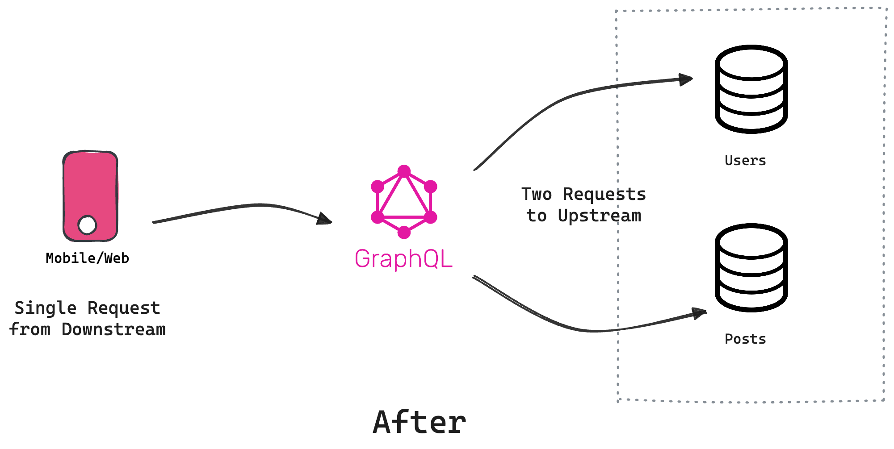

To summarize, we learnt that N + 1 is a general problem and not specific to GraphQL. It's a hard problem to identify, and developers often resort to runtime analysis to find such scenarios. N + 1 can really strain your infrastructure, leading to serious downtime in certain cases.

We also learnt that in Tailcall, the CLI can introspect your configuration and identify all the potential N + 1 issues upfront. Using `dedupe`, you can improve the N + 1 problem significantly, however, it's not a complete solution. To completely eliminate the N + 1 problem, you can configure Tailcall to leverage Batch APIs. Hopefully, this guide underscores the effectiveness of Tailcall in addressing the N + 1 problem.

