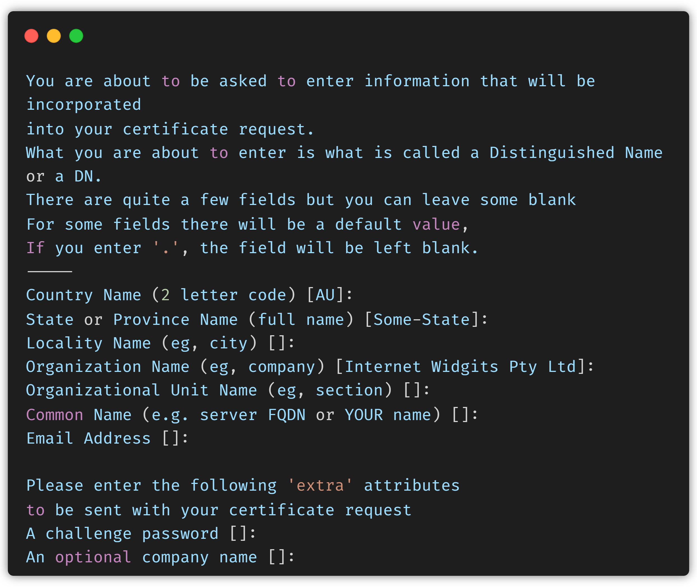
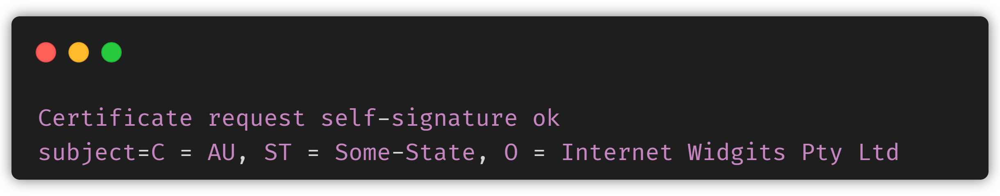

[HTTP/2](https://www.cloudflare.com/en-in/learning/performance/http2-vs-http1.1/) represents a significant advancement in web protocols, offering enhancements such as multiplexing, header compression, and streamlined connection handling, all designed to improve web performance.

Tailcall enables support for HTTP/2 for both server (ingress) and client (egress) operations, facilitating the protocol's adoption for both incoming and outgoing server requests. For egress, there is no special setting that's required, Tailcall will automatically upgrade the connection to HTTP/2 whenever possible. To configure ingress properly, you need to provide the following settings

## SSL

For Tailcall to serve GraphQL over HTTP/2 we need to first enable SSL for which we need to generate a certificate and a key. To generate the required certificates (cert.pem and key.pem) [OpenSSL](https://www.openssl.org/source/) is a widely used option. Here are the steps to get started with SSL:

1. **Install OpenSSL**: Download and install OpenSSL from its official [website](https://www.openssl.org/source/) if it's not already installed on your system.

2. **Generate Private Key**

   ```bash
   openssl genrsa -out key.pem 2048
   ```

   This creates a 2048-bit RSA private key, storing it in a file named `key.pem`.

3. **Generate Certificate Signing Request (CSR)**

   ```bash
   openssl req -new -key key.pem -out csr.pem
   ```

   You will be prompted to provide information for the certificate, such as the Common Name (CN), organization details, and locality. This information is embedded into the CSR, saved in a file named `csr.pem`. This file can be used to request a certificate from a Certificate Authority (CA) or generate a self-signed certificate.

   

4. **Generate Self-Signed Certificate**

   ```bash
   openssl x509 -req -days 365 -in csr.pem -signkey key.pem -out cert.pem
   ```

   This generates a self-signed certificate valid for 365 days using the CSR from step 3 and the private key from step 2. The validity period can be adjusted by changing the number of days (-days). A "Signature ok" prompt confirms the successful creation.

   

5. **Cleanup Intermediate Files**

   ```bash
   rm csr.pem
   ```

   After using the CSR to generate the self-signed certificate (cert.pem), the CSR file (csr.pem) becomes redundant. This step removes intermediate files created during the certificate generation process.

:::tip
Use self-signed certificates for HTTP/2 configurations in development environments. While they enable convenient HTTPS testing locally, in production, always opt for certificates issued by trusted Certificate Authorities.
:::

## Configuration

Once the certificate and key are generated we can link them with our main configuration using the [@link](./directives.md#link) directive, to enable HTTPS.

```graphql showLineNumbers
schema
  #highlight-start
  @link(type: "Cert", src: "./cert.pem")
  @link(type: "Key", src: "./key.pem") {
  #highlight-end
  query: Query
  mutation: Mutation
}

type Query {
  posts: [Post] @http(path: "/posts")
}

type User {
  id: Int!
  name: String!
}
```

Once HTTPS is enabled we set the version to `HTTP2` for the server:

```graphql showLineNumbers
schema
  @link(type: "Cert", src: "./cert.pem")
  @link(type: "Key", src: "./key.pem")
  #highlight-start
  @server(version: HTTP2) {
  #highlight-end
  query: Query
  mutation: Mutation
}

type Query {
  posts: [Post] @http(path: "/posts")
}

type User {
  id: Int!
  name: String!
}
```

That's pretty much all that's required. Now you can go ahead and [launch](/docs/guides/getting-started-with-graphql-using-tailcall/#starting-the-tailcall-server) your server as usual.

```bash
INFO File read: ./jsonplaceholder.graphql ... ok
INFO N + 1 detected: 0
INFO 🚀 Tailcall launched at [0.0.0.0:8000] over HTTP/2.0
INFO 🌍 Playground: https://tailcall.run/playground/?u=http://127.0.0.1:8000/graphql
```
