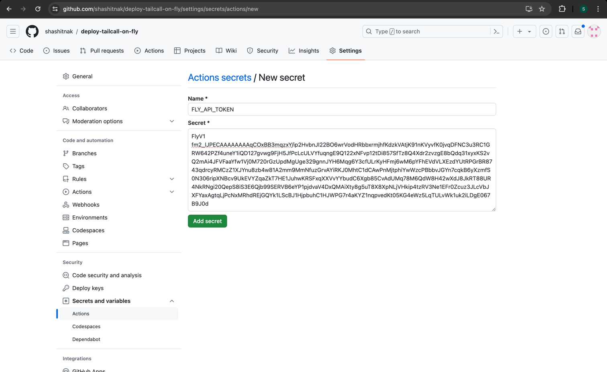

Before deploying `tailcall` on fly, you need to generate an API Key from Fly.io. If you don't have an account on Fly.io, you can create one [here](https://fly.io/app/sign-up).

### Generate API Key for Fly

Follow the steps below to generate an API Key:

1. Go to [Fly.io dashboard](https://fly.io/dashboard).


2. Click on `Tokens` in the left sidebar.


3. Here, you can optionally provide a name and the expiry for the token. Click on `Create Organization Token` to generate the token.


4. Copy the generated token and store it securely.

### Setting up the project repo

The easiest way to get started is to create a new repository using this template repo [https://github.com/tailcallhq/deploy-tailcall](https://github.com/tailcallhq/deploy-tailcall).

1. Go to the repo and click on `Use this template` and create a new repository.


2. Give your repository a name and click on `Create repository`.


3. Now that you have created a repository, you will need to add the Fly API token to the repository secrets. To do that, click on `Settings`.


4. Click on `Secrets and variables` in the left side bar to expand the section and click on `Actions`.


5. Click on `New repository secret` to add a new secret.


6. Add the secret name as `FLY_API_TOKEN` or any name you prefer and paste the Fly API token that you generated earlier in the value field. Click on `Add secret` to save the secret.



You are now ready to deploy your `tailcall` server on Fly.

### Deploy on Fly

In this example, we will deploy a simple `graphQL` server using `tailcall`, on Fly, which will convert the JSONPlaceholder REST API to a GraphQL API.

Below is the config which will be used for this deployment. If you need to make any updates, you can either clone your repo and make the changes locally or you can edit it directly on GitHub.

```graphql
schema
  @server(
    port: 8080
    headers: {
      cors: {
        allowOrigins: ["*"]
        allowHeaders: ["*"]
        allowMethods: [POST, GET, OPTIONS]
      }
    }
  )
  @upstream(
    baseURL: "http://jsonplaceholder.typicode.com"
    httpCache: 42
    batch: {delay: 100}
  ) {
  query: Query
}

type Query {
  posts: [Post] @http(path: "/posts")
  users: [User] @http(path: "/users")
  user(id: Int!): User @http(path: "/users/{{.args.id}}")
}

type User {
  id: Int!
  name: String!
  username: String!
  email: String!
  phone: String
  website: String
}

type Post {
  id: Int!
  userId: Int!
  title: String!
  body: String!
  user: User
    @call(
      steps: [
        {query: "user", args: {id: "{{.value.userId}}"}}
      ]
    )
}
```

The template repo that we are using for this deployment [tailcallhq/deploy-tailcall](https://github.com/tailcallhq/deploy-tailcall) uses the GitHub action `tailcallhq/gh-action` to deploy the `tailcall` server on Fly. Since the action can be used to deploy on multiple could providers, we need to specify the provider as `fly` in the action input .

Update the `./.github/workflows/main.yml` file in your repo to look like the following. Also, make sure you use the latest version of the action by updating the version in the `uses` field.

```yaml
on: [push]

jobs:
  deploy_tailcall:
    runs-on: ubuntu-latest
    name: Deploy Tailcall
    steps:
      - name: Checkout repository
        uses: actions/checkout@v2
      - name: Deploy Tailcall
        id: deploy-tailcall
        uses: tailcallhq/gh-action@v0.2
        with:
          provider: "fly" # Specifies the cloud provider. In this case 'fly'
          fly-api-token: ${{ secrets.FLY_API_TOKEN }}
          fly-app-name: "tailcall"
          fly-region: "lax"
          tailcall-config: "config.graphql"
```

That's it! Now, whenever you push changes to your repository, the `tailcall` server will automatically be deployed on Fly by the Github action.

### Inputs for `tailcallhq/gh-action`

You can customize the deployment by changing the inputs for the `tailcallhq/gh-action` action. Following is a description of the necessary inputs to the action when deploying to Fly:

| Input             | Description                                                                                                     |
| ----------------- | --------------------------------------------------------------------------------------------------------------- |
| `provider`        | When deploying to Fly, this should be set to `fly`                                                              |
| `fly-api-token`   | The Fly API token required for authentication. Ensure this value is stored securely, such as in GitHub Secrets. |
| `fly-app-name`    | The name of the Fly app being deployed. Defaults to `tailcall` if not specified.                                |
| `fly-region`      | The region where the Fly app will be deployed. Defaults to `ord` if not specified.                              |
| `tailcall-config` | The name of the Tailcall configuration file. This file should be present in the root of the repository.         |
