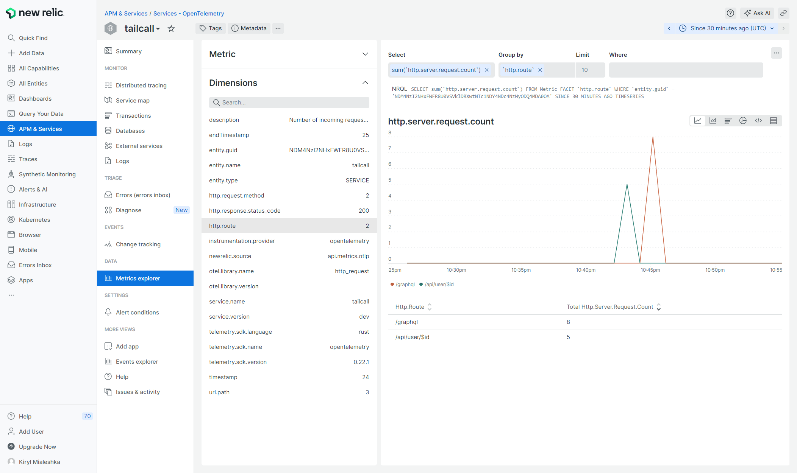
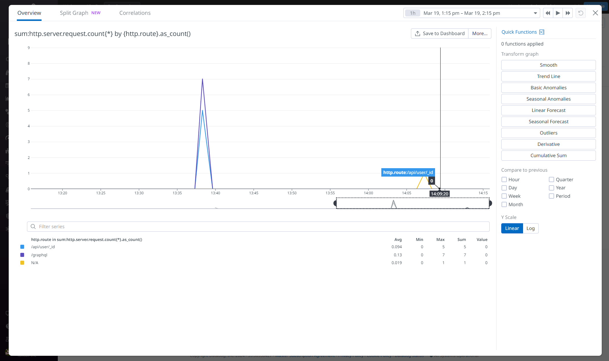

This guide will walk you through observability support in Tailcall i.e. how to collect and analyze telemetry data with different observability backends. In this guide you'll learn:

- How to enable generation of telemetry data in Tailcall.
- How to update config to forward telemetry data to your chosen observability platforms.
- See some examples of integration with existing observability tools.

Let's get started.

## What is Observability

Observability is essential for maintaining the health and performance of your applications. It provides insights into your software's operation in real-time by analyzing telemetry data — logs, metrics, and traces. This data helps in troubleshooting, optimizing, and ensuring your application runs smoothly.

- **Logs** offer a record of events that have happened within your application, useful for understanding actions taken or errors that have occurred.
- **Metrics** are numerical data that measure various aspects of your system's performance, such as request rates or memory usage.
- **Traces** show the journey of requests through your system, highlighting how different parts of your application interact and perform.

Tailcall provides observability support by integrating OpenTelemetry specification into it with help of provided SDKs and data formats.

[OpenTelemetry](https://opentelemetry.io) is a toolkit for collecting telemetry data in a consistent manner across various languages and platforms. It frees you from being locked into a single observability platform, allowing you to send your data to different tools for analysis, such as New Relic or Honeycomb.

## Comparison with Apollo Studio

While [Apollo studio](./apollo-studio.md) telemetry also provides analytics tools for your schema but when choosing between it and OpenTelemetry integration consider next points:

- OpenTelemetry is more generalized observability framework that could be used for cross-service analytics while Apollo Studio can provide insights only related to graphQL
- OpenTelemetry is vendor-agnostic and therefore you could actually use different observability platforms depending on your needs and don't rely on single tool like Apollo Studio
- OpenTelemetry integration in Tailcall can provide more analytical data that is out of scope of graphQL analytics provided by Apollo Studio

## Prerequisites

Consider we have following Tailcall config that connects with jsonplaceholder.com to fetch the data about user and posts

```graphql
schema
  @server(port: 8000, graphiql: true, hostname: "0.0.0.0")
  @upstream(
    baseURL: "http://jsonplaceholder.typicode.com"
  ) {
  query: Query
}

type Query {
  posts: [Post] @http(path: "/posts") @cache(maxAge: 3000)
  user(id: Int!): User @http(path: "/users/{{args.id}}")
}

type User {
  id: Int!
  name: String!
  username: String!
  email: String!
  phone: String
  website: String
}

type Post {
  id: Int!
  userId: Int!
  title: String!
  body: String!
  user: User @http(path: "/users/{{value.userId}}")
}
```

We will update that config with telemetry integration in following sections.

## Tailcall config

By default, telemetry data is not generated by Tailcall since it requires some setup to know where to send this data and also that affects performance of server that could be undesirable in some cases.

Telemetry configuration is provided by [`@telemetry`](../operators/telemetry.md) directive that provides various options to setup how and where the telemetry data is send.

To enable it we can update our config with something like config below:

```graphql
schema
  @telemetry(
    export: {
      otlp: {url: "http://your-otlp-compatible-backend.com"}
    }
  ) {
  query: Query
}
```

Here, `export` specifies the format of generated data and endpoint to which to send that data. Continue reading to know more about different options for it.

### Export to OTLP

[OTLP](https://opentelemetry.io/docs/specs/otlp/) is a vendor agnostic protocol that is supported by various [number of observability backends](https://opentelemetry.io/ecosystem/vendors/).

#### OpenTelemetry Collector

[OpenTelemetry Collector](https://opentelemetry.io/docs/collector/) is a vendor-agnostic way to receive, process and export telemetry data in OTLP format.

Although, tailcall can send the data directly to the backends that supports OTLP format using Otel Collector could be valuable choice since it's more robust solution well-suited for a high-scale, more flexible settings and ability to export in different formats other than OTLP.

In summary, if you're gonna to use OTLP compatible platform or just [prometheus](#export-to-prometheus) and your load is not that massive you could send the data directly to platforms. From the other side, if you need to export to different formats (like Jaeger or Datadog) or your application involves high load consider using Otel Collector as an export target.

### Export to prometheus

[Prometheus](https://prometheus.io) is a metric monitoring solution. Please note that prometheus only works with metrics and other telemetry data like traces and logs won't be sent to it.

Prometheus integration works by adding a special route for tailcall server router that outputs generated metrics in prometheus format consumable by prometheus scraper.

## Data generated

You can find a reference of type of info generated by Tailcall in the [`@telemetry` reference](../operators/telemetry.md) or consult [examples](#integration-examples) in order to gain some understanding.

### Relation with other services

Tailcall fully supports [Context Propagation](https://opentelemetry.io/docs/concepts/context-propagation/) functionality and therefore you can easily analyze distributed traces across all of your services that are provides telemetry data.

That may look like this:


Where Tailcall is just only part of whole distributed trace

### Customize generated data

In some cases you may want to customize the data that were added to telemetry payload to have more control over analyzing process. Tailcall supports that customization for specific use cases described below.

#### Metrics

##### http.server.request.count

[`requestHeaders`](../operators/telemetry.md#requestheaders) allows to add specified client headers to the metric's attributes.

:::important

The value of specified headers will be sent to telemetry backend as is, so use it with care to prevent of leaking any sensitive data to third-party services you don't have control over.

:::

## Integration Examples

### OpenTelemetry Collector

### Honeycomb.io

1. Go to [honeycomb.io](https://www.honeycomb.io)
2. Login to your account
3. Go to `Account -> Team Settings -> Environments and API Keys -> Configuration` and create new or copy existing api key
4. Go to tailcall config and update settings:
   ```graphql
   schema
     @telemetry(
       export: {
         otlp: {
           url: "https://api.honeycomb.io:443"
           headers: [
             {
               key: "x-honeycomb-team"
               value: "{{env.HONEYCOMB_API_KEY}}"
             }
             {
               key: "x-honeycomb-dataset"
               value: "<your-dataset>"
             }
           ]
         }
       }
     ) {
     query: Query
   }
   ```
5. Set the api key you've copied before to the environment variable named `HONEYCOMB_API_KEY` and start tailcall with updated config

Now make some requests to running service and wait a little bit until honeycomb proceeds the data. After that you can go to `Home -> Total traces` and click on the trace with name `request`. Now choose `Traces` in the bottom and click on the first trace from the list. You should see the picture similar to this:


Here you can see data about the request that was made to tailcall and what actions were made to handle this request.

To see metrics now go `Query` and run a query to fetch the data about metrics. You can use following screenshot as an example:


### New Relic

The guide is based on [official doc](https://docs.newrelic.com/docs/more-integrations/open-source-telemetry-integrations/opentelemetry/get-started/opentelemetry-set-up-your-app/)

1. Go to [newrelic.com](https://newrelic.com)
2. Login to your account
3. Go to `<your user name> -> Api Keys` and copy license value for key with access to write data
4. Go to tailcall config and update it with:
   ```graphql
   schema
     @telemetry(
       export: {
         otlp: {
           url: "https://otlp.nr-data.net:4317"
           headers: [
             {
               key: "api-key"
               value: "{{env.NEWRELIC_API_KEY}}"
             }
           ]
         }
       }
     ) {
     query: Query
   }
   ```
5. Set the api key you've copied before to the environment variable named `NEWRELIC_API_KEY` and start tailcall with updated config

Now make some requests to running service and wait a little bit until New Relic proceeds the data. After that you can go to `Traces` locate `request` trace, click on it, then pick one of the available traces and click on it. You should see something like the screenshot below:


To see metrics now go to `APM & Services -> Metrics Explorer` and choose the metrics you want to see like on example below.



### Datadog

This guide is based on the [official doc](https://docs.datadoghq.com/getting_started/opentelemetry/?s=header#exploring-observability-data-in-datadog).

1. Go to [datadoghq.com](https://www.datadoghq.com)
2. Login to your account (make sure you choose right region for your account on login)
3. Go to `Organization Settings -> API Keys` and copy the value of existing key or create a new one
4. Integration with datadog requires [OpenTelemetry Collector](#opentelemetry-collector) to be able to send data to. As an example we can use following config for the collector:
   ```yml
   receivers:
     otlp:
       protocols:
         grpc:
           endpoint: 0.0.0.0:4317
   exporters:
     logging:
       verbosity: detailed
     datadog:
       traces:
         span_name_as_resource_name: true
       hostname: "otelcol"
       api:
         key: ${DATADOG_API_KEY}
         # make sure to specify right datadog site based on
         # https://docs.datadoghq.com/getting_started/site/
         site: us5.datadoghq.com
   processors:
     batch:
     datadog/processor:
     probabilistic_sampler:
       sampling_percentage: 30
   service:
     pipelines:
       traces:
         receivers: [otlp]
         processors: [batch, datadog/processor]
         exporters: [datadog]
       metrics:
         receivers: [otlp]
         processors: [batch]
         exporters: [datadog]
       logs:
         receivers: [otlp]
         processors: [batch]
         exporters: [datadog]
   ```
5. Go to your tailcall config and update it to:
   ```graphql
   schema
     @telemetry(
       export: {otlp: {url: "http://localhost:4317"}}
     ) {
     query: Query
   }
   ```
6. 5. Set the api key you've copied before to the environment variable named `DATADOG_API_KEY` and start Otel collector and tailcall with updated config

Now make some requests to running service and wait a little bit until Datadog proceeds the data. After that you can go to `APM -> Traces`, locate the span with name `request` and click on it. You should see something like on screenshot below:


To see metrics now go to `Metrics -> Explorer` and search for metric you want to see. After updating the query you should see something like on example below:


