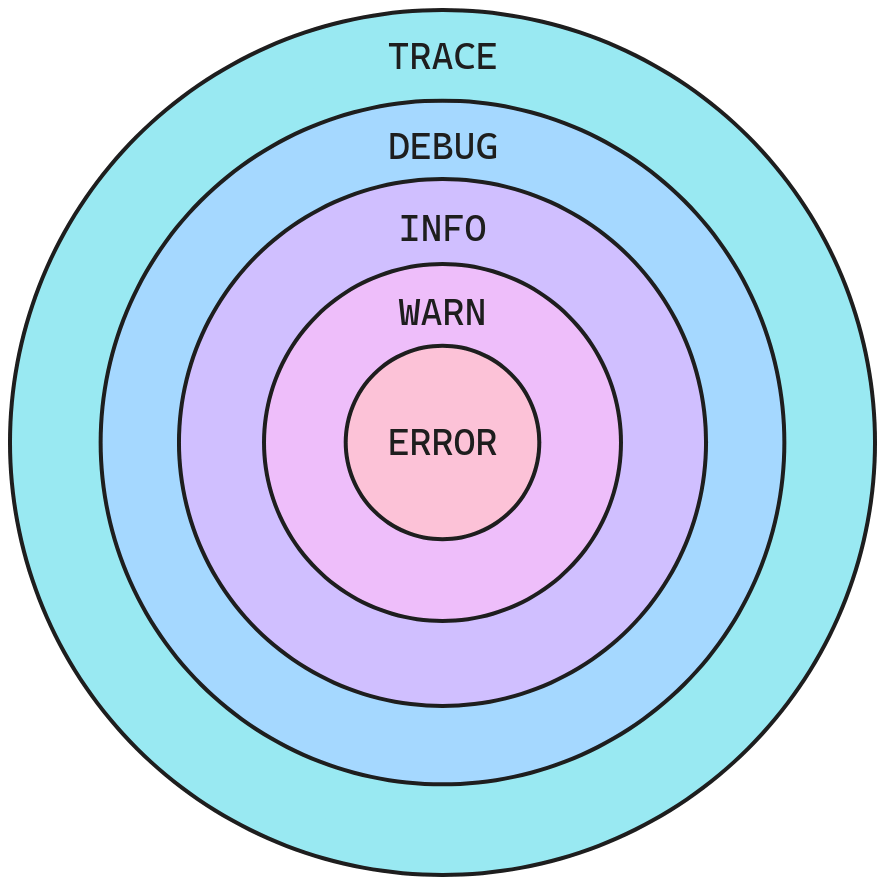

Logging acts as an essential tool for obtaining insights into code execution and addressing software development challenges. You can configure the verbosity of logs via log levels. Use `TAILCALL_LOG_LEVEL` or `TC_LOG_LEVEL` environment variables to set the application's log level. The available log levels include:

### error

This is the highest severity level. It indicates a critical issue that may lead to the failure of the program or a part of it.

```bash
TAILCALL_LOG_LEVEL=error tailcall <COMMAND>
# or
TC_LOG_LEVEL=error tailcall <COMMAND>
```

### warn

This log level signifies potential issues or warnings that do not necessarily result in immediate failure but may require attention.

```bash
TAILCALL_LOG_LEVEL=warn tailcall <COMMAND>
# or
TC_LOG_LEVEL=warn tailcall <COMMAND>
```

### info

This level offers general information about the program's execution, providing insights into its state and activities.

```bash
TAILCALL_LOG_LEVEL=info tailcall <COMMAND>
# or
TC_LOG_LEVEL=info tailcall <COMMAND>
```

### debug

The `debug` log level is useful for developers during the debugging process, providing detailed information about the program's internal workings.

```bash
TAILCALL_LOG_LEVEL=debug tailcall <COMMAND>
# or
TC_LOG_LEVEL=debug tailcall <COMMAND>
```

### trace

The `trace` log level is the most detailed logging level, used for fine-grained debugging. This level provides exhaustive details about the program's execution flow.

```bash
TAILCALL_LOG_LEVEL=trace tailcall <COMMAND>
# or
TC_LOG_LEVEL=trace tailcall <COMMAND>
```

### off

This level serves as a special indicator for generating no logs, allowing the option to disable logging entirely.

```bash
TAILCALL_LOG_LEVEL=off tailcall <COMMAND>
# or
TC_LOG_LEVEL=off tailcall <COMMAND>
```

:::info
The default log level is `info`.
:::

Log levels are hierarchical, meaning if you set the log level to a specific level, it includes all the levels above it. For example, setting the log level to `info` will include logs at the `info`, `warn`, and `error` levels, but exclude `debug` and `trace` logs.



:::info
You can specify log levels in either uppercase or lowercase; both yield the same result. For example, `TAILCALL_LOG_LEVEL=DEBUG` and `TAILCALL_LOG_LEVEL=debug` are same.
:::
