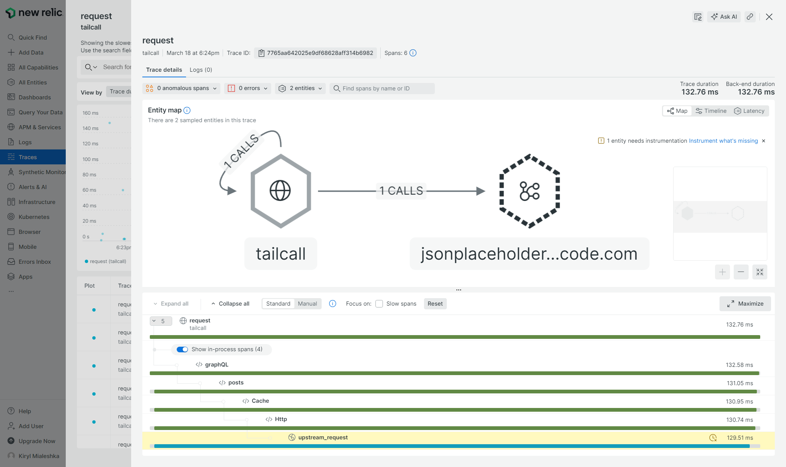
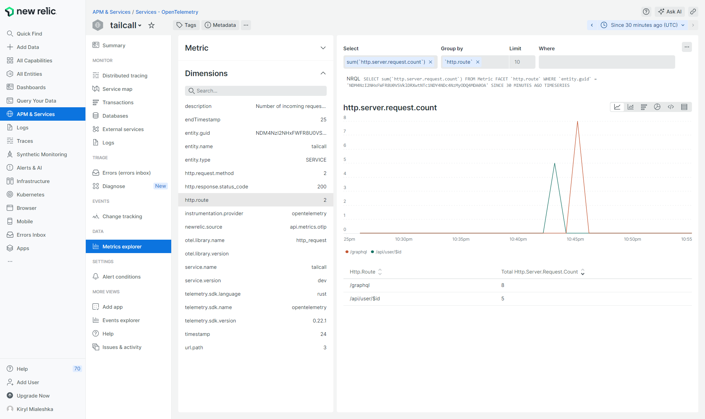

The guide is based on [official doc](https://docs.newrelic.com/docs/more-integrations/open-source-telemetry-integrations/opentelemetry/get-started/opentelemetry-set-up-your-app/)

1. Go to [newrelic.com](https://newrelic.com)
2. Login to your account
3. Go to `<your user name> -> Api Keys` and copy license value for key with access to write data
4. Go to GraphQL configuration and update it with:
   ```graphql
   schema
     @telemetry(
       export: {
         otlp: {
           url: "https://otlp.nr-data.net:4317"
           headers: [
             {
               key: "api-key"
               value: "{{.env.NEWRELIC_API_KEY}}"
             }
           ]
         }
       }
     ) {
     query: Query
   }
   ```
5. Set the api key you've copied before to the environment variable named `NEWRELIC_API_KEY` and start tailcall with updated config

Now make some requests to running service and wait a little bit until New Relic proceeds the data. After that you can go to `Traces` locate `request` trace, click on it, then pick one of the available traces and click on it. You should see something like the screenshot below:



To see metrics now go to `APM & Services -> Metrics Explorer` and choose the metrics you want to see like on example below.


