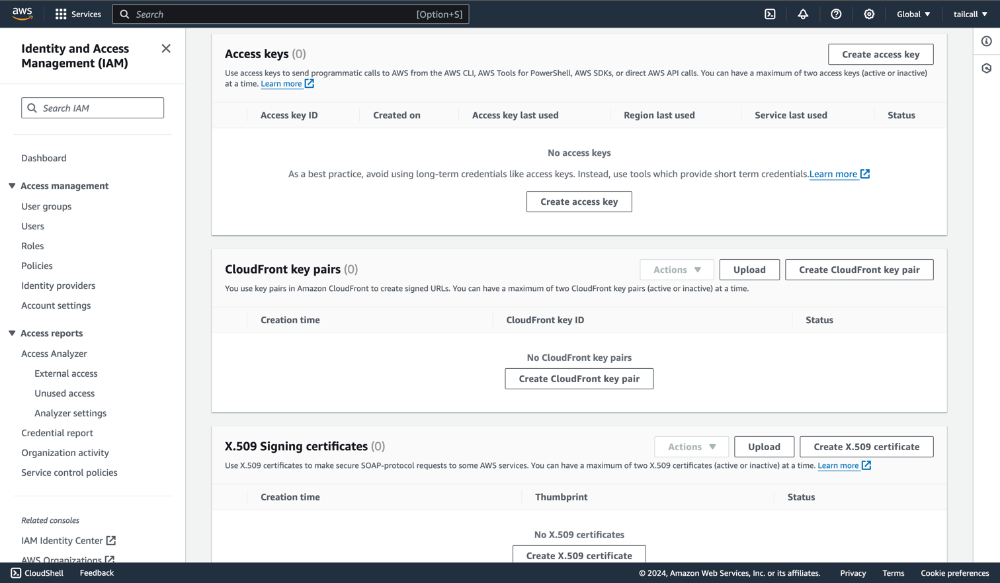
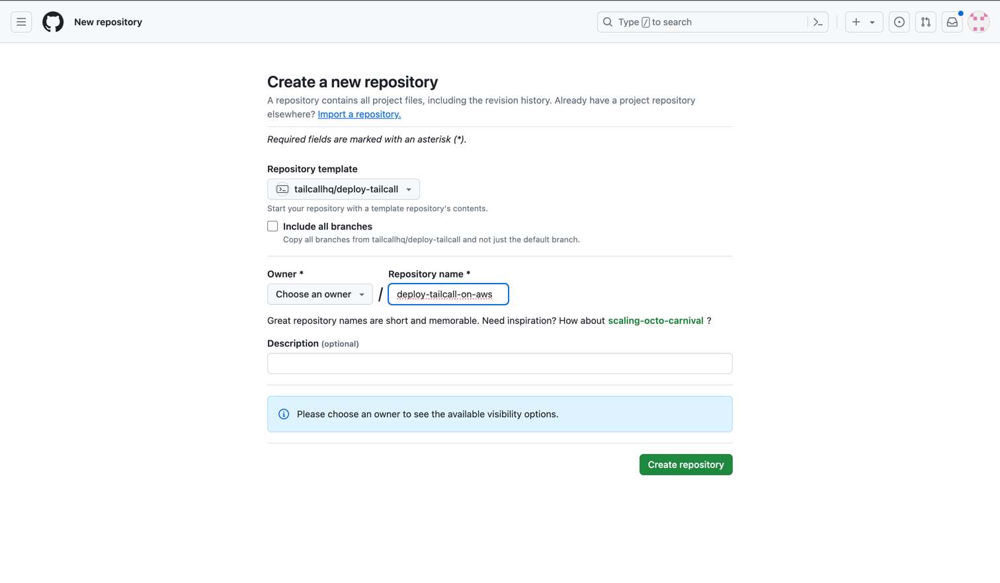
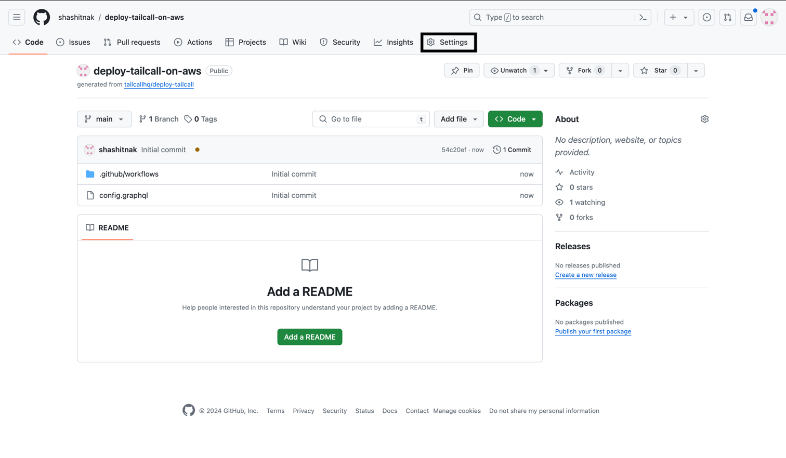

Before deploying `tailcall` on AWS Lambda, you need to generate the AWS Access Key ID and Secret Access Key. If you don't have an AWS account, you can create one [here](https://aws.amazon.com/).

## Generate Access Keys for AWS

Follow the steps below to generate the Access Keys:

1. Go to [AWS Management Console](https://console.aws.amazon.com/) and click the drop down menu in the top right corner and Click on `Security credentials`.

   

2. Scroll down to the `Access Keys` section and click on `Create access key`.

   

3. You will get the following warning since we are trying to create access keys for the root user. For this guide, we will continue with creating the access keys. If you do not want to continue with the root user, you can learn more about the AWS security credentials [here](https://docs.aws.amazon.com/IAM/latest/UserGuide/security-creds.html) and managing access keys [here](https://docs.aws.amazon.com/IAM/latest/UserGuide/id_credentials_access-keys.html?icmpid=docs_iam_console#Using_CreateAccessKey).

   

4. Once you click on `Create access key`, you will get the `Access key ID` and `Secret access key`. Make sure to download the `CSV` file and store it securely.

   

## Terraform setup

Now that you have the AWS Access Key ID and Secret Access Key, you will need to generate API token for terraform and setup a terraform organization and workspace. If you don't have a Terraform Cloud account, you can create one [here](https://app.terraform.io/signup/account).

### Terraform API Token

Follow these steps to generate the Terraform API token:

1. Go to the [Tokens section in Settings](https://app.terraform.io/app/settings/tokens) and click on `Create an API token`.

   

2. Give a description for the token and change the expiration if required. Click on `Generate token`.

   

3. Copy the generated token and store it securely.

   

### Terraform Organization and Workspace

1. To create an organization, go to the [Organizations section in Settings](https://app.terraform.io/app/organizations) and click on `Create organization`.

   

2. Fill in the organization name and email and click on `Create organization`.

   

3. Now that you have created an organization, you will be presented with the following page for creating a workspace. Click on `CLI-Driven Workflow`, since the github action which we will be using for deployment, [tailcallhq/gh-action](https://github.com/tailcallhq/gh-action), uses the terraform CLI.

   

4. Fill in the workspace name. By default the project will be set to `Default Project`, if you have any project in terraform cloud, you can select that project, otherwise continue with the `Default Project` and click on `Create`.

   

You now have everything required for a successful deployment of your `tailcall` server on AWS Lambda.

## Setting up the project repo

Now you need to create a new repository on Github and use the Github action `tailcallhq/gh-action` to deploy it. The easiest way to get started is to create a new repository using this template repo [https://github.com/tailcallhq/deploy-tailcall](https://github.com/tailcallhq/deploy-tailcall).

1. Go to the repo and click on `Use this template` and create a new repository.

   

2. Give your repository a name and click on `Create repository`.

   

3. Now that you have created a repository, you will need to add the AWS access keys and Terraform API token to the repository secrets. To do that, click on `Settings`.

   

4. Click on `Secrets and variables` in the left side bar to expand the section and click on `Actions`.

   

5. Click on `New repository secret` to add a new secret.

   

6. Add the secret name as `AWS_ACCESS_KEY_ID` or any name you prefer and paste the AWS access key ID that you generated earlier in the value field. Click on `Add secret` to save the secret.

   

7. Similarly add the AWS secret access key and the Terraform API token as secrets to the repository.

   

You are now ready to deploy your `tailcall` server on AWS Lambda using terraform.

## Deploy on AWS Lambda using terraform

In this example, we will deploy a simple `graphQL` server using `tailcall`, on AWS Lambda using terraform, which will convert the JSONPlaceholder REST API to a GraphQL API.

Below is the config present in the template repo, that will be used for this deployment. You can learn more about this [here](getting-started.mdx#writing-a-graphql-configuration).

```graphql
schema {
  query: Query
}

type Query {
  posts: [Post]
    @http(url: "https://jsonplaceholder.typicode.com/posts")
}

type User {
  id: Int!
  name: String!
  username: String!
  email: String!
  phone: String
  website: String
}

type Post {
  id: Int!
  userId: Int!
  title: String!
  body: String!
  user: User
    @http(
      url: "https://jsonplaceholder.typicode.com/users/{{.value.userId}}"
    )
}
```

To deploy the server, just update the `provider` to `aws` in the `deploy-tailcall` job in the `.github/workflows/main.yml` file, similar to the example below. Also, update the `terraform-workspace` and `terraform-org` as well as the other inputs based on your requirements.

```yaml
on: [push]

jobs:
  deploy_tailcall:
    runs-on: ubuntu-latest
    name: Deploy Tailcall
    steps:
      - name: Checkout repository
        uses: actions/checkout@v2
      - name: Deploy Tailcall
        id: deploy-tailcall
        uses: tailcallhq/gh-action@v0.2
        with:
          provider: "aws"
          aws-access-key-id: ${{ secrets.AWS_ACCESS_KEY_ID }}
          aws-secret-access-key: ${{ secrets.AWS_SECRET_ACCESS_KEY }}
          aws-region: "us-east-1"
          aws-iam-role: "iam_for_tailcall"
          terraform-api-token: ${{ secrets.TERRAFORM_API_TOKEN }}
          terraform-org: "tailcall-demo"
          terraform-workspace: "tailcall"
          tailcall-config: "config.graphql"
```

After updating the `main.yml` file, commit the changes and push them to the repository. This will trigger the deployment of the `tailcall` server on AWS Lambda.
