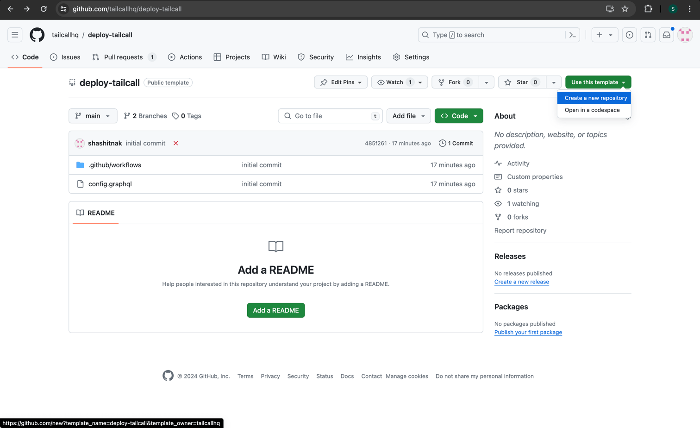

To deploy `tailcall` on Fly.io, you first need to generate an API key from Fly.io. If you don't already have an account, you can create one [here](https://fly.io/app/sign-up).

## Generate API Key for Fly.io

Follow these steps to generate an API key:

1. Go to the [Fly.io dashboard](https://fly.io/dashboard).

   

2. Click on `Tokens` in the left sidebar.

   

3. Optionally, provide a name and an expiry date for the token. Click on `Create Organization Token` to generate the token.

   

4. Copy the generated token and store it securely. You will need this token as input to the [tailcallhq/gh-action](https://github.com/tailcallhq/gh-action) when deploying to Fly.io.

## Setting Up the Project Repository

Next, create a new repository on GitHub and use the `tailcallhq/gh-action` GitHub action to deploy it. The easiest way to get started is by using this template repository: [https://github.com/tailcallhq/deploy-tailcall](https://github.com/tailcallhq/deploy-tailcall).

1. Go to the repository and click on `Use this template` to create a new repository.

   

2. Name your repository and click on `Create repository`.

   

3. After creating the repository, add the Fly.io API token to the repository secrets. To do this, click on `Settings`.

   

4. Click on `Secrets and variables` in the left sidebar to expand the section, then click on `Actions`.

   

5. Click on `New repository secret` to add a new secret.

   

6. Name the secret `FLY_API_TOKEN` or any preferred name, and paste the Fly.io API token you generated [earlier](#generate-api-key-for-fly) into the value field. Click on `Add secret` to save it.

   

You are now ready to deploy your `tailcall` server on Fly.io.

## Deploy on Fly.io

In this example, we will deploy a simple GraphQL server using `tailcall` on Fly.io, which converts the JSONPlaceholder REST API to a GraphQL API.

Below is the configuration present in the template repository, which will be used for this deployment.

:::tip
You can learn more about the configuration [here](./configuration.mdx)
:::

```graphql
schema
  @upstream(
    baseURL: "http://jsonplaceholder.typicode.com"
  ) {
  query: Query
}

type Query {
  posts: [Post] @http(path: "/posts")
}

type User {
  id: Int!
  name: String!
  username: String!
  email: String!
  phone: String
  website: String
}

type Post {
  id: Int!
  userId: Int!
  title: String!
  body: String!
  user: User @http(path: "/users/{{.value.userId}}")
}
```

To deploy the server, update the `provider` to `fly` in the `deploy-tailcall` job in the `.github/workflows/main.yml` file, as shown below.

```yaml
on: [push]

jobs:
  deploy_tailcall:
    runs-on: ubuntu-latest
    name: Deploy Tailcall
    steps:
      - name: Checkout repository
        uses: actions/checkout@v2
      - name: Deploy Tailcall
        id: deploy-tailcall
        uses: tailcallhq/gh-action@<version> # Replace <version> with the desired version
        with:
          provider: "fly" # Specifies the cloud provider as 'fly'
          fly-api-token: ${{ secrets.FLY_API_TOKEN }}
          fly-app-name: <app-name> # Replace <app-name> with the desired app name
          fly-region: "lax"
          tailcall-config: "./config.graphql"
```

:::important
When specifying the `fly-app-name` in your GitHub Actions workflow for deploying to Fly.io, ensure the app name you choose is unique across all Fly.io users.
:::

Fly.io requires each app name to be globally unique. If the name you select is already taken by another user, your deployment will fail. To avoid this issue, consider using a name that includes unique identifiers such as your organization name, project name, etc. If you do not specify the app name, `<orgname>-<reponame>` will be used.

After updating the `main.yml` file, commit the changes and push them to the repository. This will trigger the deployment of the `tailcall` server on Fly.io. Once the deployment is successful, you can access the GraphQL playground at `https://tailcall.run/playground/?u=https://<fly-app-name>.fly.dev/graphql`.
