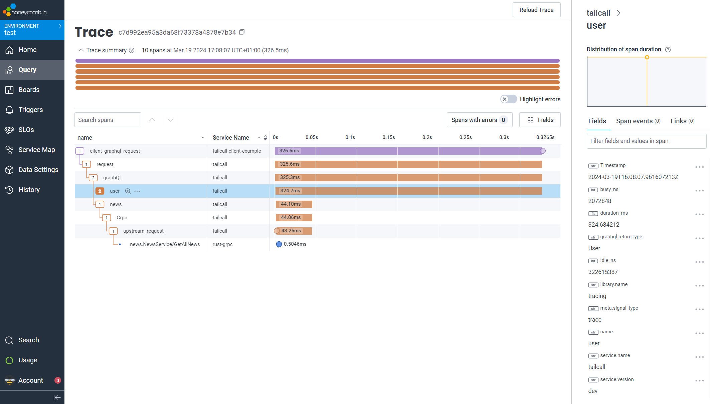

This guide will walk you through observability support in Tailcall i.e. how to collect and analyze telemetry data with different observability backends. In this guide you'll learn:

- How to enable generation of telemetry data in Tailcall?
- How to update config to forward telemetry data to your chosen observability platforms?
- See some examples of integration with existing observability tools?

Let's get started!

## What is Observability

Observability is essential for maintaining the health and performance of your applications. It provides insights into your software's operation in real-time by analyzing telemetry data — logs, metrics, and traces. This data helps in troubleshooting, optimizing, and ensuring your application works as expected.

- **Logs** offer a record of events that have happened within your application, useful for understanding actions taken or errors that have occurred.
- **Metrics** are numerical data that measure different aspects of your system's performance, such as request rates or memory usage.
- **Traces** show the journey of requests through your system, highlighting how different parts of your application interact and perform.

Tailcall provides observability support by integrating OpenTelemetry specification into it with help of provided SDKs and data formats.

[OpenTelemetry](https://opentelemetry.io) is a toolkit for collecting telemetry data in a consistent manner across different languages and platforms. It frees you from being locked into a single observability platform, allowing you to send your data to different tools for analysis, such as New Relic or Honeycomb.

## Comparison with Apollo Studio

While [Apollo studio](./apollo-studio.md) telemetry also provides analytics tools for your schema but when choosing between it and OpenTelemetry integration consider next points:

- OpenTelemetry is more generalized observability framework that could be used for cross-service analytics while Apollo Studio can provide insights related purely to graphQL
- OpenTelemetry is vendor-agnostic and therefore you could actually use different observability platforms depending on your needs and don't rely on single tool like Apollo Studio
- OpenTelemetry integration in Tailcall can provide more analytical data that is out of scope of graphQL analytics provided by Apollo Studio

## Prerequisites

Consider we have the following GraphQL configuration that connects with jsonplaceholder.com to fetch the data about user and posts

```graphql
schema @server(port: 8000, hostname: "0.0.0.0") {
  query: Query
}

type Query {
  posts: [Post]
    @http(url: "http://jsonplaceholder.typicode.com/posts")
    @cache(maxAge: 3000)
  user(id: Int!): User
    @http(
      url: "http://jsonplaceholder.typicode.com/users/{{.args.id}}"
    )
}

type User {
  id: Int!
  name: String!
  username: String!
  email: String!
  phone: String
  website: String
}

type Post {
  id: Int!
  userId: Int!
  title: String!
  body: String!
  user: User
    @http(
      url: "http://jsonplaceholder.typicode.com/users/{{.value.userId}}"
    )
}
```

We will update that config with telemetry integration in following sections.

## GraphQL Configuration for Telemetry

By default, telemetry data is not generated by Tailcall since it requires some setup to know where to send this data and also that affects performance of server that could be undesirable in some cases.

Telemetry configuration is provided by [`@telemetry`](/docs/directives.md#telemetry-directive) directive to setup how and where the telemetry data is send.

To enable it we can update our config with something like config below:

```graphql
schema
  @telemetry(
    export: {
      otlp: {url: "http://your-otlp-compatible-backend.com"}
    }
  ) {
  query: Query
}
```

Here, `export` specifies the format of generated data and endpoint to which to send that data. Continue reading to know more about different options for it.

### Export to OTLP

[OTLP](https://opentelemetry.io/docs/specs/otlp/) is a vendor agnostic protocol that is supported by growing [number of observability backends](https://opentelemetry.io/ecosystem/vendors/).

#### OpenTelemetry Collector

[OpenTelemetry Collector](https://opentelemetry.io/docs/collector/) is a vendor-agnostic way to receive, process and export telemetry data in OTLP format.

Although, tailcall can send the data directly to the backends that supports OTLP format using Otel Collector could be valuable choice since it's more robust solution well-suited for a high-scale, more flexible settings and ability to export in different formats other than OTLP.

In summary, if you're gonna to use OTLP compatible platform or [prometheus](#export-to-prometheus) and your load is not that massive you could send the data directly to platforms. From the other side, if you need to export to different formats (like Jaeger or Datadog) or your application involves high load consider using Otel Collector as an export target.

### Export to prometheus

[Prometheus](https://prometheus.io) is a metric monitoring solution. Please note that prometheus works purely with metrics and other telemetry data like traces and logs won't be sent to it.

Prometheus integration works by adding a special route for the GraphQL server's router that outputs generated metrics in prometheus format consumable by prometheus scraper.

## Data generated

You can find a reference of type of info generated by Tailcall in the [`@telemetry` reference](/docs/directives.md#telemetry-directive) or consult examples in the next section, in order to gain some understanding.

### Relation with other services

Tailcall fully supports [Context Propagation](https://opentelemetry.io/docs/concepts/context-propagation/) functionality and therefore you can analyze distributed traces across all of your services that are provides telemetry data.

That may look like this:



Where Tailcall is a part of whole distributed trace

### Customize generated data

In some cases you may want to customize the data that were added to telemetry payload to have more control over analyzing process. Tailcall supports that customization for specific use cases described below. For eg. the metric [`http.server.request.count`](/docs/directives.md#metrics) can be customized with the [`requestHeaders`](/docs/directives.md#requestheaders) property to allow splitting the overall count by specific headers.

:::important
The value of specified headers will be sent to telemetry backend as is, so use it with care to prevent of leaking any sensitive data to third-party services you don't have control over.
:::
