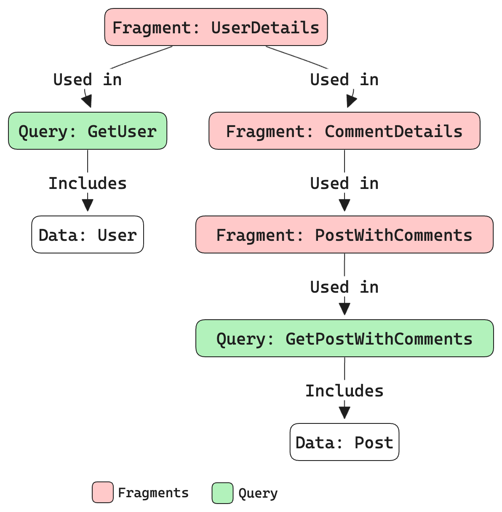

## Introduction to GraphQL Fragments

GraphQL fragments are reusable units that allow developers to define a piece of a query once and use it in multiple places. This capability not only reduces redundancy but also improves the maintainability of your GraphQL code. By using fragments, you can streamline your queries and mutations, ensuring a more efficient and organized approach to handling data.

## Why Use GraphQL Fragments?

### Code Reusability and Maintainability

GraphQL fragments enable the reuse of common fields across different queries and mutations. This reduces the need for writing the same field selections repeatedly, making your code more DRY (Don't Repeat Yourself). Consequently, maintaining and updating your codebase becomes more manageable.

### Improved Query Performance

Using fragments can lead to optimized queries by minimizing the amount of bytes sent in the query. This can result in faster query responses and a more efficient use of network resources.

### Consistent Data Fetching

With fragments, you ensure that your application fetches consistent sets of fields across various parts of your UI. This consistency can reduce bugs and discrepancies in your data representation, leading to a more stable and reliable application.

## How to Define and Use GraphQL Fragments

### Defining a Fragment

To define a fragment, use the `fragment` keyword followed by the fragment name and the type it belongs to. Here’s an example:

```graphql
fragment UserDetails on User {
  id
  name
  email
}
```

### Using a Fragment in Queries

Once defined, you can include the fragment in any query that requires the same set of fields. This is done using the `...FragmentName` syntax. Here’s how you can use the `UserDetails` fragment in a query:

```graphql
query GetUser {
  user(id: "1") {
    ...UserDetails
  }
}
```

### Combining Multiple Fragments

You can also combine multiple fragments in a single query to fetch different sets of fields. Here’s an example:

```graphql
fragment PostDetails on Post {
  id
  title
  content
}

query GetUserWithPosts {
  user(id: "1") {
    ...UserDetails
    posts {
      ...PostDetails
    }
  }
}
```

## Best Practices for Using GraphQL Fragments

### Keep Fragments Small and Specific

Avoid creating overly large fragments that include too many fields. Instead, create small, focused fragments that serve a specific purpose. This makes your fragments more reusable and easier to manage.

### Use Descriptive Names

Name your fragments descriptively to indicate their purpose and the type of data they fetch. This enhances the readability of your code and makes it easier for other developers to understand the intent of each fragment.

### Organize Fragments Logically

Group related fragments together in your codebase to keep things organized. For instance, you might have a folder dedicated to user-related fragments and another for post-related fragments. This logical organization aids in the maintainability of your project.

## Advanced Fragment Usage

### Nested Fragments

Fragments can be nested within other fragments to build more complex data structures. Here’s an example:

```graphql
fragment CommentDetails on Comment {
  id
  text
  author {
    ...UserDetails
  }
}

fragment PostWithComments on Post {
  id
  title
  content
  comments {
    ...CommentDetails
  }
}
```

### Fragments on Interfaces and Unions

You can also define fragments on interfaces and unions to handle various data types. This is particularly useful when working with polymorphic data structures. Here’s an example:

```graphql
fragment MediaFields on Media {
  ... on Photo {
    url
    height
    width
  }
  ... on Video {
    url
    duration
  }
}

query GetMedia {
  media {
    ...MediaFields
  }
}
```

## Example Diagram

Below is an example diagram to illustrate the relationship between different fragments and their usage in queries:



## Conclusion

GraphQL fragments are a powerful feature that enhances the reusability, maintainability, and performance of your GraphQL queries. By defining and using fragments effectively, you can create a more efficient and organized codebase, ensuring that your application fetches data consistently and optimally. Follow best practices such as keeping fragments small, using descriptive names, and organizing them logically to make the most out of this feature.
