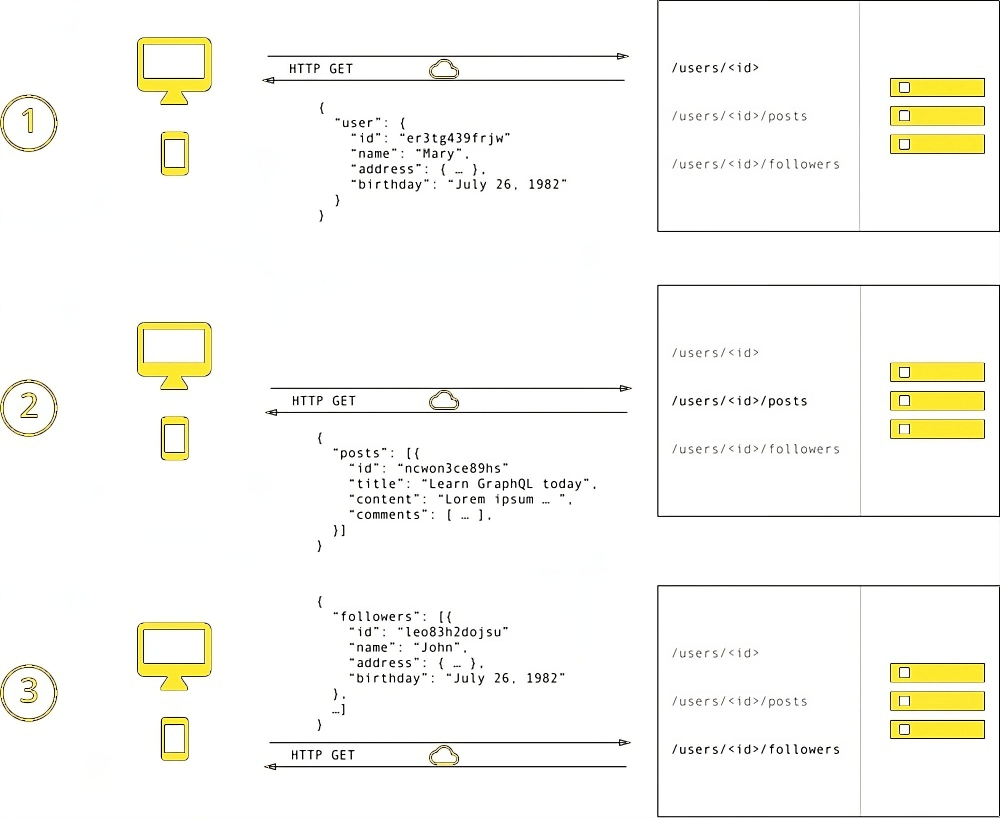
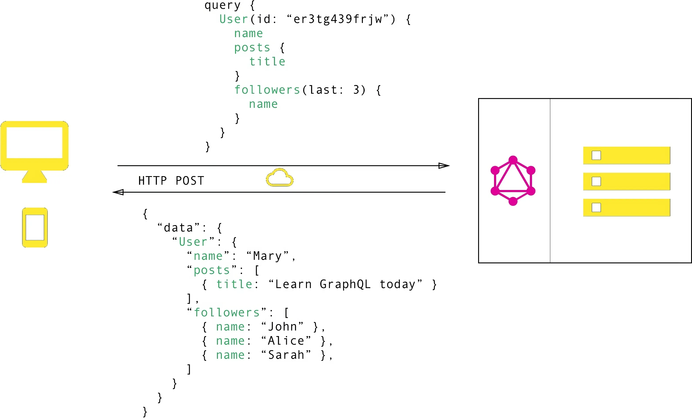

<head>
  <title>GraphQL vs REST: Comprehensive Comparison for 2024</title>
</head>

GraphQL and REST represent two different methodologies for developing APIs that facilitate data exchange over the internet. REST utilizes HTTP verbs, the fundamental protocol for web communication, allowing client applications to interact with a server. In contrast, GraphQL is a query language for APIs that establishes guidelines for how clients should request data from a server. With GraphQL, the client has more flexibility in specifying what data it needs, independent of server-side configurations. Both technologies are crucial in powering many contemporary applications.

## What is REST?

[REST](https://en.wikipedia.org/wiki/REST) (Representational State Transfer) is an architectural style for designing networked applications. It uses HTTP requests to perform CRUD (Create, Read, Update, Delete) operations. Each resource in a RESTful system is identified by a unique URI and can be manipulated using standard HTTP methods: GET, POST, PUT, DELETE.

### Key Characteristics of REST:

- **Stateless**: Each request from a client to server must contain all the information needed to understand and process the request.
- **Cacheable**: Responses must explicitly define themselves as cacheable or not to prevent clients from reusing stale or inappropriate data.
- **Layered System**: A client cannot ordinarily tell whether it is connected directly to the end server or an intermediary along the way.
  
  _This image highlights multiple requests to different endpoints, showcasing the common problem of overfetching unnecessary data in API design._

## What is GraphQL?

GraphQL is a query language for APIs and a runtime for executing those queries. It allows clients to request exactly the data they need, avoiding over-fetching and under-fetching issues common with REST. Developed by Facebook in 2012 and open-sourced in 2015, GraphQL provides a more flexible and efficient approach to API design.

### Key Characteristics of GraphQL:

- **Strongly Typed**: GraphQL APIs are defined by a schema using the GraphQL Schema Definition Language (SDL).
- **Single Endpoint**: Unlike REST, which has multiple endpoints, GraphQL operates on a single endpoint.
- **Declarative Data Fetching**: Clients specify the shape and structure of the required data in a single query.

_GraphQL Efficiency: This image shows how clients specify data needs, ensuring the server response matches the query structure precisely._

## Similarities Between GraphQL and REST

Both GraphQL and REST facilitate data exchange between client and server in a client-server model, using HTTP as the underlying communication protocol. Here are some similarities:

- **Resource-Based Design**: Both treat data as resources with unique identifiers. In REST, these are represented by URIs, while in GraphQL, they are defined in the schema and identified by the entities.
- **Stateless**: Both are stateless architectures, where each request is independent.
- **Support for JSON**: Both can use JSON for data format, although REST can also support XML and other formats.

## Differences Between GraphQL and REST

### Data Fetching

- **REST**: Multiple endpoints for different resources, leading to potential over-fetching and under-fetching.
- **GraphQL**: Single query to fetch exactly what is needed, reducing the number of requests and amount of data transferred.

### Flexibility

- **REST**: Fixed data structure defined by the server.
- **GraphQL**: Flexible data structure defined by the client.

### Error Handling

- **REST**: Error handling needs to be implemented by developers.
- **GraphQL**: Inbuilt error handling and detailed error messages due to its strong type system.

### Versioning

- **REST**: Often uses versioned endpoints to handle changes, which can be cumbersome.
- **GraphQL**: No need for versioning; deprecated fields are marked and can be handled gracefully.

### Performance

- **REST**: Can suffer from performance issues due to over-fetching and multiple round-trips.
- **GraphQL**: Typically more efficient as it reduces the amount of data transferred and number of requests.

## When to Use GraphQL vs. REST

### Use GraphQL if:

- You need to reduce the number of API calls.
- Your application requires complex querying capabilities.
- You want to minimize over-fetching and under-fetching.
- You have multiple data sources to integrate.

### Use REST if:

- You are building simple APIs with well-defined endpoints.
- Your application has low complexity and data interrelations.
- You prefer the simplicity and familiarity of REST.

## Implementing Both GraphQL and REST in a Single Application

It’s possible to use both GraphQL and REST within the same application, leveraging their respective strengths. Here’s how you can achieve this:

1. **Analyze Existing RESTful API**: Understand the current data model and endpoint structure.
2. **Define GraphQL Schema**: Write a schema that represents the data model and required operations.
3. **Create Resolvers**: Develop resolver functions to fetch data from REST endpoints or other data sources. In Tailcall resolvers can be defined using the `@http`, `@grpc`, `@graphql` and `@expr` directive. Check out the [Tailcall GraphQL Directives](/docs/directives.md) for more information.
4. **Integrate**: Set up a GraphQL server alongside your RESTful services, allowing clients to query data through both APIs.

## Conclusion

Both GraphQL and REST have their advantages and use cases. While REST is great for simpler applications with clearly defined endpoints, GraphQL offers a more flexible and efficient solution for complex and data-intensive applications. By understanding their differences and leveraging their strengths, you can design robust APIs that meet the needs of modern applications.
