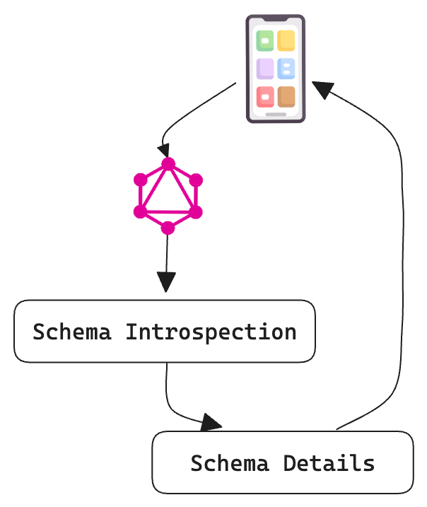

## Introduction to GraphQL Introspection

GraphQL introspection is a powerful feature that allows developers to query details about the GraphQL schema itself. This capability is essential for understanding the structure and capabilities of an API, enabling dynamic querying, generating documentation, and creating development tools. In this article, we delve deeply into the mechanics and benefits of GraphQL introspection, providing you with a thorough understanding of its uses and implementations.

## Understanding GraphQL Introspection Queries

### What Are Introspection Queries?

Introspection queries in GraphQL are specialized queries that allow clients to retrieve information about the schema, types, fields, and operations available in a GraphQL API. These queries can be used to dynamically understand what a server can do, which is particularly useful for tools like GraphiQL and Apollo Client.

### Basic Introspection Query Example

Here is an example of a simple introspection query that retrieves the schema's types:

```graphql
{
  __schema {
    types {
      name
      kind
      description
    }
  }
}
```

### Advanced Introspection Queries

For more detailed insights, advanced introspection queries can be used to fetch information about specific types, fields, and their arguments. An example is querying the fields of a particular type:

```graphql
{
  __type(name: "Query") {
    name
    fields {
      name
      description
      args {
        name
        type {
          name
          kind
        }
        defaultValue
      }
      type {
        name
        kind
      }
    }
  }
}
```

## Benefits of GraphQL Introspection

### Enhancing Developer Experience

GraphQL introspection greatly enhances the developer experience by providing a clear and comprehensive view of the API capabilities. This transparency reduces the learning curve and allows for more efficient development and debugging processes.

### Dynamic Documentation Generation

With introspection, tools can automatically generate up-to-date documentation. This dynamic documentation ensures that developers always have access to the latest API information without manual updates.

### Enabling Smart Clients

Introspection allows the creation of smart clients that can adapt to schema changes. This adaptability ensures that clients can continue to function correctly even when the server's schema evolves.

## Implementing Introspection in GraphQL

### Enabling Introspection in Your GraphQL Server

Most GraphQL servers have introspection enabled by default. However, it is crucial to ensure that this feature is properly configured and secured, especially in production environments. Here is an example of enabling introspection in Tailcall GraphQL server configuration:

```graphql showLineNumbers
schema @server(introspection: true) {
  query: Query
  mutation: Mutation
}
```

### Security Considerations

While introspection is incredibly useful, it can also expose potentially sensitive information about your schema. It is advisable to disable introspection in production environments or to secure it through proper authentication and authorization mechanisms.

## GraphQL Introspection and Tooling

### GraphiQL and Introspection

GraphiQL, an in-browser IDE for exploring GraphQL, heavily relies on introspection queries to provide a rich interface for querying and visualizing data. By utilizing introspection, GraphiQL can offer autocompletion, error highlighting, and real-time query feedback.

### Apollo Client and Schema Awareness

Apollo Client leverages introspection to manage local state and remote data seamlessly. By understanding the schema, Apollo Client can perform efficient queries and handle schema changes gracefully.

## GraphQL Introspection Workflow



## Conclusion

GraphQL introspection is a cornerstone feature that significantly improves the development lifecycle by providing real-time insights into API schemas. It empowers developers with dynamic documentation, enhances development tools, and enables adaptive client applications. By leveraging introspection effectively, you can ensure a robust and flexible GraphQL implementation.
