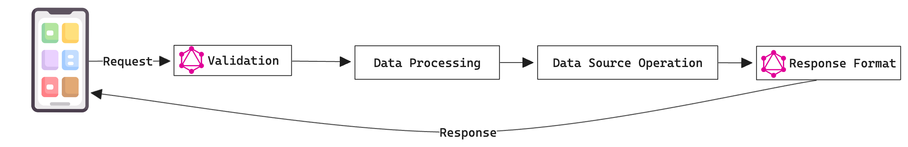

## Introduction

GraphQL has revolutionized the way we interact with APIs by offering a flexible and efficient approach to querying and manipulating data. Among its powerful features, mutations stand out as the key mechanism for creating, updating, and deleting data. In this article, we delve into the intricacies of GraphQL mutations, providing a detailed guide to mastering this essential component.

## Understanding GraphQL Mutations

### What are GraphQL Mutations?

GraphQL mutations are the counterpart to [queries](queries.md), designed specifically for writing data rather than reading it. While queries fetch data, mutations allow you to modify server-side data. Think of queries as a way to ask questions and get answers, while mutations are more like giving commands to change things.

### Why Use Mutations?

Mutations are essential because they enable dynamic interactions with your data. Instead of just looking at information, you can add new entries, update existing ones, or even remove data that's no longer needed. This ability to change data makes your application more interactive and responsive.

## Mutation Structure

### Mutation Type

A GraphQL mutation typically involves several key components. First, you have the **Mutation Type**, which defines the action to be performed, such as creating, updating, or deleting data.

### Input Arguments

Next, you have **Input Arguments**, which specify the data required for the mutation. These are like the ingredients you need to perform the mutation.

### Return Fields

Finally, you have **Return Fields**, which indicate the data returned after the mutation is executed. This is what you get back after the mutation has done its job.

Here’s a basic example of a mutation to create a new user:

```graphql
mutation {
  createUser(
    input: {name: "John Doe", email: "john.doe@example.com"}
  ) {
    id
    name
    email
  }
}
```

## Defining Mutations in the Schema

To implement mutations, you must define them in your [GraphQL schema](schema-and-types.md). This involves specifying the mutation type and the fields it supports. Here’s an example schema definition:

```graphql
type Mutation {
  createUser(input: CreateUserInput!): User
  updateUser(id: ID!, input: UpdateUserInput!): User
  deleteUser(id: ID!): User
}

input CreateUserInput {
  name: String!
  email: String!
}

input UpdateUserInput {
  name: String
  email: String
}
```

## Executing Mutations

Executing mutations in GraphQL involves sending a mutation request with the necessary input data. The response typically includes the newly modified data, confirming the mutation's success.

### Example: Creating a User

Here's how you can create a new user named Jane Doe:

```graphql
mutation {
  createUser(
    input: {name: "Jane Doe", email: "jane.doe@example.com"}
  ) {
    id
    name
    email
  }
}
```

The response might look like this:

```json
{
  "data": {
    "createUser": {
      "id": "1",
      "name": "Jane Doe",
      "email": "jane.doe@example.com"
    }
  }
}
```

## Handling Errors in Mutations

Error handling is crucial for robust GraphQL APIs. Mutations should provide meaningful error messages and handle various scenarios gracefully.

### Example: Handling Validation Errors

If you try to create a user without a name or with an invalid email, you'll get a validation error:

```graphql
mutation {
  createUser(input: {name: "", email: "invalid-email"}) {
    id
    name
    email
  }
}
```

The response will be:

```json
{
  "errors": [
    {
      "message": "Validation error: Name is required, Email is invalid",
      "locations": [
        {
          "line": 2,
          "column": 3
        }
      ],
      "path": ["createUser"]
    }
  ],
  "data": {
    "createUser": null
  }
}
```

## Advanced Mutation Techniques

### Nested Mutations

Nested mutations allow you to perform multiple related operations in a single mutation. This can be particularly useful for complex data relationships. For example, you can create a user and their associated posts in one go:

```graphql
mutation {
  createUser(
    input: {
      name: "Alice"
      email: "alice@example.com"
      posts: [{title: "First Post"}, {title: "Second Post"}]
    }
  ) {
    id
    name
    email
    posts {
      id
      title
    }
  }
}
```

:::caution
Performing Nested Mutations is possible but caution is advised as by default, GraphQL mutations are not transactional. This means that if one part of the mutation fails, the other parts will still be executed. You may need to implement custom logic to handle this.
:::

## Optimizing Mutations for Performance

Efficiently designed mutations are essential for maintaining performance and scalability in your GraphQL API. Consider the following techniques:

### Optimistic UI Updates

Enhance user experience by updating the UI optimistically before the mutation response is received. This makes the app feel faster and more responsive.

### Input Validation

Perform thorough validation on the client-side to minimize server-side processing. This helps ensure that only valid data reaches your server, reducing the risk of errors and improving performance.

## Example Diagram: Mutation Lifecycle

Here’s a simple diagram to illustrate the lifecycle of a mutation:



## Conclusion

Mastering GraphQL mutations is fundamental for any developer working with GraphQL APIs. By understanding their structure, implementing them effectively, and optimizing for performance, you can leverage the full potential of GraphQL for dynamic and efficient data manipulation.

---

## FAQs

### What is a GraphQL mutation?

A GraphQL mutation is an operation that allows clients to modify server-side data, including creating, updating, and deleting records.

### How do I handle errors in GraphQL mutations?

GraphQL responses include both data and errors. Clients can handle partial successes by checking the presence of errors in the response and taking appropriate actions.

### What is the difference between queries and mutations in GraphQL?

Queries are used to fetch data, while mutations are used to modify data. Queries are typically idempotent, while mutations change the state of the server.

### How do I secure GraphQL mutations?

Secure GraphQL mutations by implementing authentication to verify user identity and authorization to ensure users have the correct permissions to perform the mutation.
