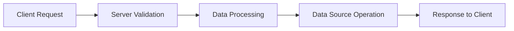

# Mastering GraphQL Mutations: A Comprehensive Guide

## Introduction to GraphQL Mutations

GraphQL has revolutionized the way we interact with APIs by offering a flexible and efficient approach to querying and manipulating data. Among its powerful features, mutations stand out as the key mechanism for creating, updating, and deleting data. In this article, we delve into the intricacies of GraphQL mutations, providing a detailed guide to mastering this essential component.

## Understanding GraphQL Mutations

GraphQL mutations are the counterpart to queries, designed specifically for writing data rather than reading it. While queries fetch data, mutations allow you to modify server-side data. Each mutation follows a structure similar to queries but with distinct differences that cater to data manipulation.

### Mutation Structure

A GraphQL mutation typically involves:

- **Mutation Type**: Defines the action to be performed (create, update, delete).
- **Input Arguments**: Specifies the data required for the mutation.
- **Return Fields**: Indicates the data returned after the mutation is executed.

Here’s a basic example of a mutation to create a new user:

```graphql
mutation {
  createUser(
    input: {name: "John Doe", email: "john.doe@example.com"}
  ) {
    id
    name
    email
  }
}
```

## Defining Mutations in the Schema

To implement mutations, you must define them in your GraphQL schema. This involves specifying the mutation type and the fields it supports.

```graphql
type Mutation {
  createUser(input: CreateUserInput!): User
  updateUser(id: ID!, input: UpdateUserInput!): User
  deleteUser(id: ID!): User
}

input CreateUserInput {
  name: String!
  email: String!
}

input UpdateUserInput {
  name: String
  email: String
}
```

## Executing Mutations

Executing mutations in GraphQL involves sending a mutation request with the necessary input data. The response typically includes the newly modified data, confirming the mutation's success.

#### Example: Creating a User

```graphql
mutation {
  createUser(
    input: {name: "Jane Doe", email: "jane.doe@example.com"}
  ) {
    id
    name
    email
  }
}
```

The response might look like:

```json
{
  "data": {
    "createUser": {
      "id": "1",
      "name": "Jane Doe",
      "email": "jane.doe@example.com"
    }
  }
}
```

### Handling Errors in Mutations

Error handling is crucial for robust GraphQL APIs. Mutations should provide meaningful error messages and handle various scenarios gracefully.

#### Example: Handling Validation Errors

```graphql
mutation {
  createUser(input: {name: "", email: "invalid-email"}) {
    id
    name
    email
  }
}
```

Response:

```json
{
  "errors": [
    {
      "message": "Validation error: Name is required, Email is invalid",
      "locations": [
        {
          "line": 2,
          "column": 3
        }
      ],
      "path": ["createUser"]
    }
  ],
  "data": {
    "createUser": null
  }
}
```

## Advanced Mutation Techniques

### Nested Mutations

Nested mutations allow you to perform multiple related operations in a single mutation. This can be particularly useful for complex data relationships.

```graphql
mutation {
  createUser(
    input: {
      name: "Alice"
      email: "alice@example.com"
      posts: [{title: "First Post"}, {title: "Second Post"}]
    }
  ) {
    id
    name
    email
    posts {
      id
      title
    }
  }
}
```

## Optimizing Mutations for Performance

Efficiently designed mutations are essential for maintaining performance and scalability in your GraphQL API. Consider the following techniques:

- **Optimistic UI Updates**: Enhance user experience by updating the UI optimistically before the mutation response is received.
- **Input Validation**: Perform thorough validation on the client-side to minimize server-side processing.

## Example Diagram: Mutation Lifecycle



## Conclusion

Mastering GraphQL mutations is fundamental for any developer working with GraphQL APIs. By understanding their structure, implementing them effectively, and optimizing for performance, you can leverage the full potential of GraphQL for dynamic and efficient data manipulation.
