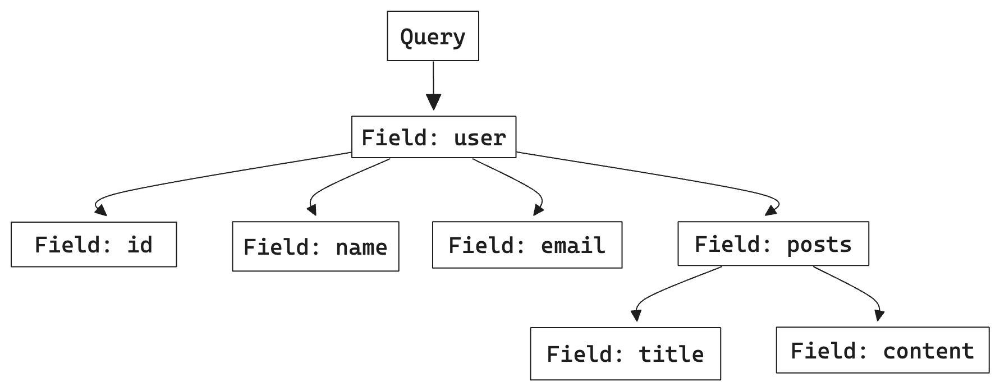

## Introduction to GraphQL Queries

In GraphQL, queries are the primary method to fetch data from a server. A GraphQL query allows you to specify exactly what data you need, making data retrieval both precise and efficient.

## What is a GraphQL Query?

A GraphQL query is a read operation that allows clients to specify precisely which data they need from the server. Unlike traditional REST APIs, where endpoints define the structure of responses, GraphQL queries let clients dictate the shape and size of the response. This flexibility reduces over-fetching and under-fetching of data, optimizing both server and client performance.

## Basic Structure of a GraphQL Query

GraphQL queries are written in a declarative syntax, resembling the structure of the requested data. Here is an example of a simple query to fetch user information:

```graphql
{
  user(id: "1") {
    id
    name
    email
  }
}
```

### Components of a Query

- **Field**: The basic unit of a query. In the example, `id`, `name`, and `email` are fields.
- **Arguments**: Parameters passed to fields to specify or filter data. `id: "1"` is an argument to the `user` field.
- **Aliases**: Alternative names for fields to avoid conflicts and improve readability.

## Advanced Query Features

### Nested Queries

GraphQL queries support nesting, allowing clients to request related data in a single query. This feature is particularly useful for fetching hierarchical data structures.

```graphql
{
  user(id: "1") {
    id
    name
    posts {
      title
      content
    }
  }
}
```

### Fragments

Fragments allow the reuse of common field selections across multiple queries, mutations, or subscriptions. They help in maintaining a DRY (Don't Repeat Yourself) approach in GraphQL queries.

```graphql
fragment userFields on User {
  id
  name
  email
}

{
  user(id: "1") {
    ...userFields
  }
}
```

### Variables

Variables enable dynamic queries, where the arguments can be passed externally, making the queries more flexible and reusable.

```graphql
query getUser($userId: ID!) {
  user(id: $userId) {
    id
    name
    email
  }
}
```

```json
{
  "userId": "1"
}
```

### Directives

Directives are used to modify the behavior of queries at runtime. Common directives include `@include` and `@skip` for conditional field inclusion.

```graphql
{
  user(id: "1") {
    id
    name
    email @include(if: $includeEmail)
  }
}
```

## Error Handling in Queries

GraphQL provides a standardized way to handle errors. The response includes both data and errors, allowing clients to handle partial success scenarios gracefully.

```json
{
  "data": {
    "user": null
  },
  "errors": [
    {
      "message": "User not found",
      "locations": [
        {
          "line": 2,
          "column": 3
        }
      ],
      "path": ["user"]
    }
  ]
}
```

## Best Practices for Writing GraphQL Queries

1. **Fetch Only Necessary Data**: Always request the minimum required fields to reduce the payload and improve performance.
2. **Use Aliases and Fragments**: To avoid naming conflicts and promote reuse of common field selections.
3. **Implement Pagination**: For queries that return large lists, use pagination techniques like `first`, `last`, `before`, and `after`.
4. **Handle Errors Gracefully**: Ensure your client can handle partial successes and provide useful feedback to users.

## Example Diagram: GraphQL Query Structure



## Conclusion

You now have the skills to write simple and nested GraphQL queries, pass arguments, use variables for dynamic queries, paginate results, and filter queries. Mastering these concepts will enable you to fetch data efficiently and effectively using GraphQL.

---

## Frequently Asked Questions (FAQs)

### How do I handle errors in GraphQL queries?

GraphQL responses include both data and errors. Clients can handle partial successes by checking the presence of errors in the response and taking appropriate actions.

### What are GraphQL fragments?

Fragments are reusable units of query logic that help maintain a DRY approach in your GraphQL queries. They allow you to define common field selections and use them across multiple queries, mutations, or subscriptions.

### Can I use GraphQL with existing REST APIs?

Yes, you can use GraphQL as a layer on top of existing REST APIs to provide a more flexible and efficient way to query your data. For quickly creating a GraphQL server that converts REST APIs to GraphQL, check out [Getting Started with Tailcall](/docs).

### What are GraphQL directives?

Directives are used to modify the behavior of queries at runtime. Common directives like `@include` and `@skip` allow you to conditionally include or exclude fields from the query based on dynamic conditions.

### How does GraphQL handle nested queries?

GraphQL allows you to fetch related data in a single request using nested queries. This is particularly useful for hierarchical data structures where you need to retrieve parent and child data together.

### What is GraphiQL?

GraphiQL is an open-source in-browser IDE for exploring GraphQL APIs. You can use GraphiQL to interact with GraphQL servers and visualize query results.

### What is the benefit of using aliases in GraphQL?

Aliases allow you to rename fields in the response, avoiding conflicts and improving readability. This is useful when querying the same field multiple times with different arguments.
