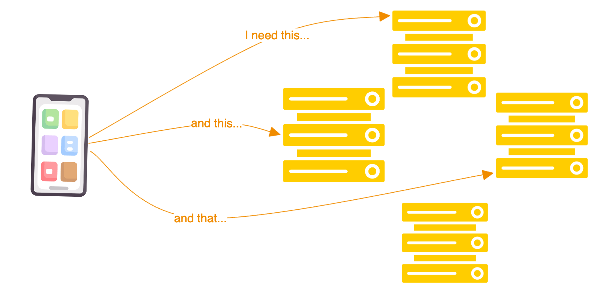
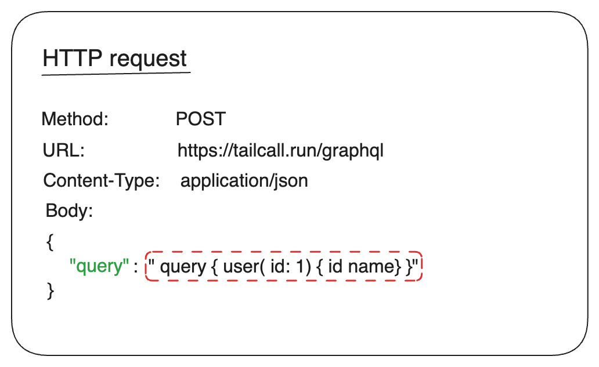
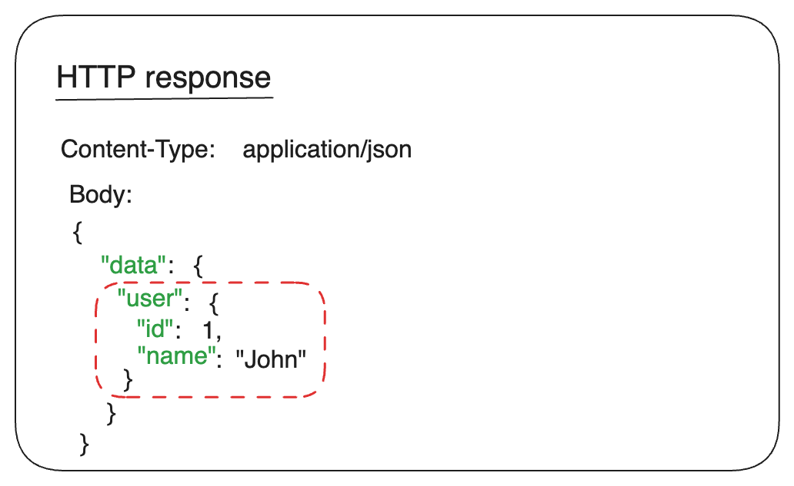
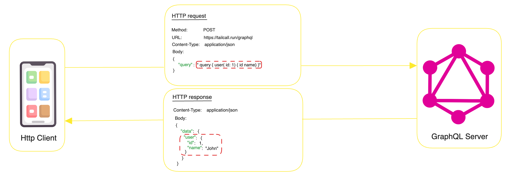

<head>
  <meta property="og:type" content="article"/>
  <title>What is GraphQL?: A Simple Introduction</title>
</head>

Due to the rise of mobile devices, the internet is now accessed by a variety of devices, not just web browsers. With the increase in types of internet users, the days of simply pulling data from databases and rendering it on web pages are over. Now, we need to consider how to retrieve data from databases and display it on mobile devices, smartwatches, smart TVs, and even refrigerators.

Today, we expect app developers to create rich, complex user interfaces that are accessible on a variety of devices, aiming to make the user experience as memorable as possible.

_The client requests specific data from various APIs, knowing which data comes from each source and is responsible for combining the data into the desired format._

To cater to these diverse needs, we need a more flexible way to interact with APIs. This is where [**GraphQL**](/graphql) comes in.

## GraphQL over HTTP

### Client Side

GraphQL is a query language for your APIs. It gives clients the capability to ask for exactly what they need without worrying about where to get it from.

Instead of making traditional `GET`, `POST`, `PUT`, and `DELETE` requests to different endpoints, GraphQL needs only one endpoint to interact, typically using the `POST` method. The client sends queries in the body of the `POST` request. The request will look something like this:

_The query is sent as a string inside a JSON object._

### Server Side

On the server side, It is a **runtime** that understands these "queries," fetches data from various data sources, bundles it in the shape that the client requested, and sends it back in an HTTP response.

_The response object is inside the `data` key of the JSON object._

The GraphQL server is responsible for exposing the schema, which is a strongly typed contract between the client and the server. It defines what queries clients can make, what types of data can be fetched, and what mutations can be performed.

For GraphQL, the origin of the data is irrelevant—it could come from a database, a microservice, or even a RESTful API. In essence, GraphQL is not concerned with the source of the data.

Check out the diagram below to get a better understanding of how GraphQL is used in your stack.

### Client-Server Interaction:

1. The client sends a query to the server. Note that the query is not in JSON format, but it looks like the shape of the JSON data the client needs. So when the `POST` request is made, the query is sent as a string inside a JSON object.
2. The server receives the JSON object, extracts the query string from it, parses the query to check for proper syntax, and validates it against the Schema (the contract between the client and the server).
3. Based on the query, the server fetches the data from the data sources and bundles it in the JSON object in the shape that the client requested.

## GraphQL Adoption

Due to this flexibility, the adoption of GraphQL has been increasing rapidly. There are many implementations available in various languages like JavaScript, Python, Ruby, Java, Rust, and more.

Starting off as a "hobbyist" stack, It has now been adopted by many big companies like Netflix, GitHub, Twitter, Pinterest, Shopify, and [more](https://landscape.graphql.org/card-mode?category=graph-ql-adopter&grouping=category).

## Frequently Asked Questions

### Is GraphQL frontend or backend?

GraphQL has two parts: the client-side and the server-side. On the client side, It is a query language that allows you to ask for the data you need. On the server side, It is a runtime for executing those queries using a type system you define for your data.

### Is GraphQL an API Gateway?

GraphQL is not an API Gateway. However, it can be used as a layer between your client and your existing APIs to provide a more flexible and efficient way to interact with your data.

### Is GraphQL a Database?

GraphQL is not a database. It is a query language for your API and a server-side runtime for executing queries using a type system you define for your data. It can be used to query data from databases, REST/gRPC APIs, and other data sources.

### Is GraphQL better than REST?

It depends on your use case. Since there is more efficiency associated with working with GraphQL, development is much faster with it than with REST.

### How can I convert my REST APIs to GraphQL?

You can use tools like Tailcall, which is the simplest way to convert your REST APIs to GraphQL APIs. You can find more details [here](https://tailcall.run/docs).
